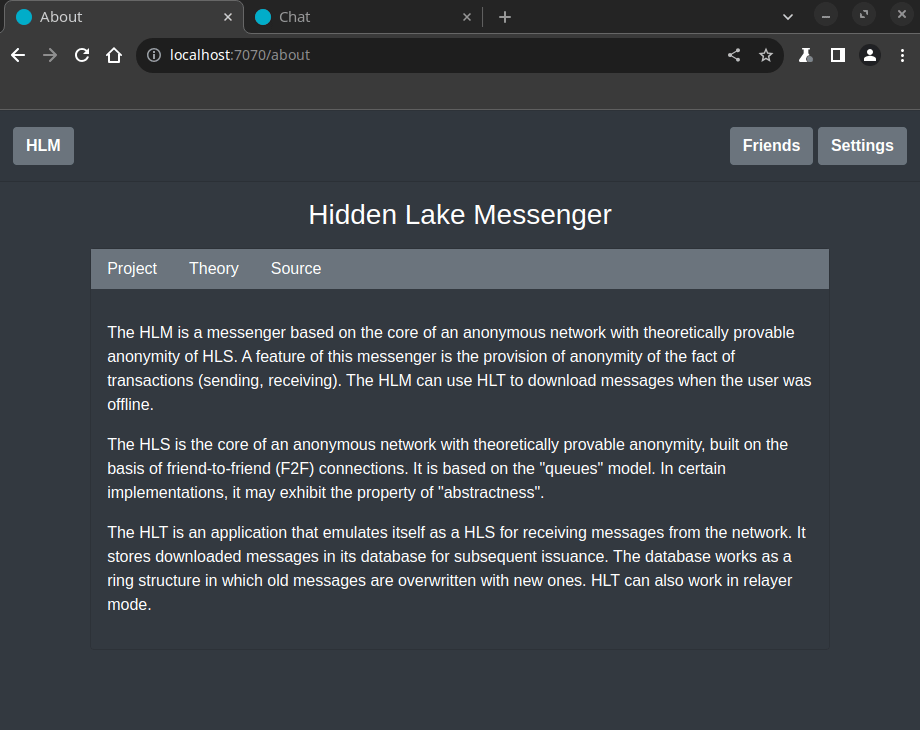
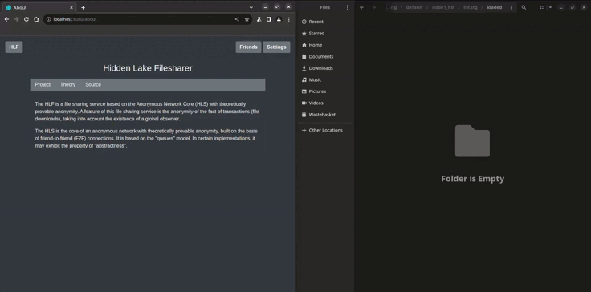
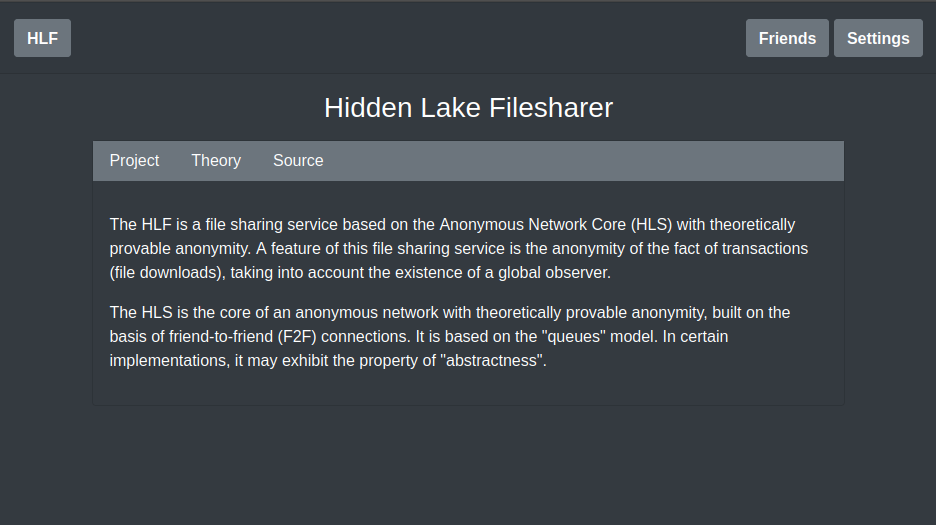
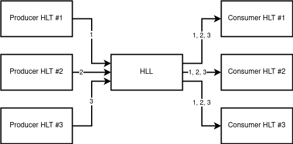
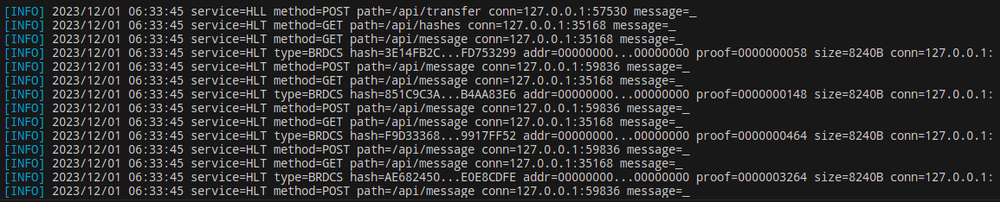
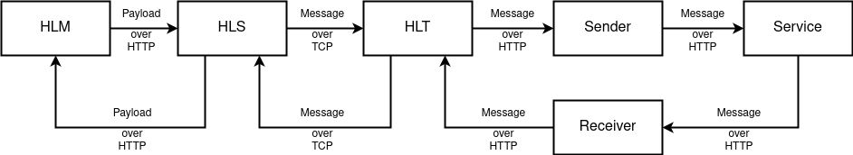
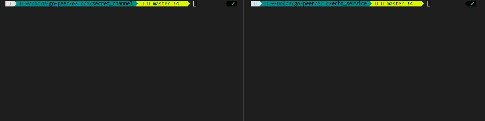

<p align="center">
    
</p>

<h2>
	<p align="center">
    	<strong>
        	Anonymity and Security without compromise
   		</strong>
	</p>
	<p align="center">
		<a href="https://github.com/topics/golang">
        	
		</a>
		<a href="https://github.com/number571/go-peer/releases">
        	
		</a>
		<a href="https://github.com/number571/go-peer/blob/master/LICENSE">
        	
		</a>
		<a href="https://github.com/number571/go-peer/blob/ee4b08c309d6966bd31621ceb7b0826708ca5dfb/Makefile#L55">
        	
		</a>
		<a href="https://godoc.org/github.com/number571/go-peer">
        	
		</a>
		<a href="https://github.com/avelino/awesome-go">
        	
		</a>
	</p>
	<p align="center">
		<a href="https://github.com/number571/go-peer/actions">
        	
		</a>
		<a href="https://goreportcard.com/report/github.com/number571/go-peer">
        	
		</a>
		<a href="https://github.com/number571/go-peer/pulse">
        	
		</a>
		<a href="https://github.com/number571/go-peer/commits/master">
        	
		</a>
	</p>
	<p align="center">
		<a href="https://vk.me/join/6Px6b0Qh/uZIK4ixUYWQm4Krepzq5xbYjYw=">
        	
		</a>
	</p>
	About project
</h2>

The `go-peer` library contains a large number of functions necessary to ensure the security of transmitted or stored information, as well as for the anonymity of nodes in the decentralized form. The library can be divided into several main `pkg` modules:

1. The `crypto` module represents cryptographic primitives: 1) asymmetric encryption, decryption; 2) asymmetric signing and signature verification; 3) symmetric encryption and decryption; 4) hashing; 5) key building; 6) computational problems (puzzles); 7) cryptographically stable pseudorandom number generator.
2. The `client` module for encrypting and decrypting information with the attached data integrity (hash), authentication (signature) and confirmation (work). It is a basic part of the `network/anonymity` module.
3. The `network` module is a decentralized communication between network nodes. It does not represent any protection of information and anonymity of participants.
4. The `network/anonymity` module to ensure anonymity based on the fifth^ stage. Presents the main functions for working with the network on top of the `network` and `network/anonymity/queue` modules.
5. The `network/anonymity/queue` module represents the generation, storage and issuance of encrypted messages every time the period specified by the application is reached. Uses the `client` module.
6. The `storage` module includes `crypto` type storage. This type of storage can be used for secure storage of passwords and private keys.
7. The `storage/database` module is a `key-value` database with the functions of value encryption and key hashing inherited from the `storage` module.

> Examples of works in the directory [github.com/number571/go-peer/examples](https://github.com/number571/go-peer/tree/master/examples "Examples");

## Installation

```bash
$ go get github.com/number571/go-peer
```

## Requirements

1. Go version `>= 1.16`

## Releases

All programs are compiled for {`amd64`, `arm64`} ARCH and {`windows`, `linux`, `darwin`} OS as pattern = `appname_arch_os`. In total, one application is compiled into six versions. The entire list of releases can be found here: [github.com/number571/go-peer/releases](https://github.com/number571/go-peer/releases "releases"). 

## Supported platforms

- Windows (x86_64, arm64)
- Linux (x86_64, arm64)
- MacOS (x86_64, arm64)

## Dependencies

> [!IMPORTANT]
> All dependencies are loaded into the go-peer project once using the `go mod vendor` command (for the Go language) or simply by installing (for other languages) and saved in it. This is done for security purposes, provided that dependency creators can modify the code in older versions.

1. Go library [github.com/syndtr/goleveldb](https://github.com/syndtr/goleveldb "goleveldb") (used by `pkg/storage/database`);
2. Go library [golang.org/x/net](https://golang.org/x/net "x/net") (used by `cmd/hidden_lake/applications/messenger`);
3. Go library [golang.org/x/crypto](https://golang.org/x/crypto "x/crypto") (used by `pkg/crypto/keybuilder`);
4. Go library [gopkg.in/yaml.v2](https://gopkg.in/yaml.v2 "yaml.v2") (used by `pkg/encoding`);
5. Go library [github.com/g8rswimmer/error-chain](https://github.com/g8rswimmer/error-chain "error-chain") (used by `pkg/utils`);
6. CSS/JS library [getbootstrap.com](https://getbootstrap.com "bootstrap") (used by `cmd/hidden_lake/applications/messenger|filesharer`);

## Theoretical works

1. [Theory of the structure of hidden systems](https://github.com/number571/go-peer/blob/master/docs/theory_of_the_structure_of_hidden_systems.pdf "TotSoHS")
2. [Monolithic cryptographic protocol](https://github.com/number571/go-peer/blob/master/docs/monolithic_cryptographic_protocol.pdf "MCP")
3. [Abstract anonymous networks](https://github.com/number571/go-peer/blob/master/docs/abstract_anonymous_networks.pdf "AAN")
4. [Decentralized key exchange protocol](https://github.com/number571/go-peer/blob/master/docs/decentralized_key_exchange_protocol.pdf "DKEP")

Also, the composition of these works can be found in the book `The general theory of anonymous communications` ([Ridero](https://ridero.ru/books/obshaya_teoriya_anonimnykh_kommunikacii/)). This book can be purchased in a tangible form on the [Ozon](https://www.ozon.ru/product/obshchaya-teoriya-anonimnyh-kommunikatsiy-vtoroe-izdanie-kovalenko-a-g-1193224608/) and [Wildberries](https://www.wildberries.ru/catalog/177390621/detail.aspx) marketplaces. You can download the book in digital form for free [here](https://github.com/number571/go-peer/blob/master/docs/general_theory_of_anonymous_communications.pdf).

## How can you help the project

1. Find bugs, vulnerabilities, and errors in the code
2. Suggest improvements, ask questions, create issues
3. Create anonymizing nodes (HLS) in the Hidden Lake network
4. Create new relay nodes (HLT) in the Hidden Lake network
5. Append new theoretical works or update current
6. Create new secure / anonymity applications
7. Popularize technology and applications

## Library based applications

Basic | Applied | Helpers
:-----------------------------:|:-----------------------------:|:------------------------------:
[HL Service](#1-hidden-lake-service) | [HL Messenger](#2-hidden-lake-messenger) | [HL Traffic](#4-hidden-lake-traffic)
[HL Composite](#8-hidden-lake-composite) | [HL Filesharer](#3-hidden-lake-filesharer) | [HL Adapters](#7-hidden-lake-adapters)
_ | _ | [HL Loader](#5-hidden-lake-loader)
_ | _ | [HL Encryptor](#6-hidden-lake-encryptor)

## 1. Hidden Lake Service

> [github.com/number571/go-peer/cmd/hidden_lake/service](https://github.com/number571/go-peer/tree/master/cmd/hidden_lake/service "HLS")


The `Hidden Lake Service` is a core of an anonymous network with theoretically provable anonymity. HLS is based on the `fifth^ stage` of anonymity and is an implementation of an `abstract` anonymous network based on `queues`. It is a `peer-to-peer` network communication with trusted `friend-to-friend` participants. All transmitted and received messages are in the form of `end-to-end` encryption.

Features / Anonymity networks |  Queue-networks (5^stage)               |  Entropy-networks (6stage)              |  DC-networks (1^stage)
:-----------------------------:|:-----------------------------:|:------------------------------:|:------------------------------:
Theoretical provability  |  +  |  +  |  + |
Anonymity has a cumulative effect   |  -  |  +  |  - |
Ease of software implementation  |  +  |  -  |  - |
Polymorphism of information  |  -  |  +  |  + |
Static communication delay  |  +/-  |  -  |  + |
Sending parallel messages  |  -  |  +  |  - |
Network scales easily  |  -  |  -  |  - |

A feature of HLS (compared to many other anonymous networks) is its easy adaptation to a hostile centralized environment. Anonymity can be restored literally from one node in the network, even if it is the only point of failure.

> More information about HLS in the [hidden_lake_anonymous_network.pdf](https://github.com/number571/go-peer/blob/master/docs/hidden_lake_anonymous_network.pdf "HLAN") and here [habr.com/ru/post/696504](https://habr.com/ru/post/696504/ "Habr HLS")

### How it works

Each network participant sets a message generation period for himself (the period can be a network constant for all system participants). When one cycle of the period ends and the next begins, each participant sends his encrypted message to all his connections (those in turn to all of their own, etc.). If there is no true message to send, then a pseudo message is generated (filled with random bytes) that looks like a normal encrypted one. The period property ensures the anonymity of the sender.

<p align="center"></p>
<p align="center">Figure 1. Queue and message generation in HLS.</p>

Since the encrypted message does not disclose the recipient in any way, each network participant tries to decrypt the message with his private key. The true recipient is only the one who can decrypt the message. At the same time, the true recipient acts according to the protocol and further distributes the received packet, even knowing the meaninglessness of the subsequent dispatch. This property makes it impossible to determine the recipient.

> Simple example of the `client` package (encrypt/decrypt functions) in the directory [github.com/number571/go-peer/pkg/client/examples](https://github.com/number571/go-peer/tree/master/pkg/client/examples "Package client");

<p align="center"></p>
<p align="center">Figure 2. Two participants are constantly generating messages for their periods on the network. It is impossible to determine their real activity.</p>

Data exchange between network participants is carried out using application services. HLS has a dual role: 1) packages traffic from pure to anonymizing and vice versa; 2) converts external traffic to internal and vice versa. The second property is the redirection of traffic from the network to the local service and back.

<p align="center"></p>
<p align="center">Figure 3. Interaction of third-party services with the traffic anonymization service.</p>

As shown in the figure above, HLS acts as an anonymizer and handlers of incoming and outgoing traffic. The remaining parts in the form of applications and services depend on third-party components (as an example, `HLM`).

### Minimum system requirements

1. Processor: `1x2.2GHz` (limit of communication = ~5-10 nodes)
2. Memory: `0.5GB RAM` (~250MB of memory can be consumed)
3. Storage: `5Gib available space` (~3.5GiB the size of hashes per year from one node)

### Build and run

Default build and run

```bash 
$ cd ./cmd/hidden_lake/service
$ make build # create hls, hls_[arch=amd64,arm64]_[os=linux,windows,darwin] and copy to ./bin
$ make run # run ./bin/hls

> [INFO] 2023/06/03 14:32:40 HLS is running...
> [INFO] 2023/06/03 14:32:42 service=HLS type=BRDCS hash=43A5E9C5...BA73DF43 addr=211494E4...EEA12BBC proof=0000000002256145 conn=127.0.0.1:
> [INFO] 2023/06/03 14:32:47 service=HLS type=BRDCS hash=EFDDC1D4...C47588AD addr=211494E4...EEA12BBC proof=0000000000090086 conn=127.0.0.1:
> [INFO] 2023/06/03 14:32:52 service=HLS type=BRDCS hash=8549E257...EDEB2748 addr=211494E4...EEA12BBC proof=0000000000634328 conn=127.0.0.1:
> ...
```

Service was running with random private key. Open ports `9571` (TCP, traffic) and `9572` (HTTP, interface).
Creates `./hls.yml` or `./_mounted/hls.yml` (docker) and `./hls.db` or `./_mounted/hls.db` (docker) files. 
The file `hls.db` stores hashes of sent/received messages.

Default config `hls.yml`

```yaml
settings:
  message_size_bytes: 8192
  work_size_bits: 22
  key_size_bits: 4096
  queue_period_ms: 5000
  limit_void_size_bytes: 4096
logging:
  - info
  - warn
  - erro
address:
  tcp: 127.0.0.1:9571
  http: 127.0.0.1:9572
services:
  hidden-lake-messenger: 
    host: 127.0.0.1:9592
```

Build and run with docker

```bash 
$ cd ./cmd/hidden_lake/service
$ make docker-build 
$ make docker-run

> [INFO] 2023/06/03 07:36:49 HLS is running...
> [INFO] 2023/06/03 07:36:51 service=HLS type=BRDCS hash=AF90439F...9F29A036 addr=BB58A8A2...B64D62C2 proof=0000000000479155 conn=127.0.0.1:
> [INFO] 2023/06/03 07:36:56 service=HLS type=BRDCS hash=2C4CE60A...E55BF9C4 addr=BB58A8A2...B64D62C2 proof=0000000000521434 conn=127.0.0.1:
> [INFO] 2023/06/03 07:37:01 service=HLS type=BRDCS hash=A9285F98...F96DB93D addr=BB58A8A2...B64D62C2 proof=0000000001256786 conn=127.0.0.1:
> ...
```

### Example

There are five nodes in the network `send_hls`, `recv_hls` and `middle_hlt1`, `middle_hlt2`, `middle_hlt3`. The `send_his` and `recv_hls` nodes connects to `middle_hlt1`, `middle_hlt3`. As a result, a link of the form `send_his <-> middle_hlt1 <-> middle_hlt2 <-> middle_hlt3 <-> recv_hls` is created. Due to the specifics of HLS, the centralized `middle_hlt` nodes does not violate the security and anonymity of the `send_hls` and `recv_hls` subjects in any way. 

The `recv_hls` node contains its `echo_service`, which performs the role of redirecting the request body back to the client as a response. Access to this service is carried out by its alias `hidden-echo-service`, put forward by the recv_hls node.

```go
...
// handle: "/echo"
// return format: {"echo":string,"return":int}
func echoPage(w http.ResponseWriter, r *http.Request) {
	if r.Method != "POST" {
		response(w, 2, "failed: incorrect method")
		return
	}
	res, err := io.ReadAll(r.Body)
	if err != nil {
		response(w, 3, "failed: read body")
		return
	}
	response(w, 1, string(res))
}
...
```

Identification between `recv_hls` and `send_hls` nodes is performed using public keys. This is the main method of identification and routing in the HLS network. IP addresses are only needed to connect to such a network and no more. Requests and responses structure are HEX encoded.

Structure of request. The body `hello, world!` is encoded base64.
```bash
JSON_DATA='{
        "method":"POST",
        "host":"hidden-echo-service",
        "path":"/echo",
        "head":{
            "Accept": "application/json"
        },
        "body":"aGVsbG8sIHdvcmxkIQ=="
}';
```

Request format
```bash
PUSH_FORMAT='{
        "receiver":"Alice",
        "hex_data":"'$(str2hex "$JSON_DATA")'"
}';
```

Build and run nodes
```bash
$ cd examples/echo_service/routing
$ make
```

Logs from one another connected node. When sending requests and receiving responses, another node does not see the action. For him, all actions and moments of inaction are equivalent.

<p align="center"></p>
<p align="center">Figure 4. Output of all actions and all received traffic from the middle_hls node.</p>

Send request
```bash
$ cd examples/echo_service
$ make request # go run ./_request/main.go
# OR
$ ./_request/request.sh
```

Get response
```bash
HTTP/1.1 200 OK
Date: Mon, 22 May 2023 18:18:34 GMT
Content-Length: 113
Content-Type: text/plain; charset=utf-8

{"code":200,"head":{"Content-Type":"application/json"},"body":"eyJlY2hvIjoiaGVsbG8sIHdvcmxkISIsInJldHVybiI6MX0K"}
Request took 8 seconds
```

Return code 200 is HTTP code = StatusOK. Decode base64 response body
```bash
echo "eyJlY2hvIjoiaGVsbG8sIHdvcmxkISIsInJldHVybiI6MX0K" | base64 -d
> {"echo":"hello, world!","return":1}
```

<p align="center"></p>
<p align="center">Figure 5. Example of running HLS with internal service.</p>

Also you can run example with docker-compose. In this example, all nodes have logging enabled
```bash
$ cd examples/echo_service/_docker/default
$ make
```

> Simple examples of the `anonymity` package in the directory [github.com/number571/go-peer/pkg/network/anonymity/examples](https://github.com/number571/go-peer/tree/master/pkg/network/anonymity/examples "Package anonymity");

**[⬆ back to top](#installation)**

## 2. Hidden Lake Messenger

> [github.com/number571/go-peer/cmd/hidden_lake/applications/messenger](https://github.com/number571/go-peer/tree/master/cmd/hidden_lake/applications/messenger "HLM");


The `Hidden Lake Messenger` is a messenger based on the core of an anonymous network with theoretically provable anonymity of HLS. A feature of this messenger is the provision of anonymity of the fact of transactions (sending, receiving).

HLM is an application that implements a graphical user interface (GUI) on a browser-based HTML/CSS/JS display. Most of the code is based on the bootstrap library https://getbootstrap.com /. GUI is adapted to the size of the window, so it can be used both in a desktop and in a smartphone.

> More information about HLM in the [habr.com/ru/post/701488](https://habr.com/ru/post/701488/ "Habr HLM")

### How it works

Most of the code is a call to API functions from the HLS kernel. Thanks to this approach, implicit authorization of users is formed from the state of the anonymizing service.

<p align="center"></p>
<p align="center">Figure 6. Example of chat room in HLM.</p>

However, there are additional features aimed at the security of the HLM application itself. All messages are stored in a local database in encrypted form with a key formed from `storage_key` param.

### Build and run

Default build and run

```bash 
$ cd ./cmd/hidden_lake/applications/messenger
$ make build # create hlm, hlm_[arch=amd64,arm64]_[os=linux,windows,darwin] and copy to ./bin
$ make run # run ./bin/hlm

> [INFO] 2023/06/03 15:30:31 HLM is running...
> ...
```

Open ports `9591` (HTTP, interface) and `9592` (HTTP, incoming).
Creates `./hlm.yml` or `./_mounted/hlm.yml` (docker) and `./hlm.db` or `./_mounted/hlm.db` (docker) files.
The file `hlm.db` stores all sent/received messages in encrypted view. 

Default config `hlm.yml`

```yaml
settings:
  messages_capacity: 2048
  work_size_bits: 20
  language: ENG
  pseudonym: i4sRNRXw_qoCv-RCBF_VjZy8nnOKYafI
  storage_key: u4Dz9PvNzn3DOItsrSWMODIrUwK5tmsw
logging:
  - info
  - warn
  - erro
address:
  interface: 127.0.0.1:9591
  incoming: 127.0.0.1:9592
connection: 127.0.0.1:9572
```

Build and run with docker

```bash 
$ cd ./cmd/hidden_lake/applications/messenger
$ make docker-build 
$ make docker-run

> [INFO] 2023/06/03 08:35:50 HLM is running...
> ...
```

### Example

The example will involve (as well as in HLS) five nodes `node1_hlm, node2_hlm` and `middle_hlt_1, middle_hlt_2, middle_hlt_3`. The three HLT nodes are only needed for communication between `node1_hlm` and `node2_hlm` nodes. Each of the remaining ones is a combination of HLS and HLM, where HLM plays the role of an application and services (as it was depicted in `Figure 3` HLS readme).

Build and run nodes
```bash
$ cd examples/anon_messenger/routing
$ make
```

The output of the `middle_hls` node is similar to `Figure 4`.
Than open browser on `localhost:8080`. It is a `node1_hlm`. This node is a Bob.

<p align="center"></p>
<p align="center">Figure 7. Home page of the HLM application.</p>

To see the success of sending and receiving messages, you need to do all the same operations, but with `localhost:7070` as `node2_hlm`. This node will be Alice.

Also you can run example with docker-compose. In this example, all nodes have logging enabled
```bash
$ cd examples/anon_messenger/_docker/default
$ make
```

<p align="center"></p>
<p align="center">Figure 8. Log of the three nodes with request/response actions.</p>

> More example images about HLM pages in the [github.com/number571/go-peer/cmd/hidden_lake/applications/messenger/_images](https://github.com/number571/go-peer/tree/master/cmd/hidden_lake/applications/messenger/_images "Path to HLM images")

**[⬆ back to top](#installation)**

## 3. Hidden Lake Filesharer

> [github.com/number571/go-peer/cmd/hidden_lake/applications/filesharer](https://github.com/number571/go-peer/tree/master/cmd/hidden_lake/applications/filesharer "HLF");


The `Hidden Lake Filesharer` is a file sharing service based on the Anonymous Network Core (HLS) with theoretically provable anonymity. A feature of this file sharing service is the anonymity of the fact of transactions (file downloads), taking into account the existence of a global observer.

HLF is an application that implements a graphical user interface (GUI) on a browser-based HTML/CSS/JS display. Most of the code is based on the bootstrap library https://getbootstrap.com/. GUI is adapted to the size of the window, so it can be used both in a desktop and in a smartphone.

> More information about HLF in the [habr.com/ru/articles/789968](https://habr.com/ru/articles/789968/ "Habr HLF")

### How it works

Most of the code is a call to API functions from the HLS kernel. Thanks to this approach, implicit authorization of users is formed from the state of the anonymizing service.

Unlike applications such as HLS, HLT, and HLM, the HLF application does not have a database. Instead, the storage is used, represented by the usual `hlf.stg` directory.

<p align="center"></p>
<p align="center">Figure 9. Example of download file in HLF (x2 speed).</p>

File transfer is limited by the bandwidth of HLS itself. If we take into account that the packet generation period is `5 seconds`, then it will take about 10 seconds to complete the request-response cycle. HLS also limits the size of transmitted packets. If we assume that the limit is `8KiB`, taking into account the existing ~4KiB headers, then the transfer rate is defined as `4KiB/10s` or `410B/1s`.

### Build and run

Default build and run

```bash 
$ cd ./cmd/hidden_lake/applications/filesharer
$ make build # create hlf, hlf_[arch=amd64,arm64]_[os=linux,windows,darwin] and copy to ./bin
$ make run # run ./bin/hlf

> [INFO] 2023/06/03 15:30:31 HLF is running...
> ...
```

Open ports `9541` (HTTP, interface) and `9542` (HTTP, incoming).
Creates `./hlf.yml` or `./_mounted/hlf.yml` file (docker) and `./hlf.stg` or `./_mounted/hlf.stg` (docker) directory.
The directory `hlf.stg` stores all shared/loaded files. 

Default config `hlf.yml`

```yaml
settings:
  retry_num: 2
  page_offset: 10
  language: ENG
logging:
- info
- warn
- erro
address:
  interface: 127.0.0.1:9541
  incoming: 127.0.0.1:9542
connection: 127.0.0.1:9572
```

Build and run with docker

```bash 
$ cd ./cmd/hidden_lake/applications/filesharer
$ make docker-build 
$ make docker-run

> [INFO] 2023/06/03 08:35:50 HLF is running...
> ...
```

### Example

The example will involve three nodes `node1_hlf, node2_hlf` and `middle_hlt_1, middle_hlt_2, middle_hlt3_`. Both nodes are a combination of HLS and HLF, where HLF plays the role of an application and services (as shown in `Figure 3` of the HLS readme). The three remaining nodes are used only for the successful connection of the two main nodes. In other words, HLT nodes are traffic relay nodes.

Build and run nodes
```bash
$ cd examples/anon_filesharing/routing
$ make
```

Than open browser on `localhost:8080`. It is a `node1_hlf`. This node is a Alice.

<p align="center"></p>
<p align="center">Figure 10. Home page of the HLF application.</p>

To see the another side of communication, you need to do all the same operations, but with `localhost:7070` as `node2_hlf`. This node will be Bob.

> More example images about HLF pages in the [github.com/number571/go-peer/cmd/hidden_lake/applications/filesharer/_images](https://github.com/number571/go-peer/tree/master/cmd/hidden_lake/applications/filesharer/_images "Path to HLF images")

**[⬆ back to top](#installation)**

## 4. Hidden Lake Traffic

> [github.com/number571/go-peer/cmd/hidden_lake/helpers/traffic](https://github.com/number571/go-peer/tree/master/cmd/hidden_lake/helpers/traffic "HLT");


The `Hidden Lake Traffic` is an application that saves traffic passed through HLS. The saved traffic can be used by other applications when they were offline. HLT provides an API for loading and unloading messages. Messages are stored in the database based on the "ring" structure. Thus, new messages will overwrite the old ones after some time.

> More information about HLT in the [habr.com/ru/post/717184](https://habr.com/ru/post/717184/ "Habr HLT")

### How it works

HLT emulates HLS to receive messages. In this scenario, HLT has only the functions of accepting messages, without the ability to generate or send them via HLS or independently.

<p align="center"></p>
<p align="center">Figure 11. Example of running HLT client.</p>

### Minimum system requirements

1. Processor: `1x2.2GHz` (characteristic for relayer mode)
2. Memory: `0.5GB RAM` (~200MB of memory is consumed in relayer mode)
3. Storage: `20Gib available space` (the size of messages per day from one node in storage mode)

### Build and run

Default build and run

```bash 
$ cd ./cmd/hidden_lake/helpers/traffic
$ make build # create hlt, hlt_[arch=amd64,arm64]_[os=linux,windows,darwin] and copy to ./bin
$ make run # run ./bin/hlt

> [INFO] 2023/06/03 15:39:13 HLT is running...
> ...
```

Open ports `9581` (HTTP, interface).
Creates `./hlt.yml` or `./_mounted/hlt.yml` (docker), `./hlt.db` or `./_mounted/hlt.db` (docker) files.
The file `hlm.db` stores all sent/received messages as structure `ring` from network HL. 

Default config `hlt.yml`

```yaml
settings:
  message_size_bytes: 8192
  work_size_bits: 22
  messages_capacity: 2048
  queue_period_ms: 5000
  limit_void_size_bytes: 4096
logging:
  - info
  - warn
  - erro
address:
  tcp: 127.0.0.1:9581
  http: 127.0.0.1:9582
connections:
  - 127.0.0.1:9571
```

Build and run with docker

```bash 
$ cd ./cmd/hidden_lake/helpers/traffic
$ make docker-build 
$ make docker-run

> [INFO] 2023/06/03 08:44:14 HLT is running...
> ...
```

### Example 

Build and run service
```bash
$ cd examples/traffic_actions/keeper
$ make
```

Run client
```bash
$ cd client
$ go run ./main.go w 'hello, world!'
$ go run ./main.go h
$ go run ./main.go r cb3c6558fe0cb64d0d2bad42dffc0f0d9b0f144bc24bb8f2ba06313af9297be4 # hash get by 'h' option
```

**[⬆ back to top](#installation)**

## 5. Hidden Lake Loader

> [github.com/number571/go-peer/cmd/hidden_lake/helpers/loader](https://github.com/number571/go-peer/tree/master/cmd/hidden_lake/helpers/loader "HLL")


The `Hidden Lake Loader` is a smallest service of the Hidden Lake network applications. It is used to redirect traffic from HLT producers (storages) to HLT consumers. Previously, it was used as a component of HLM, and then HLS applications.

### How it works

HLL uses the HLT service interface to download and upload messages. This property is necessary to redirect multiple messages to HLT once, and then to HLS services.

<p align="center"></p>
<p align="center">Figure 12. Architecture of HLL.</p>

### Build and run

Default build and run

```bash 
$ cd ./cmd/hidden_lake/helpers/loader
$ make build # create hll, hll_[arch=amd64,arm64]_[os=linux,windows,darwin] and copy to ./bin
$ make run # run ./bin/hll

> [INFO] 2023/12/03 02:12:51 HLL is running...
> ...
```

Open ports `9561` (HTTP).
Creates `./hll.yml` or `./_mounted/hll.yml` (docker) file.

Default config `hll.yml`

```yaml
settings:
  messages_capacity: 2048
  work_size_bits: 22
logging:
- info
- warn
- erro
address:
  http: 127.0.0.1:9561
```

Build and run with docker

```bash 
$ cd ./cmd/hidden_lake/helpers/loader
$ make docker-build 
$ make docker-run

> [INFO] 2023/12/02 19:15:44 HLL is running...
> ...
```

### Example 

In the example, two HLT services are created, where one is a message producer, the other a consumer. First, messages are entered into the manufacturer, then the HLL (message transportation) function is turned on, and at the end, the delivery of all previously entered messages is checked, but already on the consumer's side.

<p align="center"></p>
<p align="center">Figure 13. Example of running HLL service.</p>

Build and run HLT services
```bash
$ cd examples/traffic_actions/loader
$ make
```

Run transfer
```bash
$ cd examples/traffic_actions/loader/client_hll
$ go run ./main.go
```

Get valid response
```
messages have been successfully transported
```

**[⬆ back to top](#installation)**

## 6. Hidden Lake Encryptor

> [github.com/number571/go-peer/cmd/hidden_lake/helpers/encryptor](https://github.com/number571/go-peer/tree/master/cmd/hidden_lake/helpers/encryptor "HLE")


The `Hidden Lake Encryptor` is a small service of the Hidden Lake network applications. It is used to encrypt and decrypt HL type messages.

### How it works

HLE uses the `pkg/client` and `pkg/network/message` packages. Encrypted messages can then be sent to HLT for storage and distribution.

### Build and run

Default build and run

```bash 
$ cd ./cmd/hidden_lake/helpers/encryptor
$ make build # create hle, hle_[arch=amd64,arm64]_[os=linux,windows,darwin] and copy to ./bin
$ make run # run ./bin/hle

> [INFO] 2023/12/22 11:03:47 HLE is running...
> ...
```

Open ports `9551` (HTTP).
Creates `./hle.yml` or `./_mounted/hle.yml` (docker) file.

Default config `hle.yml`

```yaml
settings:
  message_size_bytes: 8192
  work_size_bits: 22
  key_size_bits: 4096
logging:
- info
- warn
- erro
address:
  http: 127.0.0.1:9551
```

Build and run with docker

```bash 
$ cd ./cmd/hidden_lake/helpers/encryptor
$ make docker-build 
$ make docker-run

> [INFO] 2023/12/22 04:32:08 HLE is running...
> ...
```

## Example 

Build and run HLE service
```bash
$ cd examples/encrypt_message
$ make
```

Encrypt and decrypt message
```bash
$ cd examples/encrypt_message/client_hle
$ go run ./main.go e 'hello, world'
> 000000000003df67bf78638d051770be...15ce81c8f862ad747405a07236238d04
$ go run ./main.go d '000000000003df67bf78638d051770be...15ce81c8f862ad747405a07236238d04'
> hello, world
```

**[⬆ back to top](#installation)**

## 7. Hidden Lake Adapters

> [github.com/number571/go-peer/cmd/hidden_lake/adapters](https://github.com/number571/go-peer/tree/master/cmd/hidden_lake/adapters "HLA")


The `Hidden Lake Adapters` are a way to exchange data between multiple HLS processes via third-party services. Thus, there is no need to use your own computing resources in the face of individual servers to store or distribute the traffic generated by HLS. 

> More information about HLA in the [habr.com/ru/post/720544](https://habr.com/ru/post/720544/ "Habr HLA")

### How it works

Adapters in their full execution represent one design template - "Flyweight". They are based on the composition of HLS and HLT processes.
Adapters adapt to the interfaces of the service for reading/writing data and, thanks to this, are able to conduct anonymizing traffic through the service.

<p align="center"></p>
<p align="center">Figure 14. Architecture of HLA.</p>

### Example 

Since the adapters are capable of performing the same functions as the source programs, without secret communication channels, then all the examples become similar. So, let's analyze one of the examples based on the echo service.

Build and run nodes
```bash
$ cd examples/echo_service/secret_channel
$ make
```

Send request
```bash
$ cd examples/echo_service
$ ./request.sh
```

Get response
```bash
HTTP/1.1 200 OK
Date: Mon, 22 May 2023 18:18:34 GMT
Content-Length: 113
Content-Type: text/plain; charset=utf-8

{"code":200,"head":{"Content-Type":"application/json"},"body":"eyJlY2hvIjoiaGVsbG8sIHdvcmxkISIsInJldHVybiI6MX0K"}
Request took 8 seconds
```

There are no external differences, but there are internal ones. While the original model assumed the presence of a middle_hls node through which all traffic was broadcast, there is no such intermediate node in the model based on secret communication channels, there is a service that performs its own logical functions that are in no way tied to traffic anonymization. And, thus, adapters use a third-party service in order to pass traffic through it.

<p align="center"></p>
<p align="center">Figure 15. Example of running HLA client.</p>

Similarly, you can use a more complex composition, as shown in the example `examples/anon_messenger/secret_channel`.

**[⬆ back to top](#installation)**

## 8. Hidden Lake Composite

> [github.com/number571/go-peer/cmd/hidden_lake/composite](https://github.com/number571/go-peer/tree/master/cmd/hidden_lake/composite "HLC")


The `Hidden Lake Composite` combines several HL type's services into one application using startup config.

### How it works

The application HLC includes the download of all Hidden Lake services, and runs only the configurations selected by names in the file. The exact names of the services can be found in their `pkg/settings/settings.go` configuration files.

### Build and run

Default build and run

```bash 
$ cd ./cmd/hidden_lake/composite
$ make build # create hlc, hlc_[arch=amd64,arm64]_[os=linux,windows,darwin] and copy to ./bin
$ make run # run ./bin/hlc

> [INFO] 2023/12/03 02:12:51 HLC is running...
> ...
```

Creates `./hlc.yml` or `./_mounted/hlc.yml` (docker) file.

Default config `hlc.yml`

```yaml
logging:
- info
- warn
- erro
services:
- hidden-lake-service
```

Build and run with docker

```bash 
$ cd ./cmd/hidden_lake/composite
$ make docker-build 
$ make docker-run

> [INFO] 2023/12/02 19:15:44 HLC is running...
> ...
```

**[⬆ back to top](#installation)**

## Deprecated applications

Previously, some applications (such as HL, HLS, HES) were developed separately from the go-peer platform. Currently, these applications are outdated because they did not keep up with go-peer updates and were based on poor architectural solutions.

* [github.com/number571/hidden-lake](https://github.com/number571/hidden-lake "HL"); New version in the [cmd/hidden_lake](https://github.com/number571/go-peer/tree/master/cmd/hidden_lake)
* [github.com/number571/hls](https://github.com/number571/hls "HLS"); New version in the [cmd/hidden_lake/service](https://github.com/number571/go-peer/tree/master/cmd/hidden_lake/service)
* [github.com/number571/hes](https://github.com/number571/hes "HES"); It can be implemented using [HLT](https://github.com/number571/go-peer/tree/master/cmd/hidden_lake/helpers/traffic)

The difference between the old version of Hidden Lake and the new one is in the following details:
1. The new version is based on a model of theoretically provable anonymity (QB networks), while the old version was based on onion routing
2. The old version was a monolith, incorporating both transport logic, anonymizing, and applied. The new version is already based on the micro service architecture
3. The new version is located inside the go-peer framework (in the cmd directory), while the old one used go-peer as a library
4. The main anonymizing and transport functions in the new version of Hidden Lake (at the level of the go-peer framework) have been covered by tests and verified for security. In the old version, there were no tests at all

**[⬆ back to top](#installation)**

## License

Licensed under the MIT License. See [LICENSE](LICENSE) for the full license text.
