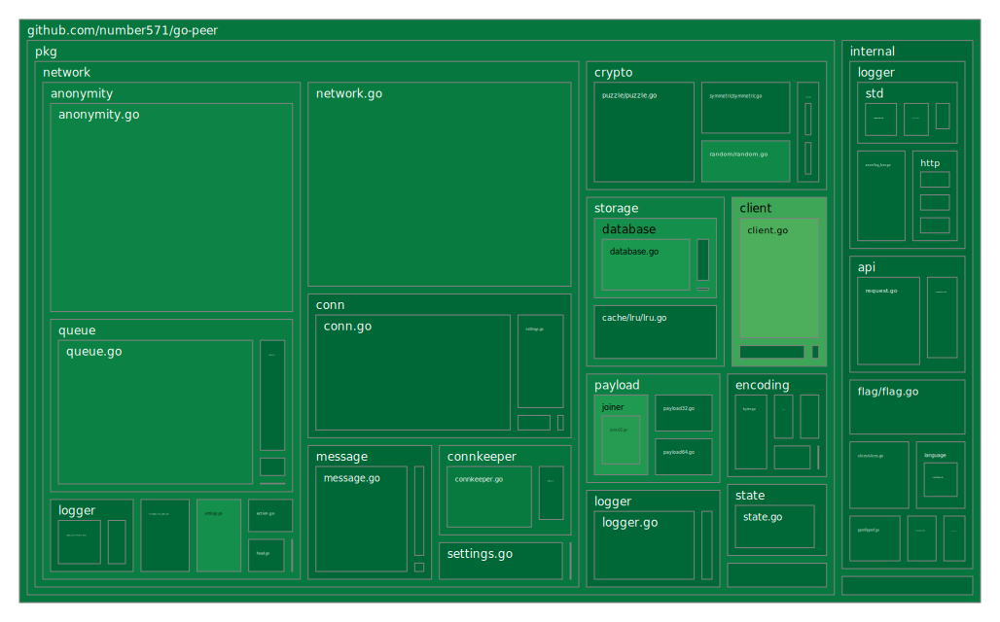

<p align="center">
    
</p>

<h2>
	<p align="center">
    	<strong>
        	Anonymity and Security without compromise
   		</strong>
	</p>
	<p align="center">
		<a href="https://github.com/topics/golang">
        	
		</a>
		<a href="https://github.com/number571/go-peer/releases">
        	
		</a>
		<a href="https://github.com/number571/go-peer/blob/master/LICENSE">
        	
		</a>
		<a href="https://github.com/number571/go-peer/actions">
        	
		</a>
		<a href="https://github.com/number571/go-peer/blob/ee4b08c309d6966bd31621ceb7b0826708ca5dfb/Makefile#L55">
        	
		</a>
		<a href="https://godoc.org/github.com/number571/go-peer">
        	
		</a>
		<a href="https://github.com/avelino/awesome-go">
        	
		</a>
	</p>
	<p align="center">
		<a href="https://goreportcard.com/report/github.com/number571/go-peer">
        	
		</a>
		<a href="https://github.com/number571/go-peer/pulse">
        	
		</a>
		<a href="https://github.com/number571/go-peer/commits/master">
        	
		</a>
		<a href="https://github.com/number571/go-peer/blob/ee4b08c309d6966bd31621ceb7b0826708ca5dfb/Makefile#L55">
        	
		</a>
		<a href="https://img.shields.io/github/languages/code-size/number571/go-peer.svg">
        	
		</a>
		<a href="https://img.shields.io/github/downloads/number571/go-peer/total.svg">
        	
		</a>
	</p>
	<p align="center">
		<a href="https://vk.me/join/6Px6b0Qh/uZIK4ixUYWQm4Krepzq5xbYjYw=">
        	
		</a>
		<a href="https://t.me/+9Kcxr8NyeU8zZDZi">
        	
		</a>
	</p>
	About project
</h2>

The `go-peer` library contains a large number of functions necessary to ensure the security of transmitted or stored information, as well as for the anonymity of nodes in the decentralized form. The library can be divided into several main `pkg` modules:

1. The `crypto` module represents cryptographic primitives: 1) asymmetric encryption, decryption; 2) asymmetric signing and signature verification; 3) symmetric encryption and decryption; 4) hashing; 5) key building; 6) computational problems (puzzles); 7) cryptographically stable pseudorandom number generator.
2. The `crypto/hybrid/client` module for encrypting and decrypting information with the attached data integrity (hash) and authentication (signature). It is a basic part of the `anonymity/qb` module.
3. The `network` module is a decentralized communication between network nodes. Allows you to delimit networks and give information a random appearance using the network key.
4. The `anonymity/qb` module to ensure anonymity based on the fifth^ stage. Presents the main functions for working with the network on top of the `anonymity/qb/adapters` and `anonymity/qb/queue` modules.
5. The `anonymity/qb/queue` module represents the generation, storage and issuance of encrypted messages every time the period specified by the application is reached. Uses the `crypto/hybrid/client`, `message/layer1` and `message/layer2` modules.

> Examples of works in the directories [pkg/crypto/hybrid/client/examples](pkg/crypto/hybrid/client/examples/), [pkg/network/examples](pkg/network/examples/), [pkg/anonymity/qb/examples](pkg/anonymity/qb/examples/), [pkg/anonymity/qb/queue/examples](pkg/anonymity/qb/queue/examples/);

## Coverage map

<p align="center"></p>

## Installation

```bash
$ go get github.com/number571/go-peer
```

## Requirements

1. Go version `>= 1.23`

## Releases

All cmd programs are compiled for {`amd64`, `arm64`} ARCH and {`windows`, `linux`, `darwin`} OS as pattern = `appname_arch_os`. In total, one application is compiled into six versions. The entire list of releases can be found here: [github.com/number571/go-peer/releases](https://github.com/number571/go-peer/releases "releases"). 

## Dependencies

1. Go library [go.etcd.io/bbolt](https://github.com/etcd-io/bbolt "bbolt") (used by `pkg/storage/database`)
2. Go library [golang.org/x/crypto](https://golang.org/x/crypto "x/crypto") (used by `pkg/crypto/keybuilder`)
3. Go library [gopkg.in/yaml.v2](https://gopkg.in/yaml.v2 "yaml.v2") (used by `pkg/encoding`)
4. Go library [github.com/cloudflare/circl](https://github.com/cloudflare/circl "circl") (used by `pkg/crypto/asymmetric`)

### Makefile

There are a number of dependencies that represent separate applications for providing additional information about the quality of the code. These applications are not entered into the project, but are loaded via the `make install-deps` command. The list of applications is as follows:

1. golangci-lint [github.com/golangci/golangci-lint@v2.1.2](https://github.com/golangci/golangci-lint/tree/v2.1.2)
2. go-cover-treemap [github.com/nikolaydubina/go-cover-treemap@v1.4.2](https://github.com/nikolaydubina/go-cover-treemap/tree/v1.4.2)

## Theoretical works

1. [Theory of the structure of hidden systems](https://github.com/number571/go-peer/blob/master/docs/theory_of_the_structure_of_hidden_systems.pdf "TotSoHS")
2. [Monolithic cryptographic protocol](https://github.com/number571/go-peer/blob/master/docs/monolithic_cryptographic_protocol.pdf "MCP")
3. [Abstract anonymous networks](https://github.com/number571/go-peer/blob/master/docs/abstract_anonymous_networks.pdf "AAN")
4. [Decentralized key exchange protocol](https://github.com/number571/go-peer/blob/master/docs/decentralized_key_exchange_protocol.pdf "DKEP")

Also, the composition of these works can be found in the book `The general theory of anonymous communications` ([Ridero](https://ridero.ru/books/obshaya_teoriya_anonimnykh_kommunikacii/)). This book can be purchased in a tangible form on the [Ozon](https://www.ozon.ru/product/obshchaya-teoriya-anonimnyh-kommunikatsiy-vtoroe-izdanie-kovalenko-a-g-1193224608/) and [Wildberries](https://www.wildberries.ru/catalog/177390621/detail.aspx) marketplaces. You can download the book in digital form for free [here](https://github.com/number571/go-peer/blob/master/docs/general_theory_of_anonymous_communications.pdf).

## How can you help the project

1. Find bugs, vulnerabilities, and errors in the code
2. Suggest improvements, ask questions, create issues
3. Append new theoretical works or update current
4. Create new secure / anonymity applications
5. Popularize technology and applications

## Library based applications

1. Anonymous network «[Hidden Lake](https://github.com/number571/hidden-lake)»
2. Console messenger «[secpy-chat](https://github.com/number571/secpy-chat)» based on Hidden Lake services `HLT`, `HLE`

## Star History

[](https://star-history.com/#number571/go-peer&Date)

## License

Licensed under the MIT License. See [LICENSE](LICENSE) for the full license text.

**[⬆ back to top](#installation)**
