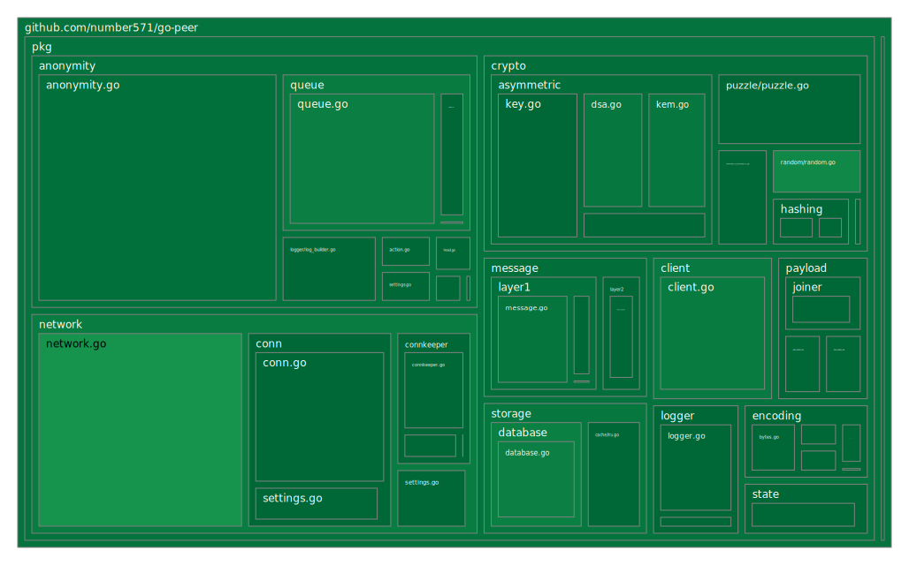

<p align="center">
    
</p>

<h2>
	<p align="center">
    	<strong>
        	Anonymity and Security without compromise
   		</strong>
	</p>
	<p align="center">
		<a href="https://github.com/topics/golang">
        	
		</a>
		<a href="https://github.com/number571/go-peer/releases">
        	
		</a>
		<a href="https://github.com/number571/go-peer/blob/master/LICENSE">
        	
		</a>
		<a href="https://github.com/number571/go-peer/actions">
        	
		</a>
		<a href="https://github.com/number571/go-peer/blob/ee4b08c309d6966bd31621ceb7b0826708ca5dfb/Makefile#L55">
        	
		</a>
		<a href="https://godoc.org/github.com/number571/go-peer">
        	
		</a>
		<a href="https://github.com/avelino/awesome-go">
        	
		</a>
	</p>
	<p align="center">
		<a href="https://goreportcard.com/report/github.com/number571/go-peer">
        	
		</a>
		<a href="https://github.com/number571/go-peer/pulse">
        	
		</a>
		<a href="https://github.com/number571/go-peer/commits/master">
        	
		</a>
		<a href="https://github.com/number571/go-peer/blob/ee4b08c309d6966bd31621ceb7b0826708ca5dfb/Makefile#L55">
        	
		</a>
		<a href="https://img.shields.io/github/languages/code-size/number571/go-peer.svg">
        	
		</a>
		<a href="https://img.shields.io/github/downloads/number571/go-peer/total.svg">
        	
		</a>
	</p>
	<p align="center">
		<a href="https://vk.me/join/6Px6b0Qh/uZIK4ixUYWQm4Krepzq5xbYjYw=">
        	
		</a>
	</p>
	About project
</h2>

> [!WARNING]
> The go-peer package and the Hidden Lake anonymous network are under `active development`. New versions may not be compatible with the old ones. As a result, it is necessary to use the latest release versions in order to keep up to date.

The `go-peer` library contains a large number of functions necessary to ensure the security of transmitted or stored information, as well as for the anonymity of nodes in the decentralized form. The library can be divided into several main `pkg` modules:

1. The `crypto` module represents cryptographic primitives: 1) asymmetric encryption, decryption; 2) asymmetric signing and signature verification; 3) symmetric encryption and decryption; 4) hashing; 5) key building; 6) computational problems (puzzles); 7) cryptographically stable pseudorandom number generator.
2. The `client` module for encrypting and decrypting information with the attached data integrity (hash) and authentication (signature). It is a basic part of the `network/anonymity` module.
3. The `network` module is a decentralized communication between network nodes. Allows you to delimit networks and give information a random appearance using the network key.
4. The `network/anonymity` module to ensure anonymity based on the fifth^ stage. Presents the main functions for working with the network on top of the `network` and `network/anonymity/queue` modules.
5. The `network/anonymity/queue` module represents the generation, storage and issuance of encrypted messages every time the period specified by the application is reached. Uses the `client`, `client/message` and `network/message` modules.
6. The `storage/database` module is a `key-value` database with the functions of value encryption and key hashing.

> Examples of works in the directories [pkg/client/examples](pkg/client/examples/), [pkg/network/examples](pkg/network/examples/), [pkg/network/anonymity/queue/examples](pkg/network/anonymity/queue/examples/), [pkg/network/anonymity/examples](pkg/network/anonymity/examples/);

## Coverage map

<p align="center"></p>

## Installation

```bash
$ go get github.com/number571/go-peer
```

## Requirements

1. Go version `>= 1.16`

## Releases

All cmd programs are compiled for {`amd64`, `arm64`} ARCH and {`windows`, `linux`, `darwin`} OS as pattern = `appname_arch_os`. In total, one application is compiled into six versions. The entire list of releases can be found here: [github.com/number571/go-peer/releases](https://github.com/number571/go-peer/releases "releases"). 

## Dependencies

> [!IMPORTANT]
> All dependencies are loaded into the go-peer project once using the `go mod vendor` command (for the Go language) or simply by installing (for other languages) and saved in it. This is done for security purposes, provided that dependency creators can modify the code in older versions.

1. Go library [go.etcd.io/bbolt](https://github.com/etcd-io/bbolt "bbolt") (used by `pkg/database`)
2. Go library [golang.org/x/net](https://golang.org/x/net "x/net") (used by `cmd/hidden_lake/applications/messenger`)
3. Go library [golang.org/x/crypto](https://golang.org/x/crypto "x/crypto") (used by `pkg/crypto/keybuilder`)
4. Go library [gopkg.in/yaml.v2](https://gopkg.in/yaml.v2 "yaml.v2") (used by `pkg/encoding`)
5. Go library [github.com/g8rswimmer/error-chain](https://github.com/g8rswimmer/error-chain "error-chain") (used by `pkg/utils`)
6. CSS/JS library [getbootstrap.com](https://getbootstrap.com "bootstrap") (used by `cmd/hidden_lake/applications/messenger|filesharer`)

### Makefile

There are a number of dependencies that represent separate applications for providing additional information about the quality of the code. These applications are not entered into the project, but are loaded via the `make install-deps` command. The list of applications is as follows:

1. golangci-lint [github.com/golangci/golangci-lint/cmd/golangci-lint@v1.57.2](https://github.com/golangci/golangci-lint/tree/v1.57.2)
2. go-cover-treemap [github.com/nikolaydubina/go-cover-treemap@v1.4.2](https://github.com/nikolaydubina/go-cover-treemap/tree/v1.4.2)

## Theoretical works

1. [Theory of the structure of hidden systems](https://github.com/number571/go-peer/blob/master/docs/theory_of_the_structure_of_hidden_systems.pdf "TotSoHS")
2. [Monolithic cryptographic protocol](https://github.com/number571/go-peer/blob/master/docs/monolithic_cryptographic_protocol.pdf "MCP")
3. [Abstract anonymous networks](https://github.com/number571/go-peer/blob/master/docs/abstract_anonymous_networks.pdf "AAN")
4. [Decentralized key exchange protocol](https://github.com/number571/go-peer/blob/master/docs/decentralized_key_exchange_protocol.pdf "DKEP")
5. [The Hidden Lake anonymous network](https://github.com/number571/go-peer/blob/master/docs/hidden_lake_anonymous_network.pdf "HLAN")

Also, the composition of these works (without "The Hidden Lake anonymous network") can be found in the book `The general theory of anonymous communications` ([Ridero](https://ridero.ru/books/obshaya_teoriya_anonimnykh_kommunikacii/)). This book can be purchased in a tangible form on the [Ozon](https://www.ozon.ru/product/obshchaya-teoriya-anonimnyh-kommunikatsiy-vtoroe-izdanie-kovalenko-a-g-1193224608/) and [Wildberries](https://www.wildberries.ru/catalog/177390621/detail.aspx) marketplaces. You can download the book in digital form for free [here](https://github.com/number571/go-peer/blob/master/docs/general_theory_of_anonymous_communications.pdf).

## How can you help the project

1. Find bugs, vulnerabilities, and errors in the code
2. Suggest improvements, ask questions, create issues
3. Create anonymizing nodes (HLS) in the Hidden Lake network
4. Create new relay nodes (HLT) in the Hidden Lake network
5. Append new theoretical works or update current
6. Create new secure / anonymity applications
7. Popularize technology and applications

## Library based applications

1. Anonymous network «[Hidden Lake](cmd/hidden_lake)»
2. Console messenger «[secpy-chat](cmd/secpy_chat)» based on Hidden Lake services `HLT`, `HLE`
3. Generator of asymmetric keys «[tkeygen](cmd/tools/keygen)» in `PrivKey{hex}`, `PubKey{hex}` format
3. Serverless and stateless password manager «[tpmanager](cmd/tools/pmanager)»

### Deprecated applications

Previously, some applications (such as HL, HLS, HES) were developed separately from the go-peer platform. Currently, these applications are outdated because they did not keep up with go-peer updates and were based on poor architectural solutions.

* [github.com/number571/hidden-lake](https://github.com/number571/hidden-lake "HL"); New version in the [cmd/hidden_lake](https://github.com/number571/go-peer/tree/master/cmd/hidden_lake)
* [github.com/number571/hls](https://github.com/number571/hls "HLS"); New version in the [cmd/hidden_lake/service](https://github.com/number571/go-peer/tree/master/cmd/hidden_lake/service)
* [github.com/number571/hes](https://github.com/number571/hes "HES"); It can be implemented using [HLT](https://github.com/number571/go-peer/tree/master/cmd/hidden_lake/helpers/traffic)

The difference between the old version of Hidden Lake and the new one is in the following details:
1. The new version is based on a model of theoretically provable anonymity (QB networks), while the old version was based on onion routing
2. The old version was a monolith, incorporating both transport logic, anonymizing, and applied. The new version is already based on the micro service architecture
3. The new version is located inside the go-peer framework (in the cmd directory), while the old one used go-peer as a library
4. The main anonymizing and transport functions in the new version of Hidden Lake (at the level of the go-peer framework) have been covered by tests and verified for security. In the old version, there were no tests at all

## Star History

[](https://star-history.com/#number571/go-peer&Date)

## License

Licensed under the MIT License. See [LICENSE](LICENSE) for the full license text.

**[⬆ back to top](#installation)**
