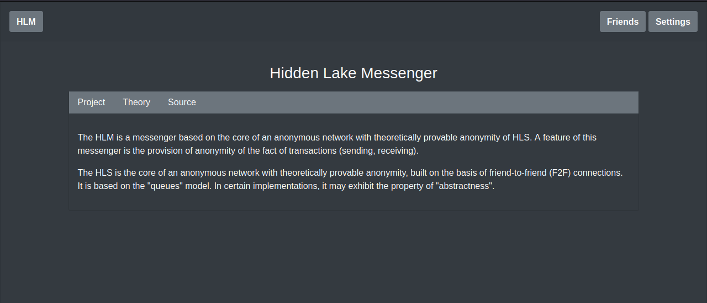
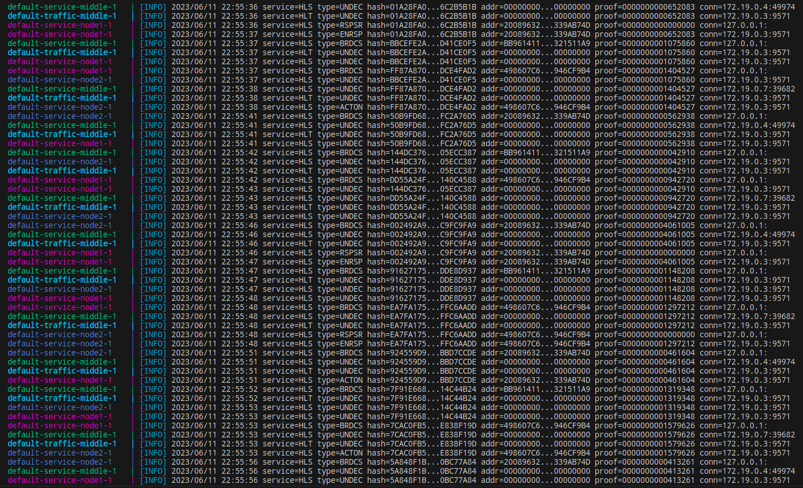

<p align="center">
    
</p>

<h2>
	<p align="center">
    	<strong>
        	Anonymity and Security without compromise
   		</strong>
	</p>
	<p align="center">
		<a href="https://github.com/topics/golang">
        	
		</a>
		<a href="https://github.com/number571/go-peer/actions">
        	
		</a>
		<a href="https://github.com/number571/go-peer/blob/master/LICENSE">
        	
		</a>
		<a href="https://github.com/number571/go-peer/releases">
        	
		</a>
		<a href="https://github.com/number571/go-peer/pulse">
        	
		</a>
		<a href="https://github.com/number571/go-peer/commits/master">
        	
		</a>
	</p>
	<p align="center">
		<a href="https://vk.me/join/6Px6b0Qh/uZIK4ixUYWQm4Krepzq5xbYjYw=">
        	
		</a>
	</p>
	About project
</h2>

The `go-peer` library contains a large number of functions necessary to ensure the security of transmitted or stored information, as well as for the anonymity of nodes in the decentralized form. The library can be divided into several main modules:

1. The `crypto` module represents cryptographic primitives: 1) asymmetric encryption, decryption; 2) asymmetric signing and signature verification; 3) symmetric encryption and decryption; 4) hashing; 5) entropy enhancement; 6) computational problems (puzzles); 7) cryptographically stable pseudorandom number generator.
2. The `client` module for encrypting and decrypting information with the attached data integrity (hash), authentication (signature) and confirmation (work). It is a basic part of the `anonymity` module.
3. The `client/queue` module represents the generation, storage and issuance of encrypted messages every time the period specified by the application is reached. Uses the `client` module.
4. The `network` module is a decentralized communication between network nodes. It does not represent any protection of information and anonymity of participants.
5. The `network/anonymity` module to ensure anonymity based on the fifth stage. Presents the main functions for working with the network on top of the `network` and `queue` modules.
6. The `storage` module includes `crypto` type storage. This type of storage can be used for secure storage of passwords and private keys.
7. The `storage/database` module is a `key-value` database with the functions of value encryption and key hashing inherited from the `storage` module.

> Examples of works in the directory [github.com/number571/go-peer/examples](https://github.com/number571/go-peer/tree/master/examples "Examples");

## Installation

```bash
$ go get github.com/number571/go-peer
```

## Requirements

1. Go version `>= 1.16`

## Dependencies

1. Go library (used by `pkg/storage/database`) [github.com/syndtr/goleveldb](https://github.com/syndtr/goleveldb "goleveldb");
2. Go library (used by `cmd/hidden_lake/messenger`) [github.com/boombuler/barcode](https://github.com/boombuler/barcode "boombuler/barcode");
3. Go library (used by `cmd/hidden_lake/messenger`) [golang.org/x/net](https://golang.org/x/net "x/net");
4. CSS/JS library (used by `cmd/hidden_lake/messenger`) [getbootstrap.com](https://getbootstrap.com "bootstrap")

## Library based applications

1. [Hidden Lake Service](#1-hidden-lake-service) 
2. [Hidden Lake Messenger](#2-hidden-lake-messenger) 
3. [Hidden Lake Traffic](#3-hidden-lake-traffic) 
4. [Hidden Lake Adapters](#4-hidden-lake-adapters) 

## 1. Hidden Lake Service

> [github.com/number571/go-peer/cmd/hidden_lake/service](https://github.com/number571/go-peer/tree/master/cmd/hidden_lake/service "HLS")


The `Hidden Lake Service` is the core of an anonymous network with theoretically provable anonymity. HLS is based on the `fifth^ stage` of anonymity and is an implementation of an `abstract` anonymous network based on `queues`. It is a `peer-to-peer` network communication with trusted `friend-to-friend` participants. All transmitted and received messages are in the form of `end-to-end` encryption.

Features / Anonymity networks |  Queue-networks (5^stage)               |  Entropy-networks (6stage)              |  DC-networks (1^stage)
:-----------------------------:|:-----------------------------:|:------------------------------:|:------------------------------:
Theoretical provability  |  +  |  +  |  + |
Ease of software implementation  |  +  |  -  |  - |
Polymorphism of information  |  -  |  +  |  + |
Static communication delay  |  +  |  -  |  + |
Network scales easily  |  -  |  -  |  - |

A feature of HLS (compared to many other anonymous networks) is its easy adaptation to a hostile centralized environment. Anonymity can be restored literally from one node in the network, even if it is the only point of failure.

> More information about HLS in the [habr.com/ru/post/696504](https://habr.com/ru/post/696504/ "Habr HLS")

### How it works

Each network participant sets a message generation period for himself (the period can be a network constant for all system participants). When one cycle of the period ends and the next begins, each participant sends his encrypted message to all his connections (those in turn to all of their own, etc.). If there is no true message to send, then a pseudo message is generated (filled with random bytes) that looks like a normal encrypted one. The period property ensures the anonymity of the sender.

<p align="center"></p>
<p align="center">Figure 1. Queue and message generation in HLS.</p>

Since the encrypted message does not disclose the recipient in any way, each network participant tries to decrypt the message with his private key. The true recipient is only the one who can decrypt the message. At the same time, the true recipient acts according to the protocol and further distributes the received packet, even knowing the meaninglessness of the subsequent dispatch. This property makes it impossible to determine the recipient.

> Simple example of the `client` package (encrypt/decrypt functions) in the directory [github.com/number571/go-peer/pkg/client/_examples](https://github.com/number571/go-peer/tree/master/pkg/client/_examples "Package client");

<p align="center"></p>
<p align="center">Figure 2. Two participants are constantly generating messages for their periods on the network. It is impossible to determine their real activity.</p>

Data exchange between network participants is carried out using application services. HLS has a dual role: 1) packages traffic from pure to anonymizing and vice versa; 2) converts external traffic to internal and vice versa. The second property is the redirection of traffic from the network to the local service and back.

<p align="center"></p>
<p align="center">Figure 3. Interaction of third-party services with the traffic anonymization service.</p>

As shown in the figure above, HLS acts as an anonymizer and handlers of incoming and outgoing traffic. The remaining parts in the form of applications and services depend on third-party components (as an example, `HLM`).

###  More details in the works 

1. [Theory of the structure of hidden systems](https://github.com/number571/go-peer/blob/master/docs/theory_of_the_structure_of_hidden_systems.pdf "TotSoHS")
2. [Monolithic cryptographic protocol](https://github.com/number571/go-peer/blob/master/docs/monolithic_cryptographic_protocol.pdf "MCP")
3. [Abstract anonymous networks](https://github.com/number571/go-peer/blob/master/docs/abstract_anonymous_networks.pdf "AAN")

### Supported platforms

- Windows (x86_64, arm64)
- Linux (x86_64, arm64)
- MacOS (x86_64, arm64)

### Minimum system requirements

1. Processor: `1x2.2GHz` (limit of communication = ~4 nodes)
2. Memory: `0.5GB RAM` (~250MB of memory is consumed)
3. Storage: `5Gib available space` (the size of hashes per year from one node)

### Build and run

Default build and run

```bash 
$ cd ./cmd/hidden_lake/service
$ make build # create hls, hls_[arch=amd64,arm64]_[os=linux,windows,darwin] and copy to ./bin
$ make run # run ./bin/hls

> [INFO] 2023/06/03 14:32:40 HLS is running...
> [INFO] 2023/06/03 14:32:42 service=HLS type=BRDCS hash=43A5E9C5...BA73DF43 addr=211494E4...EEA12BBC proof=0000000002256145 conn=127.0.0.1:
> [INFO] 2023/06/03 14:32:47 service=HLS type=BRDCS hash=EFDDC1D4...C47588AD addr=211494E4...EEA12BBC proof=0000000000090086 conn=127.0.0.1:
> [INFO] 2023/06/03 14:32:52 service=HLS type=BRDCS hash=8549E257...EDEB2748 addr=211494E4...EEA12BBC proof=0000000000634328 conn=127.0.0.1:
> ...
```

Service was running with random private key. Open ports `9571` (TCP, traffic) and `9572` (HTTP, interface).
Creates `./hls.cfg` or `./_mounted/hls.cfg` (docker) and `./hls.db` or `./_mounted/hls.db` (docker) files. 
The file `hls.db` stores hashes of sent/received messages.

Default config `hls.cfg`

```json
{
	"settings": {
		"message_size_bytes": 1048576,
		"work_size_bits": 20,
		"key_size_bits": 4096,
		"queue_period_ms": 5000
	},
	"logging": [
		"info",
		"warn",
		"erro"
	],
	"address": {
		"tcp": ":9571",
		"http": ":9572"
	},
	"services": {
		"go-peer/hidden-lake-messenger": "127.0.0.1:9592"
	}
}
```

If service works not in docker's enviroment than need rewrite connection host in `hls.cfg` file from `messenger`to IP address (example: `127.0.0.1:9592` for local network).

Build and run with docker

```bash 
$ cd ./cmd/hidden_lake/service
$ make docker-build 
$ make docker-run

> [INFO] 2023/06/03 07:36:49 HLS is running...
> [INFO] 2023/06/03 07:36:51 service=HLS type=BRDCS hash=AF90439F...9F29A036 addr=BB58A8A2...B64D62C2 proof=0000000000479155 conn=127.0.0.1:
> [INFO] 2023/06/03 07:36:56 service=HLS type=BRDCS hash=2C4CE60A...E55BF9C4 addr=BB58A8A2...B64D62C2 proof=0000000000521434 conn=127.0.0.1:
> [INFO] 2023/06/03 07:37:01 service=HLS type=BRDCS hash=A9285F98...F96DB93D addr=BB58A8A2...B64D62C2 proof=0000000001256786 conn=127.0.0.1:
> ...
```

### Example

There are three nodes in the network `send_hls`, `recv_hls` and `middle_hls`. The `send_his` and `recv_hls` nodes connects to `middle_hls`. As a result, a link of the form `send_his <-> middle_hls <-> recv_hls` is created. Due to the specifics of HLS, the centralized `middle_hls` node does not violate the security and anonymity of the `send_hls` and `recv_hls` subjects in any way. All nodes, including the `middle_hls` node, set periods and adhere to the protocol of constant message generation.

The `recv_hls` node contains its `echo_service`, which performs the role of redirecting the request body back to the client as a response. Access to this service is carried out by its alias `hidden-echo-service`, put forward by the recv_hls node.

```go
...
// handle: "/echo"
// return format: {"echo":string,"return":int}
func echoPage(w http.ResponseWriter, r *http.Request) {
	if r.Method != "POST" {
		response(w, 2, "failed: incorrect method")
		return
	}
	res, err := io.ReadAll(r.Body)
	if err != nil {
		response(w, 3, "failed: read body")
		return
	}
	response(w, 1, string(res))
}
...
```

Identification between `recv_hls` and `send_hls` nodes is performed using public keys. This is the main method of identification and routing in the HLS network. IP addresses are only needed to connect to such a network and no more. Requests and responses structure are HEX encoded.

Structure of request. The body `hello, world!` is encoded base64.
```bash
JSON_DATA='{
        "method":"POST",
        "host":"hidden-echo-service",
        "path":"/echo",
        "head":{
            "Accept": "application/json"
        },
        "body":"aGVsbG8sIHdvcmxkIQ=="
}';
```

Request format
```bash
PUSH_FORMAT='{
        "receiver":"PubKey(go-peer/rsa){3082020A0282020100B752D35E81F4AEEC1A9C42EDED16E8924DD4D359663611DE2DCCE1A9611704A697B26254DD2AFA974A61A2CF94FAD016450FEF22F218CA970BFE41E6340CE3ABCBEE123E35A9DCDA6D23738DAC46AF8AC57902DDE7F41A03EB00A4818137E1BF4DFAE1EEDF8BB9E4363C15FD1C2278D86F2535BC3F395BE9A6CD690A5C852E6C35D6184BE7B9062AEE2AFC1A5AC81E7D21B7252A56C62BB5AC0BBAD36C7A4907C868704985E1754BAA3E8315E775A51B7BDC7ACB0D0675D29513D78CB05AB6119D3CA0A810A41F78150E3C5D9ACAFBE1533FC3533DECEC14387BF7478F6E229EB4CC312DC22436F4DB0D4CC308FB6EEA612F2F9E00239DE7902DE15889EE71370147C9696A5E7B022947ABB8AFBBC64F7840BED4CE69592CAF4085A1074475E365ED015048C89AE717BC259C42510F15F31DA3F9302EAD8F263B43D14886B2335A245C00871C041CBB683F1F047573F789673F9B11B6E6714C2A3360244757BB220C7952C6D3D9D65AA47511A63E2A59706B7A70846C930DCFB3D8CAFB3BD6F687CACF5A708692C26B363C80C460F54E59912D41D9BB359698051ABC049A0D0CFD7F23DC97DA940B1EDEAC6B84B194C8F8A56A46CE69EE7A0AEAA11C99508A368E64D27756AD0BA7146A6ADA3D5FA237B3B4EDDC84B71C27DE3A9F26A42197791C7DC09E2D7C4A7D8FCDC8F9A5D4983BB278FCE9513B1486D18F8560C3F31CC70203010001}",
        "hex_data":"'$(str2hex "$JSON_DATA")'"
}';
```

Build and run nodes
```bash
$ cd examples/echo_service/default
$ make
```

Logs from `middle_hls` node. When sending requests and receiving responses, `middle_hls` does not see the action. For him, all actions and moments of inaction are equivalent.

<p align="center"></p>
<p align="center">Figure 4. Output of all actions and all received traffic from the middle_hls node.</p>

Send request
```bash
$ cd examples/echo_service
$ ./request.sh
```

Get response
```bash
HTTP/1.1 200 OK
Date: Mon, 22 May 2023 18:18:34 GMT
Content-Length: 113
Content-Type: text/plain; charset=utf-8

{"code":200,"head":{"Content-Type":"application/json"},"body":"eyJlY2hvIjoiaGVsbG8sIHdvcmxkISIsInJldHVybiI6MX0K"}
Request took 8 seconds
```

Return code 200 is HTTP code = StatusOK. Decode base64 response body
```bash
echo "eyJlY2hvIjoiaGVsbG8sIHdvcmxkISIsInJldHVybiI6MX0K" | base64 -d
> {"echo":"hello, world!","return":1}
```

<p align="center"></p>
<p align="center">Figure 5. Example of running HLS with internal service.</p>

Also you can run example with docker-compose. In this example, all nodes have logging enabled
```bash
$ cd examples/echo_service/_docker/default
$ make
```

> Simple examples of the `anonymity` package in the directory [github.com/number571/go-peer/pkg/network/anonymity/_examples](https://github.com/number571/go-peer/tree/master/pkg/network/anonymity/_examples "Package anonymity");

## 2. Hidden Lake Messenger

> [github.com/number571/go-peer/cmd/hidden_lake/messenger](https://github.com/number571/go-peer/tree/master/cmd/hidden_lake/messenger "HLM");


The `Hidden Lake Messenger` is a messenger based on the core of an anonymous network with theoretically provable anonymity of HLS. A feature of this messenger is the provision of anonymity of the fact of transactions (sending, receiving).

HLM is an application that implements a graphical user interface (GUI) on a browser-based HTML/CSS/JS display. Most of the code is based on the bootstrap library https://getbootstrap.com /. GUI is adapted to the size of the window, so it can be used both in a desktop and in a smartphone.

> More information about HLM in the [habr.com/ru/post/701488](https://habr.com/ru/post/701488/ "Habr HLM")

### How it works

Most of the code is a call to API functions from the HLS kernel. However, there are additional features aimed at the security of the HLM application itself.

<p align="center"></p>
<p align="center">Figure 6. Example of chat room in HLM.</p>

Firstly, there is registration and authorization, which does not exist in the HLS core. Registration performs the role of creating / depositing a private key `PrivKey` in order to save it through encryption. 

The encryption of the private key is carried out on the basis of the entered `login (L) / password (P)`, where the login acts as a cryptographic salt. The concatenation of the login and password `L||P` is hashed `2^20` times `K = H(L||H(...L||(H(L||P)...))` to increase the password security by about `20 bits` of entropy and turn it into an encryption key `K`. The resulting `K` is additionally hashed by `H(K)` and stored together with the encrypted version of the private key `Q = E(K, PrivKey)`.

<p align="center"></p>
<p align="center">Figure 7. Data encryption with different types of input parameters.</p>

Authorization is performed by entering a `login/password`, their subsequent conversion to `K' and H(K')`, subsequent comparison with the stored hash `H(K) = H(K')?` and subsequent decryption of the private key `D(K, Q) = D(K, E(K, PrivKey)) = PrivKey`.

Secondly, the received key K is also used to encrypt all incoming and outgoing messages `C = E(K, M)`. All personal encrypted messages `C` are stored in the local database of each individual network participant.

### Supported platforms

- Windows (x86_64, arm64)
- Linux (x86_64, arm64)
- MacOS (x86_64, arm64)

### Build and run

Default build and run

```bash 
$ cd ./cmd/hidden_lake/messenger
$ make build # create hlm, hlm_[arch=amd64,arm64]_[os=linux,windows,darwin] and copy to ./bin
$ make run # run ./bin/hlm

> [INFO] 2023/06/03 15:30:31 HLM is running...
> ...
```

Open ports `9591` (HTTP, interface) and `9592` (HTTP, incoming).
Creates `./hlm.cfg` or `./_mounted/hlm.cfg` (docker), `./hlm.db` or `./_mounted/hlm.db` (docker) files and `./hlm.stg` or `./_mounted/hlm.stg` (docker).
The file `hlm.db` stores all sent/received messages in encrypted view. The file `hlm.stg` stores all auth information (logins, passwords, private keys) in encrypted view.

Default config `hlm.cfg`

```json
{
	"settings": {
		"message_size_bytes": 1048576,
		"work_size_bits": 20,
		"key_size_bits": 4096
	},
	"logging": [
		"info",
		"warn",
		"erro"
	],
	"address": {
		"interface": ":9591",
		"incoming": ":9592"
	},
	"connection": {
		"service": "127.0.0.1:9572",
		"traffic": "127.0.0.1:9582"
	}
}
```

If messenger works not in docker's enviroment than need rewrite connection hosts in `hlm.cfg` file from `service` and `traffic` to IP addresses (example: `127.0.0.1:9572` and also `127.0.0.1:9581` for local network).

Build and run with docker

```bash 
$ cd ./cmd/hidden_lake/messenger
$ make docker-build 
$ make docker-run

> [INFO] 2023/06/03 08:35:50 HLM is running...
> ...
```

### Example

The example will involve (as well as in HLS) three nodes `middle_hls, node1_hlm and node2_hlm`. The first one is only needed for communication between `node1_hlm` and `node2_hlm` nodes. Each of the remaining ones is a combination of HLS and HLM, where HLM plays the role of an application and services, as it was depicted in `Figure 3`.

Build and run nodes
```bash
$ cd examples/anon_messenger/default
$ make
```

The output of the `middle_hls` node is similar to `Figure 4`.
Than open browser on `localhost:8080`. It is a `node1_hlm`. This node is a Bob.

<p align="center"></p>
<p align="center">Figure 8. Home page of the HLM application.</p>

Next, you need to login by going to the Sign in page. Enter your `login=user` and `password=password` than the private key, friends and connections will be automatically loaded from the storage.

To see the success of sending and receiving messages, you need to do all the same operations, but with `localhost:7070` as `node2_hlm`. This node will be Alice.

Also you can run example with docker-compose. In this example, all nodes have logging enabled
```bash
$ cd examples/anon_messenger/_docker/default
$ make
```

<p align="center"></p>
<p align="center">Figure 9. Log of the three nodes with request/response actions.</p>

> More example images about HLM pages in the [github.com/number571/go-peer/cmd/hidden_lake/messenger/_images](https://github.com/number571/go-peer/tree/master/cmd/hidden_lake/messenger/_images "Path to HLM images")

## 3. Hidden Lake Traffic

> [github.com/number571/go-peer/cmd/hidden_lake/traffic](https://github.com/number571/go-peer/tree/master/cmd/hidden_lake/traffic "HLT");


The `Hidden Lake Traffic` is an application that saves traffic passed through HLS. The saved traffic can be used by other applications when they were offline. HLT provides an API for loading and unloading messages. Messages are stored in the database based on the "ring" structure. Thus, new messages will overwrite the old ones after some time.

> More information about HLT in the [habr.com/ru/post/717184](https://habr.com/ru/post/717184/ "Habr HLT")

### How it works

HLT emulates HLS to receive messages. In this scenario, HLT has only the functions of accepting messages, without the ability to generate or send them via HLS or independently.

<p align="center"></p>
<p align="center">Figure 10. Example of running HLT client.</p>

### Supported platforms

- Windows (x86_64, arm64)
- Linux (x86_64, arm64)
- MacOS (x86_64, arm64)

### Build and run

Default build and run

```bash 
$ cd ./cmd/hidden_lake/traffic
$ make build # create hlt, hlt_[arch=amd64,arm64]_[os=linux,windows,darwin] and copy to ./bin
$ make run # run ./bin/hlt

> [INFO] 2023/06/03 15:39:13 HLT is running...
> ...
```

Open ports `9581` (HTTP, interface).
Creates `./hlt.cfg` or `./_mounted/hlt.cfg` (docker), `./hlt.db` or `./_mounted/hlt.db` (docker) files.
The file `hlm.db` stores all sent/received messages as structure `ring` from network HL. 

Default config `hlt.cfg`

```json
{
	"settings": {
		"message_size_bytes": 1048576,
		"work_size_bits": 20,
		"messages_capacity": 1000
	},
	"logging": [
		"info",
		"warn",
		"erro"
	],
	"address": {
		"tcp": ":9581",
		"http": ":9582"
	},
	"connections": [
		"127.0.0.1:9571"
	]
}
```

If traffic works not in docker's enviroment than need rewrite connection host in `hlt.cfg` file from `service` to IP address (example: `127.0.0.1:9571` for local network).

Build and run with docker

```bash 
$ cd ./cmd/hidden_lake/traffic
$ make docker-build 
$ make docker-run

> [INFO] 2023/06/03 08:44:14 HLT is running...
> ...
```

### Example 

Build and run service
```bash
$ cd examples/traffic_keeper
$ make
```

Run client
```bash
$ cd client
$ go run ./main.go w 'hello, world!'
$ go run ./main.go h
$ go run ./main.go r cb3c6558fe0cb64d0d2bad42dffc0f0d9b0f144bc24bb8f2ba06313af9297be4 # hash get by 'h' option
```

## 4. Hidden Lake Adapters

> [github.com/number571/go-peer/cmd/hidden_lake/adapters](https://github.com/number571/go-peer/tree/master/cmd/hidden_lake/adapters "HLA")


The `Hidden Lake Adapters` are a way to exchange data between multiple HLS processes via third-party services. Thus, there is no need to use your own computing resources in the face of individual servers to store or distribute the traffic generated by HLS. 

> More information about HLA in the [habr.com/ru/post/720544](https://habr.com/ru/post/720544/ "Habr HLA")

### How it works

Adapters in their full execution represent one design template - "Flyweight". They are based on the composition of HLS and HLT processes.
Adapters adapt to the interfaces of the service for reading/writing data and, thanks to this, are able to conduct anonymizing traffic through the service.

<p align="center"></p>
<p align="center">Figure 11. Architecture of HLA.</p>

### Example 

Since the adapters are capable of performing the same functions as the source programs, without secret communication channels, then all the examples become similar. So, let's analyze one of the examples based on the echo service.

Build and run nodes
```bash
$ cd examples/echo_service/secret_channel
$ make
```

Send request
```bash
$ cd examples/echo_service
$ ./request.sh
```

Get response
```bash
HTTP/1.1 200 OK
Date: Mon, 22 May 2023 18:18:34 GMT
Content-Length: 113
Content-Type: text/plain; charset=utf-8

{"code":200,"head":{"Content-Type":"application/json"},"body":"eyJlY2hvIjoiaGVsbG8sIHdvcmxkISIsInJldHVybiI6MX0K"}
Request took 8 seconds
```

There are no external differences, but there are internal ones. While the original model assumed the presence of a middle_hls node through which all traffic was broadcast, there is no such intermediate node in the model based on secret communication channels, there is a service that performs its own logical functions that are in no way tied to traffic anonymization. And, thus, adapters use a third-party service in order to pass traffic through it.

<p align="center"></p>
<p align="center">Figure 12. Example of running HLA client.</p>

Similarly, you can use a more complex composition, as shown in the example `examples/anon_messenger/secret_channel`.

## Deprecated applications

* Hidden Lake (can be used as HLS+HLM+HLT+...): [github.com/number571/hidden-lake](https://github.com/number571/hidden-lake "HL");
* Hidden Email Service (HLT can be used as HES): [github.com/number571/hes](https://github.com/number571/hes "HES");
* Hidden Lake Service (new release = HLS): [github.com/number571/hls](https://github.com/number571/hls "HLS");
