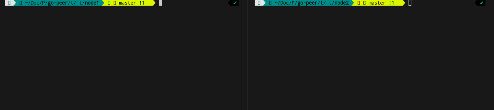

## M-A

> Micro-Anonymous network


The M-A network is based on a queue-based task (also as HL).

```bash
usage: 
    ./main [nickname] [host:port]
where:
    nickname - prints on another nodes
    host:port - listen address
```

> More information about M-A in the [habr.com/ru/articles/745256/](https://habr.com/ru/articles/745256/ "Habr M-A")

### How it works

<p align="center"></p>
<p align="center">Figure 1. Chat node1 with node2.</p>

In `_init/` directory should be exists `priv.key` (can be generated with `keygen` program), `auth.key` (key of network) and `connects.txt` (list of http nodes).
In `_keys/` directory should be exists public keys of nodes. The file names can be any. The attach to the public key is made via the `attach$` command.
By default program attach self public key. Therefore, if you write the `send$` command, you will send a message to yourself.

### Build and run

```bash
go run . node1 :7070
> attach$ node2.key
ok
> send$ hello, world!
> 
node2: hi!
>
```
