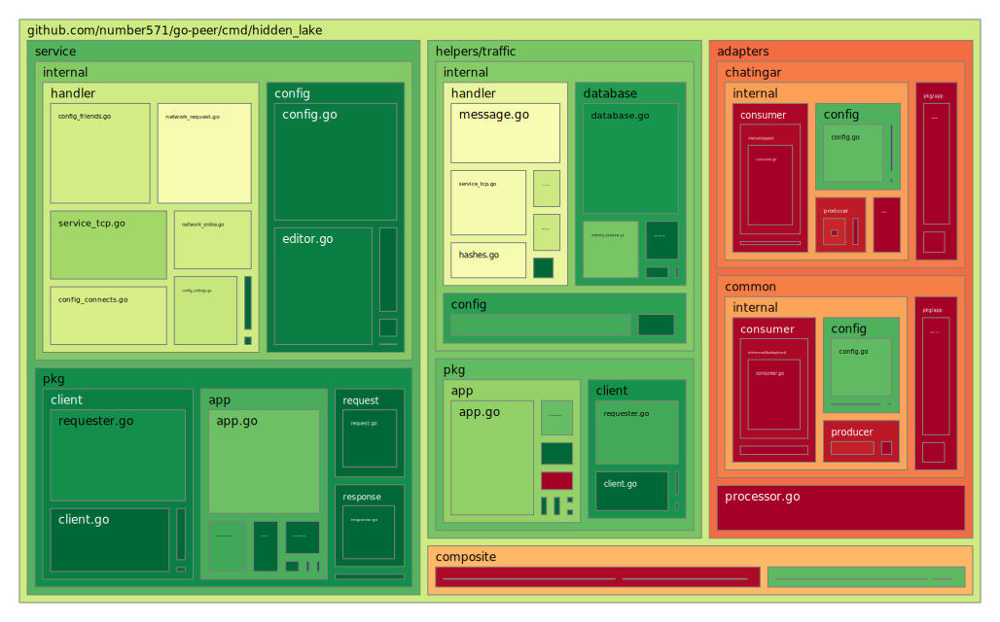
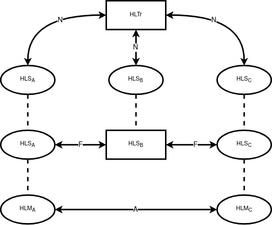
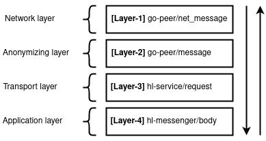
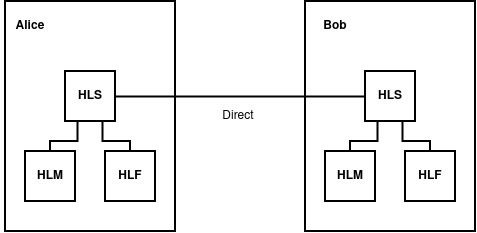
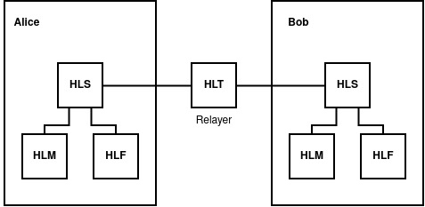

<h2>
	<p align="center">
    	<strong>
        	Theoretically Provable Anonymous Network
   		</strong>
	</p>
	<p align="center">
        <a href="https://github.com/topics/golang">
        	
		</a>
        <a href="https://github.com/number571/go-peer/releases">
        	
		</a>
        <a href="https://github.com/number571/go-peer/blob/master/LICENSE">
        	
		</a>
		<a href="https://github.com/number571/go-peer/blob/d06ff1b7d35ceb8fa779acda2e1335896b0afdb1/cmd/hidden_lake/Makefile#L50">
        	
		</a>
        <a href="https://pkg.go.dev/github.com/number571/go-peer/cmd/hidden_lake?status.svg">
        	
		</a>
        <a href="https://github.com/number571/go-peer">
        	
		</a>
        <a href="https://github.com/croqaz/awesome-decentralized">
        	
		</a>
        <a href="https://github.com/redecentralize/alternative-internet">
        	
		</a>
	</p>
	About project
</h2>

> [!IMPORTANT]
> The project is being actively developed, the implementation of some details may change over time. More information about the changes can be obtained from the [CHANGELOG.md](https://github.com/number571/go-peer/blob/master/CHANGELOG.md) file.

The `Hidden Lake` is an anonymous network built on a `micro-service` architecture. At the heart of HL is the core - `HLS` (service), which generates anonymizing traffic and combines many other services (for example, `HLT` and `HLM`). Thus, Hidden Lake is not a whole and monolithic solution, but a composition of several combined services.

By default, the anonymous Hidden Lake network is a `friend-to-friend` (F2F) network, which means building trusted communications. Due to this approach, members of the HL network can avoid `spam` in their direction, as well as `possible attacks` if vulnerabilities are found in the code.

> More information about HL in the [hidden_lake_anonymous_network.pdf](https://github.com/number571/go-peer/blob/master/docs/hidden_lake_anonymous_network.pdf "HLAN") and here [hidden_lake_anonymous_network_view.pdf](https://github.com/number571/go-peer/blob/master/docs/hidden_lake_anonymous_network_view.pdf "HLANv")

## List of applications

Basic | Applied | Helpers
:-----------------------------:|:-----------------------------:|:------------------------------:
[HL Service](service) | [HL Messenger](applications/messenger) | [HL Traffic](helpers/traffic)
[HL Composite](composite) | [HL Filesharer](applications/filesharer) | [HL Loader](helpers/loader)
[HL Adapters](adapters) | [HL Remoter](applications/remoter) | [HL Encryptor](helpers/encryptor)

## Coverage map

<p align="center"></p>

## How it works

The anonymous Hidden Lake network is an `abstract` network. This means that regardless of the system in which it is located and regardless of the number of nodes, as well as their location, the HL network remains anonymous. This property is achieved due to a theoretically provable `queue-based` problem. Its algorithm can be described as follows.

1. Each message is `encrypted` with the recipient's key,
2. The message is sent during the period `= T` to all network participants,
3. Period T of one participant regardless of periods `T1, T2, ..., Tn` of other participants,
4. If there is no message for the period T, then an `empty message` without a recipient is sent to the network,
5. Each participant `tries to decrypt` the message they received from the network.

<p align="center"></p>
<p align="center">Figure 1. Queue and message generation in HLS.</p>

According to the interaction of nodes with each other, the Hidden Lake network scheme can be represented in the form of three layers: `network` (N), `friendly` (F), and `application` (A).

1. The network layer ensures the `transfer of raw bytes` from one node to another. HLS and HLT services interact at this level. HLT is an auxiliary service that is used to relay messages from HLS. The HLT can be replaced by an HLS node.
2. The friendly layer (also known as anonymizing) performs the function of `anonymizing traffic` by setting up a list of friends and queue control on the side of the HLS service. Cryptographic routing based on public keys works at this level.
3. The application layer boils down to using the final `logic of the application` itself to transmit and receive messages. One of the main tasks of this level is to control data security, provided that intermediate (group) HLS nodes exist/are used.

<p align="center"></p>
<p align="center">Figure 2. The scheme of the anonymous Hidden Lake network.</p>

The above-described paradigm of dividing the interactions of network participants into levels can also be displayed through the prism of `message layers`. Unlike the method of separation according to the interaction of nodes with each other, in which there were three levels, there are four levels at the level of consideration of the message structure. This is due to the fact that the second and third levels are interconnected through an HLS service that performs the role of anonymization and message transportation.

<p align="center"></p>
<p align="center">Figure 3. The layers of the Hidden Lake message.</p>

Since the anonymous Hidden Lake network is formed due to the microservice architecture, some individual services can be used `outside` the HL architecture due to the common `go-peer` protocol. For example, it becomes possible to create messengers with `end-to-end encryption` based on HLT and HLE services, bypassing the anonymizing HLS service (as example [secpy-chat](https://github.com/number571/go-peer/tree/master/cmd/secpy_chat "Secpy-Chat")).

> You can find out more about the message levels using the following schemes: 
> [layer-1](https://github.com/number571/go-peer/blob/master/images/go-peer_layer1_net_message.jpg), 
> [layer-2](https://github.com/number571/go-peer/blob/master/images/go-peer_layer2_message.jpg), 
> [layer-3](_images/hl_layer3_request.jpg), 
> All schemes can be found in the [hidden_lake_message_layers.svg](https://github.com/number571/go-peer/blob/master/docs/hidden_lake_message_layers.svg) file.

## Possible ways of application

The anonymous Hidden Lake network is similar in the way it is used to client-secure applications such as `RetroShare` or `Bitmessage`. The main difference from the last two applications is the existence of an anonymizing property, which makes HL also related to existing closed anonymous p2p networks of the `I2P` type. However, the Hidden Lake network is not an ordinary composition of two ideas in the face of combining traffic anonymization and client-secure application architecture, because among other things, it is also an `abstract` anonymous network. As a result, HL network, for successful anonymization of traffic, criteria such as the level of centralization, the number of nodes in the network, the location and connection of nodes among themselves become irrelevant.

On the basis of this characteristic, methods of possible application also begin to be built:

1. Due to the property of abstracting from network communications, the anonymous Hidden Lake network can be `integrated` into any other network (including a centralized one) where group communication is possible. In such a case, the HL software implementation provides for the essence of [adapters](https://github.com/number571/go-peer/tree/master/cmd/hidden_lake/adapters) that must be able to adapt to a specific execution environment, hiding and obscuring the generated parasitic traffic,
2. Due to the `theoretically provable anonymity` and independence of nodes among themselves in choosing the period of packet generation, the network can be used in military affairs, ensuring not only the confidentiality of transmitted data, but also the confidentiality of metadata in the face of the activity of actions,
3. The Hidden Lake network can be used as a `communication platform` for applications that are heterogeneous in nature. This is made possible by the go-peer protocol, which does not define any application use. As a result, you can create your own applications at several levels: either at the go-peer library level or at the HL services level ([example](https://github.com/number571/go-peer/tree/master/cmd/secpy_chat)),
4. Due to problems with scaling at the level of the `QB-problem` itself, the network is difficult to deploy in a global space, which nevertheless does not indicate a local field of action. Hidden Lake can protect `local networks` in a more efficient way due to the existence of small groups of participants that do not vary greatly in number. This may be a relevant solution in the context of the existence of critical areas of a local organization.

## Possible launch modes

The anonymous Hidden Lake network has different launch modes depending on the environment in which it is located.

1. Classic direct communication. In this communication mode, the nodes are connected to each other directly. This method is convenient only if at least one of the nodes has a public IP address that goes beyond NAT. [Example](https://github.com/number571/go-peer/tree/master/examples/anonymity/echo_service/simple).

<p align="center"></p>
<p align="center">Figure 4. The direct communication launch mode.</p>

2. Communication via a relayer. In this startup mode, nodes are connected to each other using separate relay nodes. In this concept, relayers become TURN servers that redirect traffic to all connected nodes, including other relayers. [Example](https://github.com/number571/go-peer/tree/master/examples/anonymity/echo_service/routing).

<p align="center"></p>
<p align="center">Figure 5. The relayer communication launch mode.</p>

3. Communication through a secret communication channel. In this mode, communication begins to adapt to a communication platform other than the primary Hidden Lake network. [Example](https://github.com/number571/go-peer/tree/master/examples/anonymity/echo_service/secret_channel).

<p align="center"></p>
<p align="center">Figure 6. The secret channel communication launch mode.</p>

## Build and run

Launching an anonymous network is primarily the launch of an anonymizing HLS service. There are two ways to run HLS: through `source code`, and through the `release version`. It is recommended to run applications with the available release version, [tag](https://github.com/number571/go-peer/tags).

### 1. Running from source code

```bash
$ go install github.com/number571/go-peer/cmd/hidden_lake/service/cmd/hls@<tag-name>
$ hls
```

### 2. Running from release version

When starting from the release version, you must specify the processor architecture and platform used. Available architectures: `amd64`, `arm64`. Available platforms: `windows`, `darwin`, `linux`.

```bash
$ wget https://github.com/number571/go-peer/releases/download/<tag-name>/hls_<arch-name>_<platform-name>
$ chmod +x hls_<arch-name>_<platform-name>
$ ./hls_<arch-name>_<platform-name>
```

## Production

### Running

The HLS node is easy to connect to a production environment. To do this, it is sufficient to specify two parameters: `network_key` and `connections`. The network_key parameter is used to separate networks from each other, preventing them from merging. The connections parameter is used for direct network connection to HLS and HLT nodes.

```bash
$ wget https://raw.githubusercontent.com/number571/go-peer/<tag-name>/cmd/hidden_lake/_configs/prod/1/hls.yml
$ hls
```

> There are also examples of running HL applications in a production environment. For more information, follow the links: [echo_service](https://github.com/number571/go-peer/tree/master/examples/anonymity/echo_service/prod_test), [anon_messenger](https://github.com/number571/go-peer/tree/master/examples/anonymity/messenger/prod_test), [anon_filesharer](https://github.com/number571/go-peer/tree/master/examples/anonymity/filesharer/prod_test).

### Settings

The Hidden Lake network must have `common configuration` file settings for successful data exchange between network nodes. If some settings are different, other nodes will consider it a `protocol violation` and reject the connection attempt. You can find ready-made configuration files for HLS and HLT services in the [prod/1](https://github.com/number571/go-peer/blob/master/cmd/hidden_lake/_configs/prod/1), [prod/2](https://github.com/number571/go-peer/blob/master/cmd/hidden_lake/_configs/prod/2), [prod/3](https://github.com/number571/go-peer/blob/master/cmd/hidden_lake/_configs/prod/3), [prod/4](https://github.com/number571/go-peer/blob/master/cmd/hidden_lake/_configs/prod/4) directories.

```yaml
# default settings
message_size_bytes: 8192
work_size_bits: 22
key_size_bits: 4096
fetch_timeout_ms: 60000
queue_period_ms: 5000
```

<table style="width: 100%">
  <tr>
    <th>Available network</th>
    <th>Types of services</th>
  </tr>
  <tr>
    <td>
        <table style="width: 100%">
            <tr>
                <th>ID</th>
                <th>Type</th>
                <th>Version</th>
                <th>Host</th>
                <th>Port</th>
                <th>Network key</th>
                <th>Provider</th>
                <th>Country</th>
                <th>City</th>
                <th>Characteristics</th>
                <th>Expired time</th>
                <th>Logging</th>
                <th>Storage size</th>
            </tr>
            <tr>
                <td>1</td>
                <td>HLTr/HLTs</td>
                <td>v1.6.18</td>
                <td>94.103.91.81</td> 
                <td>9581/9582</td>
                <td>8Jkl93Mdk93md1bz</td>
                <td><a href="https://vdsina.ru">vdsina.ru</a></td>
                <td>Russia</td>
                <td>Moscow</td>
                <td>1x4.0GHz, 1.0GB RAM, 30GB HDD</td>
                <td>±eternal</td>
                <td>off</td>
                <td>300_000</td>
            </tr>
            <tr>
                <td>2</td>
                <td>HLTr/HLTs</td>
                <td>v1.6.18</td>
                <td>195.133.1.126</td>
                <td>9581/9582</td>
                <td>kf92j74Nof92n9F4</td>
                <td><a href="https://ruvds.com">ruvds.ru</a></td>
                <td>Russia</td>
                <td>Moscow</td>
                <td>1x2.2GHz, 0.5GB RAM, 10GB HDD</td>
                <td>±28.07.2027</td>
                <td>off</td>
                <td>300_000</td>
            </tr>
            <tr>
                <td>3</td>
                <td>HLTr/HLTs</td>
                <td>v1.6.18</td>
                <td>193.233.18.245</td>
                <td>9581/9582</td>
                <td>oi4r9NW9Le7fKF9d</td>
                <td><a href="https://4vps.su">4vps.su</a></td>
                <td>Russia</td>
                <td>Novosibirsk</td>
                <td>1x2.5GHz, 1.0GB RAM, 5GB VNMe</td>
                <td>±07.08.2027</td>
                <td>on</td>
                <td>100_000</td>
            </tr>
            <tr>
                <td>4</td>
                <td>HLTr/HLTs</td>
                <td>v1.6.18</td>
                <td>185.43.4.253</td>
                <td>9581/9582</td>
                <td>j2BR39JfDf7Bajx3</td>
                <td><a href="https://firstvds.ru">firstvds.ru</a></td>
                <td>Russia</td>
                <td>Moscow</td>
                <td>1x3.1GHz, 2.0GB RAM, 300GB HDD</td>
                <td>±10.12.2024</td>
                <td>off</td>
                <td>1_000_000</td>
            </tr>
        </table>
    </td>
    <td>
        <table style="width: 100%">
            <tr>
                <th>Type</th>
                <th>Name</th>
                <th>Default port</th>
            </tr>
            <tr>
                <td>HLS</td>
                <td>node</td>
                <td>9571</td>
            </tr>
            <tr>
                <td>HLTr</td>
                <td>relayer</td>
                <td>9581</td>
            </tr>
            <tr>
                <td>HLTs</td>
                <td>storage</td>
                <td>9582</td>
            </tr>
        </table>
    </td>
  </tr>
</table>
