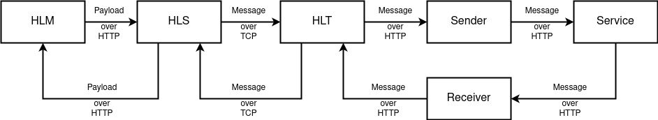
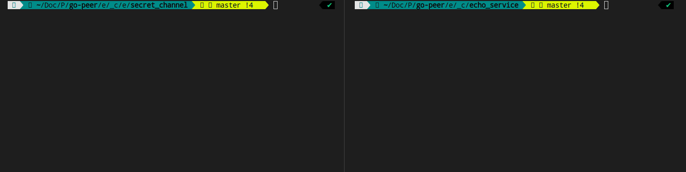

# HLA

> Hidden Lake Adapters


The `Hidden Lake Adapters` are a way to exchange data between multiple HLS processes via `third-party` services. Thus, there is no need to use your own computing resources in the face of individual servers to store or distribute the traffic generated by HLS. 

> More information about HLA in the [habr.com/ru/post/720544](https://habr.com/ru/post/720544/ "Habr HLA")

## How it works

Adapters in their full execution represent one design template - "Flyweight". They are based on the composition of HLS and HLT processes.
Adapters adapt to the interfaces of the service for reading/writing data and, thanks to this, are able to conduct anonymizing traffic through the service.

<p align="center"></p>
<p align="center">Figure 1. Architecture of HLA.</p>

## Example 

Since the adapters are capable of performing the same functions as the source programs, without secret communication channels, then all the examples become similar. So, let's analyze one of the examples based on the echo service.

Build and run nodes
```bash
$ cd examples/_cmd/echo_service/secret_channel
$ make
```

Send request
```bash
$ cd examples/_cmd/echo_service
$ ./request.sh
```

Get response
```bash
HTTP/1.1 200 OK
Date: Mon, 22 May 2023 18:18:34 GMT
Content-Length: 113
Content-Type: text/plain; charset=utf-8

{"code":200,"head":{"Content-Type":"application/json"},"body":"eyJlY2hvIjoiaGVsbG8sIHdvcmxkISIsInJldHVybiI6MX0K"}
Request took 8 seconds
```

There are no external differences, but there are internal ones. While the original model assumed the presence of a middle_hls node through which all traffic was broadcast, there is no such intermediate node in the model based on secret communication channels, there is a service that performs its own logical functions that are in no way tied to traffic anonymization. And, thus, adapters use a third-party service in order to pass traffic through it.

<p align="center"></p>
<p align="center">Figure 2. Example of running HLA client.</p>

Similarly, you can use a more complex composition, as shown in the example `examples/_cmd/anon_messenger/secret_channel`.
