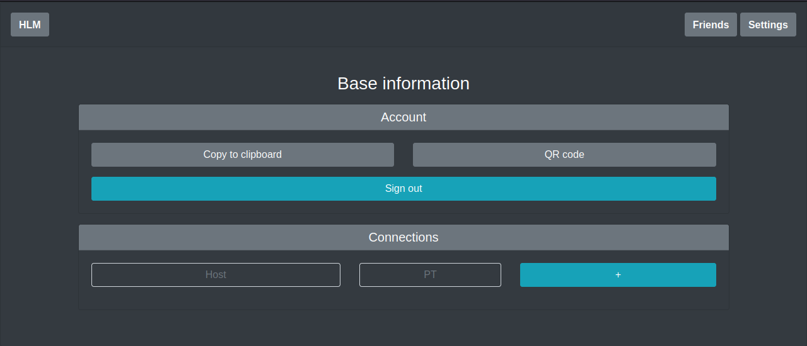
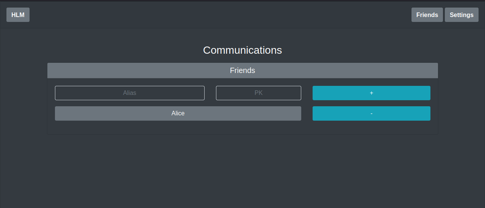
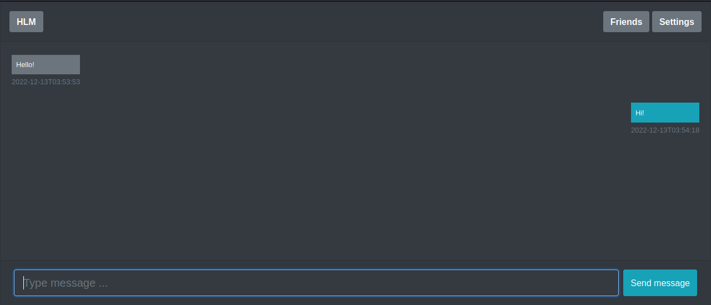

# HLM

> Hidden Lake Messenger


The `Hidden Lake Messenger` is a messenger based on the core of an anonymous network with theoretically provable anonymity of HLS. A feature of this messenger is the provision of anonymity of the fact of transactions (sending, receiving).

HLM is an application that implements a graphical user interface (GUI) on a browser-based HTML/CSS/JS display. Most of the code is based on the bootstrap library https://getbootstrap.com/. GUI is adapted to the size of the window, so it can be used both in a desktop and in a smartphone.

> More information about HLM in the [habr.com/ru/post/701488](https://habr.com/ru/post/701488/ "Habr HLM")

## Installation

```bash
$ go install github.com/number571/go-peer/cmd/hidden_lake/applications/messenger/cmd/hlm@latest
```

## How it works

Most of the code is a call to API functions from the HLS kernel. Thanks to this approach, implicit authorization of users is formed from the state of the anonymizing service.

<p align="center"></p>
<p align="center">Figure 1. Example of chat room in HLM.</p>

However, there are additional features aimed at the security of the HLM application itself. All messages are stored in a local database in encrypted form with a key formed from `storage_key` param.

## Supported platforms

- Windows (x86_64, arm64)
- Linux (x86_64, arm64)
- MacOS (x86_64, arm64)

## Build and run

Default build and run

```bash 
$ cd ./cmd/hidden_lake/applications/messenger
$ make build # create hlm, hlm_[arch=amd64,arm64]_[os=linux,windows,darwin] and copy to ./bin
$ make run # run ./bin/hlm

> [INFO] 2023/06/03 15:30:31 HLM is running...
> ...
```

Open ports `9591` (HTTP, interface) and `9592` (HTTP, incoming).
Creates `./hlm.yml` or `./_mounted/hlm.yml` (docker) and `./hlm.db` or `./_mounted/hlm.db` (docker) files.
The file `hlm.db` stores all sent/received messages in encrypted view. 

Default config `hlm.yml`

```yaml
settings:
  messages_capacity: 2048
  share_enabled: false
logging:
  - info
  - warn
  - erro
language: ENG
address:
  interface: 127.0.0.1:9591
  incoming: 127.0.0.1:9592
connection: 127.0.0.1:9572
```

Build and run with docker

```bash 
$ cd ./cmd/hidden_lake/applications/messenger
$ make docker-build 
$ make docker-run

> [INFO] 2023/06/03 08:35:50 HLM is running...
> ...
```

```bash
$ ./hlm -path=/root
# path = path to config and database files
```

## Example

The example will involve (as well as in HLS) five nodes `node1_hlm, node2_hlm` and `middle_hlt_1, middle_hlt_2, middle_hlt_3`. The three HLT nodes are only needed for communication between `node1_hlm` and `node2_hlm` nodes. Each of the remaining ones is a combination of HLS and HLM, where HLM plays the role of an application and services (as it was depicted in `Figure 3` HLS readme).

Build and run nodes
```bash
$ cd examples/anon_messenger/routing
$ make
```

The output of the `middle_hls` node is similar to `Figure 4` (HLS).
Than open browser on `localhost:8080`. It is a `node1_hlm`. This node is a Bob.

<p align="center"></p>
<p align="center">Figure 2. Home page of the HLM application.</p>

To see the success of sending and receiving messages, you need to do all the same operations, but with `localhost:7070` as `node2_hlm`. This node will be Alice.

Also you can run example with docker-compose. In this example, all nodes have logging enabled
```bash
$ cd examples/anon_messenger/_docker/default
$ make
```

<p align="center"></p>
<p align="center">Figure 3. Log of the three nodes with request/response actions.</p>

> More example images about HLM pages in the [github.com/number571/go-peer/cmd/hidden_lake/applications/messenger/_images](https://github.com/number571/go-peer/cmd/hidden_lake/applications/messenger/_images "Path to HLM images")

## Pages

### About page

Base information about projects HLM and HLS with links to source.


### Settings page

Information about public key and connections. Connections can be appended and deleted.



### Friends page

Information about friends. Friends can be appended and deleted.



### Chat page

Chat with friend. The chat is based on web sockets, so it can update messages in real time. Messages can be sent.


