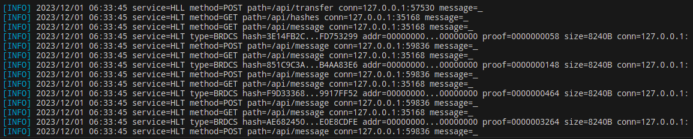

# HLL

> Hidden Lake Loader


The `Hidden Lake Loader` is a smallest service of the Hidden Lake network applications. It is used to redirect traffic from HLT producers (storages) to HLT consumers. Previously, it was used as a component of HLM, and then HLS applications.

### How it works

HLL uses the HLT service interface to download and upload messages. This property is necessary to redirect multiple messages to HLT once, and then to HLS services.

<p align="center"></p>
<p align="center">Figure 1. Architecture of HLL.</p>

### Example 

In the example, two HLT services are created, where one is a message producer, the other a consumer. First, messages are entered into the manufacturer, then the HLL (message transportation) function is turned on, and at the end, the delivery of all previously entered messages is checked, but already on the consumer's side.

<p align="center"></p>
<p align="center">Figure 2. Example of running HLL service.</p>

Build and run HLT services
```bash
$ cd examples/echo_service/traffic_loader
$ make
```

Run transfer
```bash
$ cd examples/echo_service/traffic_loader/client_hll
$ go run ./main.go
```

Get valid response
```
messages have been successfully transported
```

## Supported platforms

- Windows (x86_64, arm64)
- Linux (x86_64, arm64)
- MacOS (x86_64, arm64)

## Build and run

Default build and run

```bash 
$ cd ./cmd/hidden_lake/loader
$ make build # create hll, hll_[arch=amd64,arm64]_[os=linux,windows,darwin] and copy to ./bin
$ make run # run ./bin/hll

> [INFO] 2023/06/03 15:39:13 HLL is running...
> ...
```

Open port `9561` (HTTP).
Creates `./hll.cfg` or `./_mounted/hll.cfg` (docker) files.

Default config `hll.cfg`

```json
{
	"settings": {
		"messages_capacity": 2048,
        "work_size_bits": 20
	},
	"logging": [
		"info",
		"warn",
		"erro"
	],
	"address": {
		"http": "127.0.0.1:9561"
	}
}
```

Build and run with docker

```bash 
$ cd ./cmd/hidden_lake/loader
$ make docker-build 
$ make docker-run

> [INFO] 2023/06/03 08:44:14 HLL is running...
> ...
```

## Example 

TODO

## Config structure

```
"logging"    Enable loggins in/out actions in the network
"address"    API addresses for HLT functions
"consumers"  A list of the HLT consumers
"producers"  A list of the HLTs producers
```

```json
{
	"settings": {
        "messages_capacity": 2048,
        "work_size_bits": 20,
        "network_key": "hlt-network-key"
	},
	"logging": [
		"info",
		"warn",
		"erro"
	],
	"address": {
		"http": "127.0.0.1:9561"
	},
    "producers": [
		"localhost:8582"
	],
	"consumers": [
		"localhost:7582"
	]
}
```

## Response structure from HLL API

```
"result" is string
"return" is int; 1 = success
```

```json
{
	"result":"go-peer/hidden-lake-loader",
	"return":1
}
```

## HLL API

```
1. POST/DELETE /api/transfer
```

### 1. /api/transfer

#### 1.1. POST Request

```bash
curl -i -X POST -H 'Accept: application/json' http://localhost:9561/api/transfer
```

#### 1.1. POST Response

```
HTTP/1.1 200 OK
Content-Type: application/json
Date: Mon, 07 Aug 2023 02:59:42 GMT
Content-Length: 68

success: run transfer
```

#### 1.2. DELETE Request

```bash
curl -i -X DELETE -H 'Accept: application/json' http://localhost:9561/api/transfer
```

#### 1.2. DELETE Response

```
HTTP/1.1 200 OK
Content-Type: application/json
Date: Mon, 07 Aug 2023 02:59:42 GMT
Content-Length: 68

success: stop transfer
```
