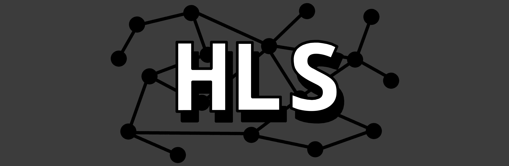
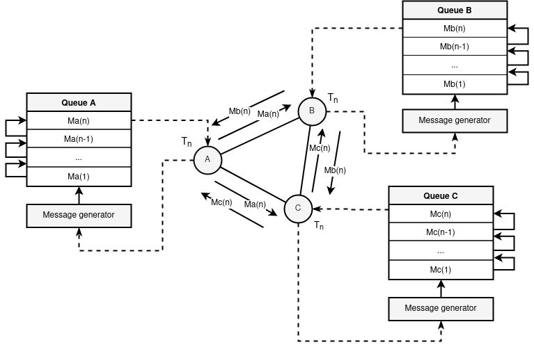
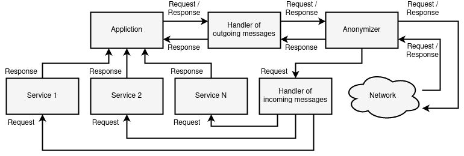
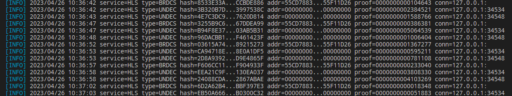
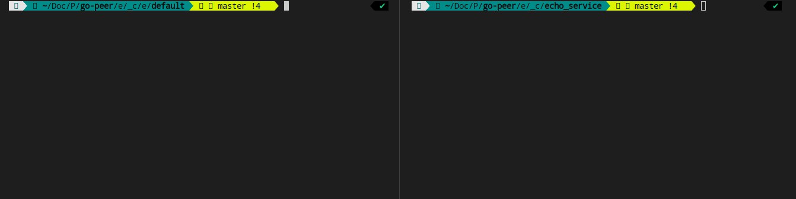

# HLS

> Hidden Lake Service



The `Hidden Lake Service` is a core of an anonymous network with theoretically provable anonymity. HLS is based on the `fifth^ stage` of anonymity and is an implementation of an `abstract` anonymous network based on `queues`. It is a `peer-to-peer` network communication with trusted `friend-to-friend` participants. All transmitted and received messages are in the form of `end-to-end` encryption.

Features / Anonymity networks |  Queue-networks (5^stage)               |  Entropy-networks (6stage)              |  DC-networks (1^stage)
:-----------------------------:|:-----------------------------:|:------------------------------:|:------------------------------:
Theoretical provability  |  +  |  +  |  + |
Ease of software implementation  |  +  |  -  |  - |
Polymorphism of information  |  -  |  +  |  + |
Static communication delay  |  +  |  -  |  + |
Sending parallel messages  |  -  |  +  |  - |
Network scales easily  |  -  |  -  |  - |

A feature of HLS (compared to many other anonymous networks) is its easy adaptation to a hostile centralized environment. Anonymity can be restored literally from one node in the network, even if it is the only point of failure.

> More information about HLS in the [hidden_lake_anonymous_network.pdf](https://github.com/number571/go-peer/blob/master/docs/hidden_lake_anonymous_network.pdf "HLAN") and here [habr.com/ru/post/696504](https://habr.com/ru/post/696504/ "Habr HLS")

## How it works

Each network participant sets a message generation period for himself (the period can be a network constant for all system participants). When one cycle of the period ends and the next begins, each participant sends his encrypted message to all his connections (those in turn to all of their own, etc.). If there is no true message to send, then a pseudo message is generated (filled with random bytes) that looks like a normal encrypted one. The period property ensures the anonymity of the sender.

<p align="center"></p>
<p align="center">Figure 1. Queue and message generation in HLS.</p>

Since the encrypted message does not disclose the recipient in any way, each network participant tries to decrypt the message with his private key. The true recipient is only the one who can decrypt the message. At the same time, the true recipient acts according to the protocol and further distributes the received packet, even knowing the meaninglessness of the subsequent dispatch. This property makes it impossible to determine the recipient.

> Simple example of the `client` package (encrypt/decrypt functions) in the directory [github.com/number571/go-peer/pkg/client/examples](https://github.com/number571/go-peer/tree/master/pkg/client/examples "Package client");

<p align="center"></p>
<p align="center">Figure 2. Two participants are constantly generating messages for their periods on the network. It is impossible to determine their real activity.</p>

Data exchange between network participants is carried out using application services. HLS has a dual role: 1) packages traffic from pure to anonymizing and vice versa; 2) converts external traffic to internal and vice versa. The second property is the redirection of traffic from the network to the local service and back.

<p align="center"></p>
<p align="center">Figure 3. Interaction of third-party services with the traffic anonymization service.</p>

As shown in the figure above, HLS acts as an anonymizer and handlers of incoming and outgoing traffic. The remaining parts in the form of applications and services depend on third-party components (as an example, `HLM`).

##  More details in the works 

1. [Theory of the structure of hidden systems](https://github.com/number571/go-peer/blob/master/docs/theory_of_the_structure_of_hidden_systems.pdf "TotSoHS")
2. [Monolithic cryptographic protocol](https://github.com/number571/go-peer/blob/master/docs/monolithic_cryptographic_protocol.pdf "MCP")
3. [Abstract anonymous networks](https://github.com/number571/go-peer/blob/master/docs/abstract_anonymous_networks.pdf "AAN")
4. [Decentralized key exchange protocol](https://github.com/number571/go-peer/blob/master/docs/decentralized_key_exchange_protocol.pdf "DKEP")

## Supported platforms

- Windows (x86_64, arm64)
- Linux (x86_64, arm64)
- MacOS (x86_64, arm64)

## Minimum system requirements

1. Processor: `1x2.2GHz` (limit of communication = ~5-10 nodes)
2. Memory: `0.5GB RAM` (~250MB of memory can be consumed)
3. Storage: `5Gib available space` (~3.5GiB the size of hashes per year from one node)

## Build and run

Default build and run

```bash 
$ cd ./cmd/hidden_lake/service
$ make build # create hls, hls_[arch=amd64,arm64]_[os=linux,windows,darwin] and copy to ./bin
$ make run # run ./bin/hls

> [INFO] 2023/06/03 14:32:40 HLS is running...
> [INFO] 2023/06/03 14:32:42 service=HLS type=BRDCS hash=43A5E9C5...BA73DF43 addr=211494E4...EEA12BBC proof=0000000002256145 conn=127.0.0.1:
> [INFO] 2023/06/03 14:32:47 service=HLS type=BRDCS hash=EFDDC1D4...C47588AD addr=211494E4...EEA12BBC proof=0000000000090086 conn=127.0.0.1:
> [INFO] 2023/06/03 14:32:52 service=HLS type=BRDCS hash=8549E257...EDEB2748 addr=211494E4...EEA12BBC proof=0000000000634328 conn=127.0.0.1:
> ...
```

Service was running with random private key. Open ports `9571` (TCP, traffic) and `9572` (HTTP, interface).
Creates `./hls.yml` or `./_mounted/hls.yml` (docker) and `./hls.db` or `./_mounted/hls.db` (docker) files. 
The file `hls.db` stores hashes of sent/received messages.

Default config `hls.yml`

```yaml
settings:
  message_size_bytes: 8192
  work_size_bits: 20
  key_size_bits: 4096
  queue_period_ms: 5000
  limit_void_size_bytes: 4096
logging:
  - info
  - warn
  - erro
address:
  tcp: 127.0.0.1:9571
  http: 127.0.0.1:9572
services:
  hidden-lake-messenger: 
    host: 127.0.0.1:9592
```

Build and run with docker

```bash 
$ cd ./cmd/hidden_lake/service
$ make docker-build 
$ make docker-run

> [INFO] 2023/06/03 07:36:49 HLS is running...
> [INFO] 2023/06/03 07:36:51 service=HLS type=BRDCS hash=AF90439F...9F29A036 addr=BB58A8A2...B64D62C2 proof=0000000000479155 conn=127.0.0.1:
> [INFO] 2023/06/03 07:36:56 service=HLS type=BRDCS hash=2C4CE60A...E55BF9C4 addr=BB58A8A2...B64D62C2 proof=0000000000521434 conn=127.0.0.1:
> [INFO] 2023/06/03 07:37:01 service=HLS type=BRDCS hash=A9285F98...F96DB93D addr=BB58A8A2...B64D62C2 proof=0000000001256786 conn=127.0.0.1:
> ...
```

## Example

There are three nodes in the network `send_hls`, `recv_hls` and `middle_hls`. The `send_his` and `recv_hls` nodes connects to `middle_hls`. As a result, a link of the form `send_his <-> middle_hls <-> recv_hls` is created. Due to the specifics of HLS, the centralized `middle_hls` node does not violate the security and anonymity of the `send_hls` and `recv_hls` subjects in any way. All nodes, including the `middle_hls` node, set periods and adhere to the protocol of constant message generation.

The `recv_hls` node contains its `echo_service`, which performs the role of redirecting the request body back to the client as a response. Access to this service is carried out by its alias `hidden-echo-service`, put forward by the recv_hls node.

```go
...
// handle: "/echo"
// return format: {"echo":string,"return":int}
func echoPage(w http.ResponseWriter, r *http.Request) {
	if r.Method != "POST" {
		response(w, 2, "failed: incorrect method")
		return
	}
	res, err := io.ReadAll(r.Body)
	if err != nil {
		response(w, 3, "failed: read body")
		return
	}
	response(w, 1, string(res))
}
...
```

Identification between `recv_hls` and `send_hls` nodes is performed using public keys. This is the main method of identification and routing in the HLS network. IP addresses are only needed to connect to such a network and no more. Requests and responses structure are HEX encoded.

Structure of request. The body `hello, world!` is encoded base64.
```bash
JSON_DATA='{
        "method":"POST",
        "host":"hidden-echo-service",
        "path":"/echo",
        "head":{
            "Accept": "application/json"
        },
        "body":"aGVsbG8sIHdvcmxkIQ=="
}';
```

Request format
```bash
PUSH_FORMAT='{
        "receiver":"Alice",
        "hex_data":"'$(str2hex "$JSON_DATA")'"
}';
```

Build and run nodes
```bash
$ cd examples/echo_service/default
$ make
```

Logs from `middle_hls` node. When sending requests and receiving responses, `middle_hls` does not see the action. For him, all actions and moments of inaction are equivalent.

<p align="center"></p>
<p align="center">Figure 4. Output of all actions and all received traffic from the middle_hls node.</p>

Send request
```bash
$ cd examples/echo_service
$ make request # go run ./_request/main.go
# OR
$ ./_request/request.sh
```

Get response
```bash
HTTP/1.1 200 OK
Date: Mon, 22 May 2023 18:18:34 GMT
Content-Length: 113
Content-Type: text/plain; charset=utf-8

{"code":200,"head":{"Content-Type":"application/json"},"body":"eyJlY2hvIjoiaGVsbG8sIHdvcmxkISIsInJldHVybiI6MX0K"}
Request took 8 seconds
```

Return code 200 is HTTP code = StatusOK. Decode base64 response body
```bash
echo "eyJlY2hvIjoiaGVsbG8sIHdvcmxkISIsInJldHVybiI6MX0K" | base64 -d
> {"echo":"hello, world!","return":1}
```

<p align="center"></p>
<p align="center">Figure 5. Example of running HLS with internal service.</p>

Also you can run example with docker-compose. In this example, all nodes have logging enabled
```bash
$ cd examples/echo_service/_docker/default
$ make
```

> Simple examples of the `anonymity` package in the directory [github.com/number571/go-peer/pkg/network/anonymity/examples](https://github.com/number571/go-peer/tree/master/pkg/network/anonymity/examples "Package anonymity");

## Cryptographic algorithms and functions

1. AES-256-CFB (Data encryption)
2. RSA-4096-OAEP (Key encryption)
3. RSA-4096-PSS (Hash signing)
4. SHA-256 (Data hashing)
5. HMAC-SHA-256 (Network hashing)
6. PoW-20 (Hash proof)

## Config structure

```
"logging"      Enable loggins in/out actions in the network
"address.tcp"  Connection address for anonymity network, may be void
"address.http" Connection address for API functions
"services"     Map with redirects requests from network to services
"network_key"  A network key created to encapsulate connections
"connections"  Connection addresses of the another nodes in network
"friends"      Friend addresses for send or receive messages over network
```

```yaml
settings:
  message_size_bytes: 8192
  work_size_bits: 20
  key_size_bits: 4096
  queue_period_ms: 5000
  limit_void_size_bytes: 4096
  network_key: hls-network-key
logging:
  - info
  - warn
  - erro
address:
  tcp: localhost:9571
  http: localhost:9572
services:
  hidden-default-service:
    share: false 
    host: localhost:8080
connections:
  - localhost:8571
friends:
  alias-name: >-
    PubKey{30818902818100C709DA63096CEDBA0DD6B5DD9465B412268C00509757A8EBD9096E17BEEC17C25A3A8F246E1591554CD214F4B27254EFA811F8BE441A03B37B3C8B390484C74C2294A4C895AA925D723E0065A877D4502CC010996863821E7348348E4E96CDD4CB7A852B2E2853C8FDEE556C4F89F6C3295EAC00DAEE86DD94E25F9703F368C70203010001}
```

## Request structure in HLS for internal services

```
Need encode this json to hex format
and put result to "hex_data" HLS API

"body" is base64 string
```

```json
{
	"method":"GET",
	"host":"hidden-default-service",
	"path":"/",
	"head":{
		"Accept":"application/json"
	},
	"body":"aGVsbG8sIHdvcmxkIQ=="
}
```

## Response structure from HLS API

```
"result" is string
"return" is int; 1 = success
```

```json
{
	"result":"hidden-lake-service",
	"return":1
}
```

## HLS API

```
1. GET/POST/DELETE /api/config/connects
2. GET/POST/DELETE /api/config/friends
3. GET/POST        /api/config/settings
4. GET/DELETE      /api/network/online
5. POST/PUT        /api/network/request
6. GET             /api/network/pubkey
```

### 1. /api/config/connects

#### 1.1. GET Request

```bash
curl -i -X GET -H 'Accept: application/json' http://localhost:9572/api/config/connects
```

#### 1.1. GET Response

```
HTTP/1.1 200 OK
Content-Type: application/json
Date: Mon, 07 Aug 2023 00:21:25 GMT
Content-Length: 35
```

```json
["localhost:9581","localhost:8888"]
```

#### 1.2. POST Request

```bash
curl -i -X POST -H 'Accept: application/json' http://localhost:9572/api/config/connects --data 'localhost:8888'
```

#### 1.2. POST Response

```
HTTP/1.1 200 OK
Content-Type: text/plain
Date: Mon, 07 Aug 2023 00:21:17 GMT
Content-Length: 27

success: update connections
```

#### 1.3. DELETE Request

```bash
curl -i -X DELETE -H 'Accept: application/json' http://localhost:9572/api/config/connects --data 'localhost:8888'
```

#### 1.3. DELETE Response

```
HTTP/1.1 200 OK
Content-Type: text/plain
Date: Mon, 07 Aug 2023 00:21:46 GMT
Content-Length: 26

success: delete connection
```

### 2. /api/config/friends

#### 2.1. GET Request

```bash
curl -i -X GET -H 'Accept: application/json' http://localhost:9572/api/config/friends
```

#### 2.1. GET Response

```
HTTP/1.1 200 OK
Content-Type: application/json
Date: Mon, 07 Aug 2023 00:22:38 GMT
Transfer-Encoding: chunked
```

```json
[{"alias_name":"Bob","public_key":"PubKey{3082020A0282020100B752D35E81F4AEEC1A9C42EDED16E8924DD4D359663611DE2DCCE1A9611704A697B26254DD2AFA974A61A2CF94FAD016450FEF22F218CA970BFE41E6340CE3ABCBEE123E35A9DCDA6D23738DAC46AF8AC57902DDE7F41A03EB00A4818137E1BF4DFAE1EEDF8BB9E4363C15FD1C2278D86F2535BC3F395BE9A6CD690A5C852E6C35D6184BE7B9062AEE2AFC1A5AC81E7D21B7252A56C62BB5AC0BBAD36C7A4907C868704985E1754BAA3E8315E775A51B7BDC7ACB0D0675D29513D78CB05AB6119D3CA0A810A41F78150E3C5D9ACAFBE1533FC3533DECEC14387BF7478F6E229EB4CC312DC22436F4DB0D4CC308FB6EEA612F2F9E00239DE7902DE15889EE71370147C9696A5E7B022947ABB8AFBBC64F7840BED4CE69592CAF4085A1074475E365ED015048C89AE717BC259C42510F15F31DA3F9302EAD8F263B43D14886B2335A245C00871C041CBB683F1F047573F789673F9B11B6E6714C2A3360244757BB220C7952C6D3D9D65AA47511A63E2A59706B7A70846C930DCFB3D8CAFB3BD6F687CACF5A708692C26B363C80C460F54E59912D41D9BB359698051ABC049A0D0CFD7F23DC97DA940B1EDEAC6B84B194C8F8A56A46CE69EE7A0AEAA11C99508A368E64D27756AD0BA7146A6ADA3D5FA237B3B4EDDC84B71C27DE3A9F26A42197791C7DC09E2D7C4A7D8FCDC8F9A5D4983BB278FCE9513B1486D18F8560C3F31CC70203010001}"},{"alias_name":"Eve","public_key":"PubKey{3082020A0282020100C971936CE7F037D60E72613552F9E5DDAA7367CF414E1EC97B1C622E9DAC66DEE488048CECB51ACA082EF1EA1F6DF05FEB595B8A075C012634EEFDA62905717D2FC4DCBEDB824F0E92015E6124C81FD9D6B5E0EE13C685F6E226CDA5646DC2BE32D2FDDE486B0B15F4B7455CD1311F604A822C321B304ECBD599D2D7B4A8FB380F38AAEBCC2D1176E1D2BA85F38E25B7879DD61A8C290F55BAB4502221F23DDF6F75B5B3CA631D63B736FD7B7E6F8F9A82F55DE5B673862F0F324F4F911502810477E820946057F951B57E44EC79525BD10B472D05F57A7CAAB835AE55E71129CF9B1CC54175989E1BE86697F9A4C560D09C179CD332E05550F169DEC6318D4E8172F009DC82837A418E454A75E4CAE5A098161099BEA499FFD56E98433ABECAE1961A864388D355EF29C02DC1DEE315C03D16DA6687B6AD67D544A20E541ADB450D1CC57869EB21D3B53368CB716DCBAF18E625A4A68081651C2E5AEA28549F141DBBBB1F500EE970303DE1BC82098B130D202234322D7C1E8A71D71F016E10ACF523303DB48BD1DA9B1D2E623012557CFB81176F2195872F244E6149FE03395951AEE6F90B4808A88796875264A4FF177504D5139EE4729D9603FC3B0F448E0F3E95865CD5234A169DEF8EE07A067DED78E782A534F12DA6313597522E0592C69D381E60A2CA66364F429CB182BB32CCE3727974484B4A23F61E99AC494C710203010001}"}]
```

#### 2.2. POST Request

```bash
curl -i -X POST -H 'Accept: application/json' http://localhost:9572/api/config/friends --data '{"alias_name": "Eve", "public_key":"PubKey{3082020A0282020100C971936CE7F037D60E72613552F9E5DDAA7367CF414E1EC97B1C622E9DAC66DEE488048CECB51ACA082EF1EA1F6DF05FEB595B8A075C012634EEFDA62905717D2FC4DCBEDB824F0E92015E6124C81FD9D6B5E0EE13C685F6E226CDA5646DC2BE32D2FDDE486B0B15F4B7455CD1311F604A822C321B304ECBD599D2D7B4A8FB380F38AAEBCC2D1176E1D2BA85F38E25B7879DD61A8C290F55BAB4502221F23DDF6F75B5B3CA631D63B736FD7B7E6F8F9A82F55DE5B673862F0F324F4F911502810477E820946057F951B57E44EC79525BD10B472D05F57A7CAAB835AE55E71129CF9B1CC54175989E1BE86697F9A4C560D09C179CD332E05550F169DEC6318D4E8172F009DC82837A418E454A75E4CAE5A098161099BEA499FFD56E98433ABECAE1961A864388D355EF29C02DC1DEE315C03D16DA6687B6AD67D544A20E541ADB450D1CC57869EB21D3B53368CB716DCBAF18E625A4A68081651C2E5AEA28549F141DBBBB1F500EE970303DE1BC82098B130D202234322D7C1E8A71D71F016E10ACF523303DB48BD1DA9B1D2E623012557CFB81176F2195872F244E6149FE03395951AEE6F90B4808A88796875264A4FF177504D5139EE4729D9603FC3B0F448E0F3E95865CD5234A169DEF8EE07A067DED78E782A534F12DA6313597522E0592C69D381E60A2CA66364F429CB182BB32CCE3727974484B4A23F61E99AC494C710203010001}"}'
```

#### 2.2. POST Response

```
HTTP/1.1 200 OK
Content-Type: text/plain
Date: Mon, 07 Aug 2023 00:22:19 GMT
Content-Length: 23

success: update friends
```

#### 2.3. DELETE Request

```bash
curl -i -X DELETE -H 'Accept: application/json' http://localhost:9572/api/config/friends --data '{"alias_name": "Eve"}'
```

#### 2.3. DELETE Response

```
HTTP/1.1 200 OK
Content-Type: text/plain
Date: Mon, 07 Aug 2023 00:23:12 GMT
Content-Length: 22

success: delete friend
```

### 3. /api/config/settings

#### 3.1. GET Request

```bash
curl -i -X GET -H 'Accept: application/json' http://localhost:9572/api/config/settings
```

#### 3.1. GET Response

```
HTTP/1.1 200 OK
Content-Type: application/json
Date: Sun, 12 Nov 2023 19:01:38 GMT
Content-Length: 120
```

```json
{"message_size_bytes":8192,"queue_period_ms":5000,"key_size_bits":4096,"work_size_bits":20,"limit_void_size_bytes":4096}
```

#### 3.2. POST Request

```bash
curl -i -X POST -H 'Accept: application/json' http://localhost:9572/api/config/settings --data "used_network_key"'
```

#### 3.2. POST Response

```
HTTP/1.1 200 OK
Date: Sun, 06 Aug 2023 23:22:49 GMT
Content-Length: 24
Content-Type: text/plain; charset=utf-8

success: set network key
```

### 4. /api/network/online

#### 4.1. GET Request

```bash
curl -i -X GET -H 'Accept: application/json' http://localhost:9572/api/network/online
```

#### 4.1. GET Response

```
HTTP/1.1 200 OK
Content-Type: application/json
Date: Mon, 07 Aug 2023 00:23:25 GMT
Content-Length: 18
```

```json
["localhost:9581"]
```

#### 4.2. DELETE Request

```bash
curl -i -X DELETE -H 'Accept: application/json' http://localhost:9572/api/network/online --data 'localhost:9581'
```

#### 4.2. DELETE Response

```
HTTP/1.1 200 OK
Content-Type: text/plain
Date: Mon, 07 Aug 2023 00:24:14 GMT
Content-Length: 33

success: delete online connection
```

### 5. /api/network/request

#### Prefix script

```bash
#!/bin/bash

str2hex() {
    local str=${1:-""}
    local fmt="%02X"
    local chr
    local -i i
    for i in `seq 0 $((${#str}-1))`; do
        chr=${str:i:1}
        printf "${fmt}" "'${chr}"
    done
}

JSON_DATA='{
        "method":"POST",
        "host":"hidden-echo-service",
        "path":"/echo",
        "head":{
            "Accept": "application/json"
        },
        "body":"aGVsbG8sIHdvcmxkIQ=="
}';

# POST = request with response from service
# PUT  = broadcast without response from service
PUSH_FORMAT='{
        "receiver":"Alice",
        "req_data":"'$(str2hex "$JSON_DATA")'"
}';
```

#### 5.1. POST Request

```bash
curl -i -X POST -H 'Accept: application/json' http://localhost:9572/api/network/request --data "${PUSH_FORMAT}"
```

#### 5.1. POST Response

```
HTTP/1.1 200 OK
Content-Type: application/json
Date: Mon, 07 Aug 2023 00:31:27 GMT
Content-Length: 113
```

```json
{"code":200,"head":{"Content-Type":"application/json"},"body":"eyJlY2hvIjoiaGVsbG8sIHdvcmxkISIsInJldHVybiI6MX0K"}
```

#### 5.2. PUT Request

```bash
curl -i -X PUT -H 'Accept: application/json' http://localhost:9572/api/network/request --data "${PUSH_FORMAT}"
```

#### 5.2. PUT Response

```
HTTP/1.1 200 OK
Date: Sun, 06 Aug 2023 23:21:20 GMT
Content-Length: 18
Content-Type: text/plain; charset=utf-8

success: broadcast
```

### 6. /api/network/pubkey

#### 6.1. GET Request

```bash
curl -i -X GET -H 'Accept: application/json' http://localhost:9572/api/network/pubkey
```

#### 6.1. GET Response

```
HTTP/1.1 200 OK
Content-Type: application/json
Date: Mon, 07 Aug 2023 00:35:45 GMT
Transfer-Encoding: chunked
```

```
PubKey{3082020A0282020100C17B6FA53983050B0339A0AB60D20A8A5FF5F8210564464C45CD2FAC2F266E8DDBA3B36C6F356AE57D1A71EED7B612C4CBC808557E4FCBAF6EDCFCECE37494144F09D65C7533109CE2F9B9B31D754453CA636A4463594F2C38303AE1B7BFFE738AC57805C782193B4854FF3F3FACA2C6BF9F75428DF6C583FBC29614C0B3329DF50F7B6399E1CC1F12BED77F29F885D7137ADFADE74A43451BB97A32F2301BE8EA866AFF34D6C7ED7FF1FAEA11FFB5B1034602B67E7918E42CA3D20E3E68AA700BE1B55A78C73A1D60D0A3DED3A6E5778C0BA68BAB9C345462131B9DC554D1A189066D649D7E167621815AB5B93905582BF19C28BCA6018E0CD205702968885E92A3B1E3DB37A25AC26FA4D2A47FF024ECD401F79FA353FEF2E4C2183C44D1D44B44938D32D8DBEDDAF5C87D042E4E9DAD671BE9C10DD8B3FE0A7C29AFE20843FE268C6A8F14949A04FF25A3EEE1EBE0027A99CE1C4DC561697297EA9FD9E23CF2E190B58CA385B66A235290A23CBB3856108EFFDD775601B3DE92C06C9EA2695C2D25D7897FD9D43C1AE10016E51C46C67F19AC84CD25F47DE2962A48030BCD8A0F14FFE4135A2893F62AC3E15CC61EC2E4ACADE0736C9A8DBC17D439248C42C5C0C6E08612414170FBE5AA6B52AE64E4CCDAE6FD3066BED5C200E07DBB0167D74A9FAD263AF253DFA870F44407F8EF3D9F12B8D910C4D803AD82ABA136F93F0203010001}
```
