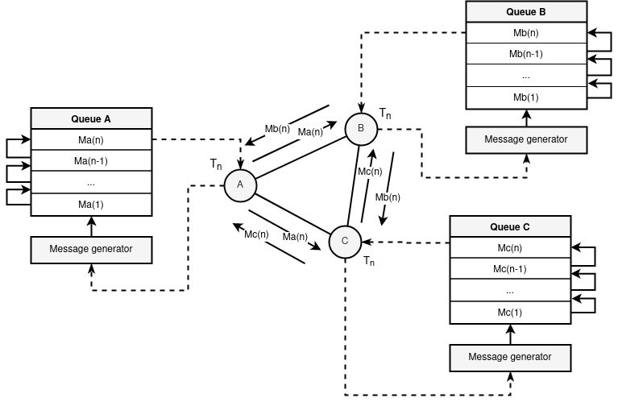

# HLS

> Hidden Lake Service


The `Hidden Lake Service` is the core of an anonymous network with theoretically provable anonymity. HLS is based on the `fifth^ stage` of anonymity and is an implementation of an `abstract` anonymous network based on `queues`. It is a `peer-to-peer` network communication with trusted `friend-to-friend` participants. All transmitted and received messages are in the form of `end-to-end` encryption.

Features / Anonymity networks |  Queue-networks (5^stage)               |  Entropy-networks (6stage)              |  DC-networkds (1^stage)
:-----------------------------:|:-----------------------------:|:------------------------------:|:------------------------------:
Theoretical provability  |  +  |  +  |  +
Ease of software implementation  |  +  |  -  |  -
Polymorphism of information  |  -  |  +  |  +
Static communication delay  |  +  |  -  |  +
Network scales easily  |  -  |  -  |  -

A feature of HLS (compared to many other anonymous networks) is its easy adaptation to a hostile centralized environment. Anonymity can be restored literally from one node in the network, even if it is the only point of failure.

> More information about HLS in the [habr.com/ru/post/696504](https://habr.com/ru/post/696504/ "Habr HLS")

## How it works

Each network participant sets a message generation period for himself (the period can be a network constant for all system participants). When one cycle of the period ends and the next begins, each participant sends his encrypted message to all his connections (those in turn to all of their own, etc.). If there is no true message to send, then a pseudo message is generated (filled with random bytes) that looks like a normal encrypted one. The period property ensures the anonymity of the sender.

<p align="center"></p>
<p align="center">Figure 1. Queue and message generation in HLS.</p>

Since the encrypted message does not disclose the recipient in any way, each network participant tries to decrypt the message with his private key. The true recipient is only the one who can decrypt the message. At the same time, the true recipient acts according to the protocol and further distributes the received packet, even knowing the meaninglessness of the subsequent dispatch. This property makes it impossible to determine the recipient.

> Simple example of the `client` module (encrypt/decrypt functions) in the directory [github.com/number571/go-peer/examples/_modules/client](https://github.com/number571/go-peer/tree/master/examples/_modules/client "Module client");

<p align="center"></p>
<p align="center">Figure 2. Two participants are constantly generating messages for their periods on the network. It is impossible to determine their real activity.</p>

Data exchange between network participants is carried out using application services. HLS has a dual role: 1) packages traffic from pure to anonymizing and vice versa; 2) converts external traffic to internal and vice versa. The second property is the redirection of traffic from the network to the local service and back.

<p align="center"></p>
<p align="center">Figure 3. Interaction of third-party services with the traffic anonymization service.</p>

As shown in the figure above, HLS acts as an anonymizer and handlers of incoming and outgoing traffic. The remaining parts in the form of applications and services depend on third-party components (as an example, `HLM`).

> More details in the works 
>> 1. [Theory of the structure of hidden systems](https://github.com/number571/go-peer/blob/master/docs/theory_of_the_structure_of_hidden_systems.pdf "TotSoHS")
>> 2. [Monolithic cryptographic protocol](https://github.com/number571/go-peer/blob/master/docs/monolithic_cryptographic_protocol.pdf "MCP")
>> 3. [Abstract anonymous networks](https://github.com/number571/go-peer/blob/master/docs/abstract_anonymous_networks.pdf "AAN")

### Example

There are three nodes in the network `send_hls`, `recv_hls` and `middle_hls`. The `send_his` and `recv_hls` nodes connects to `middle_hls`. As a result, a link of the form `send_his <-> middle_hls <-> recv_hls` is created. Due to the specifics of HLS, the centralized `middle_hls` node does not violate the security and anonymity of the `send_hls` and `recv_hls` subjects in any way. All nodes, including the `middle_hls` node, set periods and adhere to the protocol of constant message generation.

The `recv_hls` node contains its `echo_service`, which performs the role of redirecting the request body back to the client as a response. Access to this service is carried out by its alias `hidden-echo-service`, put forward by the recv_hls node.

```go
...
// handle: "/echo"
// return format: {"echo":string,"return":int}
func echoPage(w http.ResponseWriter, r *http.Request) {
	if r.Method != "POST" {
		response(w, 2, "failed: incorrect method")
		return
	}
	res, err := io.ReadAll(r.Body)
	if err != nil {
		response(w, 3, "failed: read body")
		return
	}
	response(w, 1, string(res))
}
...
```

Identification between `recv_hls` and `send_hls` nodes is performed using public keys. This is the main method of identification and routing in the HLS network. IP addresses are only needed to connect to such a network and no more. Requests and responses structure are HEX encoded.

Structure of request. The body `hello, world!` is encoded base64.
```bash
JSON_DATA='{
        "method":"POST",
        "host":"hidden-echo-service",
        "path":"/echo",
        "head":{
            "Accept": "application/json"
        },
        "body":"aGVsbG8sIHdvcmxkIQ=="
}';
```

Request format
```bash
PUSH_FORMAT='{
        "receiver":"PubKey(go-peer/rsa){3082020A0282020100B752D35E81F4AEEC1A9C42EDED16E8924DD4D359663611DE2DCCE1A9611704A697B26254DD2AFA974A61A2CF94FAD016450FEF22F218CA970BFE41E6340CE3ABCBEE123E35A9DCDA6D23738DAC46AF8AC57902DDE7F41A03EB00A4818137E1BF4DFAE1EEDF8BB9E4363C15FD1C2278D86F2535BC3F395BE9A6CD690A5C852E6C35D6184BE7B9062AEE2AFC1A5AC81E7D21B7252A56C62BB5AC0BBAD36C7A4907C868704985E1754BAA3E8315E775A51B7BDC7ACB0D0675D29513D78CB05AB6119D3CA0A810A41F78150E3C5D9ACAFBE1533FC3533DECEC14387BF7478F6E229EB4CC312DC22436F4DB0D4CC308FB6EEA612F2F9E00239DE7902DE15889EE71370147C9696A5E7B022947ABB8AFBBC64F7840BED4CE69592CAF4085A1074475E365ED015048C89AE717BC259C42510F15F31DA3F9302EAD8F263B43D14886B2335A245C00871C041CBB683F1F047573F789673F9B11B6E6714C2A3360244757BB220C7952C6D3D9D65AA47511A63E2A59706B7A70846C930DCFB3D8CAFB3BD6F687CACF5A708692C26B363C80C460F54E59912D41D9BB359698051ABC049A0D0CFD7F23DC97DA940B1EDEAC6B84B194C8F8A56A46CE69EE7A0AEAA11C99508A368E64D27756AD0BA7146A6ADA3D5FA237B3B4EDDC84B71C27DE3A9F26A42197791C7DC09E2D7C4A7D8FCDC8F9A5D4983BB278FCE9513B1486D18F8560C3F31CC70203010001}",
        "hex_data":"'$(str2hex "$JSON_DATA")'"
}';
```

Build and run nodes
```bash
$ cd examples/_cmd/echo_service
$ make
```

Logs from `middle_hls` node. When sending requests and receiving responses, `middle_hls` does not see the action. For him, all actions and moments of inaction are equivalent.

<p align="center"></p>
<p align="center">Figure 4. Output of all actions and all received traffic from the middle_hls node.</p>

Send request
```bash
$ ./request.sh
```

Get response
```bash
HTTP/1.1 200 OK
Content-Type: application/json
Date: Thu, 15 Dec 2022 07:42:49 GMT
Content-Length: 97

{"result":"7b226563686f223a2268656c6c6f2c20776f726c6421222c2272657475726e223a317d0a","return":1}
```

Decode response
```json
{"echo":"hello, world!","return":1}
```

<p align="center"></p>
<p align="center">Figure 5. Example of running HLS with internal service.</p>

> Simple examples of the `anonymity` module in the directory [github.com/number571/go-peer/examples/_modules/network/anonymity](https://github.com/number571/go-peer/tree/master/examples/_modules/network/anonymity "Module anonymity");

## Cryptographic algorithms and functions

1. AES-256-CTR (Data encryption)
2. RSA-4096-OAEP (Key encryption)
3. RSA-4096-PSS (Hash signing)
4. SHA-256 (Data hashing)
5. HMAC-SHA-256 (Network hashing)
6. PoW-20 (Hash proof)

## Config structure

```
"logging"      Enable loggins in/out actions in the network
"network"      A network key created to encapsulate connections
"address.tcp"  Connection address for anonymity network, may be void
"address.http" Connection address for API functions
"services"     Map with redirects requests from network to services
"connections"  Connection addresses of the another nodes in network
"friends"      Friend addresses for send or receive messages over network
```

```json
{
	"logging": ["info", "warn", "erro"],
	"network": "hls-network-key",
	"address": {
		"tcp": "localhost:9571",
		"http": "localhost:9572"
	},
	"services": {
		"hidden-default-service": "localhost:8080"
	},
	"connections": [
		"localhost:8571"
	],
	"friends": {
		"alias-name": "PubKey(go-peer/rsa){30818902818100C709DA63096CEDBA0DD6B5DD9465B412268C00509757A8EBD9096E17BEEC17C25A3A8F246E1591554CD214F4B27254EFA811F8BE441A03B37B3C8B390484C74C2294A4C895AA925D723E0065A877D4502CC010996863821E7348348E4E96CDD4CB7A852B2E2853C8FDEE556C4F89F6C3295EAC00DAEE86DD94E25F9703F368C70203010001}"
	}
}
```

## Request structure in HLS for internal services

```
Need encode this json to hex format
and put result to "hex_data" HLS API

"body" is base64 string
```

```json
{
	"method":"GET",
	"host":"hidden-default-service",
	"path":"/",
	"head":{
		"Accept":"application/json"
	},
	"body":"aGVsbG8sIHdvcmxkIQ=="
}
```

## Response structure from HLS API

```
"result" is string
"return" is int; 1 = success
```

```json
{
	"result":"go-peer/hidden-lake-service",
	"return":1
}
```

## HLS API

```
1. GET/POST/DELETE /api/config/connects
2. GET/POST/DELETE /api/config/friends
3. GET/DELETE      /api/network/online
4. POST/PUT        /api/network/request
5. GET/POST        /api/node/key
```

### 1. /api/config/connects

#### 1.1. GET Request

```bash
curl -i -X GET -H 'Accept: application/json' http://localhost:9572/api/config/connects
```

#### 1.1. GET Response

```
HTTP/1.1 200 OK
Content-Type: application/json
Date: Wed, 12 Oct 2022 09:19:00 GMT
Content-Length: 39
```

```json
{"result":"localhost:9571,localhost:8888","return":1}
```

#### 1.2. POST Request

```bash
curl -i -X POST -H 'Accept: application/json' http://localhost:9572/api/config/connects --data '{"connect":"localhost:8888"}'
```

#### 1.2. POST Response

```
HTTP/1.1 200 OK
Content-Type: application/json
Date: Wed, 12 Oct 2022 09:20:10 GMT
Content-Length: 52
```

```json
{"result":"success: update connections","return":1}
```

#### 1.3. DELETE Request

```bash
curl -i -X DELETE -H 'Accept: application/json' http://localhost:9572/api/config/connects --data '{"connect":"localhost:8888"}'
```

#### 1.3. DELETE Response

```
HTTP/1.1 200 OK
Content-Type: application/json
Date: Wed, 12 Oct 2022 09:20:57 GMT
Content-Length: 51
```

```json
{"result":"success: delete connection","return":1}
```

### 2. /api/config/friends

#### 2.1. GET Request

```bash
curl -i -X GET -H 'Accept: application/json' http://localhost:9572/api/config/friends
```

#### 2.1. GET Response

```
HTTP/1.1 200 OK
Content-Type: application/json
Date: Wed, 12 Oct 2022 08:57:24 GMT
Transfer-Encoding: chunked
```

```json
{"result":"PubKey(go-peer/rsa){3082020A0282020100E5B249D1547C5CD9A340CA8DB7DCB789657BAFD39FFA09351DF818CE99CED41451C6D5C7FD87C1CC027C6FC51A8C160DFE5029DA19F02D6E3A237995D0C64FFDEE8423A201663DEDA4574949C76EDE313EE8CC81C7451D602B133936CC045AA73218B2F6359777892A20C4041CAAB279B8718805A56E4C44CEC3BB7B084C1C8EF009E0BAD0F391B4204F96698526CF386B05F0B76CFE6FE278B023C5495D5E728500CFFCF5075DB6AC5214B97D7D14CECAB21E1F79E8AF844999760A040173B0D2DADDC0013A45C3423F127459E0FB70380E8469A7069C31DCD18760E2F0481F1CC2437BEFB801C394FE5D5AC1F985D52D44B980A9E64E46FDA1C3F2A739D2C473057506718EE9903C7E1FD584EE2261593C64543417846B3137098EEBE638AB54149A4EE2839A1DF243B593A3A952A2760885F62986E951C87FEBD99D47FBC7ECF6369DC94663A241ED72BBDB5AD86981ECE2862BE7B32C550A9D9FA141438BA3BA05EF68E52B18F9167CA3D10067CA350D2266385A8470927FAC05A3EBB8D0CB0C9F6430D205F933693478377F892506EAEA2ADE6A9DD736BC54583FF308068DB3B1A37B3ADA22695B27564A4822BDC143381617BCCD0CB7EFB21E1ACA4669B9A72AC3CAC6305407AA16DD50FA8AFEBA680D979242C521A2F9989008FAF6F691A55C34CF0988E4201536F95CF6C92E388278E1F70837C6CCFCC7ACD35272410203010001},PubKey(go-peer/rsa){3082020A0282020100C71D5265F2CF14041E3E966B13E652ED8A87913E6907FB16FCE698F876B5AE7544FB337FB246DD20FEEFDFAE823476F1B6CC01A0F5C25D3F7A0FD17BAF2EF4193883FB55E6945B51FC6E17B625391F99EAE223FB4992BA5FE83C000BC44FEF67F78A33A7BDB1891E16EBDF6C0C161709242B5EF275E9B0DACDC5FA6BF7884C942FB9A2B8C4C04265DD209306DE805D5232A68D4E2B124699BB37C19C1EB493938E5CED4E717AD030440337423E306C80AA9AE6F5B63D03D5EC6B7F708E9CE6B3716820A9B643D6F7C318F18CFB28AB20153A6AD43E81CC0BB9758670D9F592A3D9713565BC26767D8FAB3BC2D33847F34DD0BE1F3C53F4873C5153E761B7AE346CABB52A9692618D3AC7282C90B294A3129B91B40FE04CB481922EC3C6C31ED068A2654CD1ACFF5584515204ADCB84CB5ACD3DA07DCBCABE45BD4CBC3D55FE41FF9FAB41ECF948E43C1FE9A8253CD1AEE30900216C0A78ED0AB3C2DEB0852003C5155C57C5847374248430A8D462908B0B5E5E03AD597C44EB4ECDE82B1B62DA29A0792E890F6B6CE1672285C8D5D16DC8E0DF3D0B6110A9CC7D1BCF63E6B83C4E976A088DDDACC7FD711F95F568D4E8ED96D3E17C9E48DCA363D6F024507E423326936090E3A4B9865DF6AB577BC4EC45CC8C9BA4E80E9B9D8BF3A6C796555582016148C8C2D85FBD5284E1013F7451FC52ABF70942CB7D7DE8F75D97522FA50203010001}","return":1}
```

#### 2.2. POST Request

```bash
curl -i -X POST -H 'Accept: application/json' http://localhost:9572/api/config/friends --data '{"friend":"PubKey(go-peer/rsa){30818902818100B662B1E9B64BE02E34A23F656D3A9A42C3F7C723580187768CADD92CC4B1A8D87BF1F922B6FF1E8715F6C4897B6ED834BC2CBE1E0988DFD93E99E391B3853F5455E0CB292F2C5801357872D282888FB56A02FA86EB38A650F8569FB2FDCB93A0C7E776CD62BF030B502FC680FCCDEE11D3BB8D0D6B8FE7367D10B0B3EFBBE0210203010001}"}'
```

#### 2.2. POST Response

```
HTTP/1.1 200 OK
Content-Type: application/json
Date: Wed, 12 Oct 2022 09:02:05 GMT
Content-Length: 48
```

```json
{"result":"success: update friends","return":1}
```

#### 2.3. DELETE Request

```bash
curl -i -X DELETE -H 'Accept: application/json' http://localhost:9572/api/config/friends --data '{"friend":"PubKey(go-peer/rsa){30818902818100B662B1E9B64BE02E34A23F656D3A9A42C3F7C723580187768CADD92CC4B1A8D87BF1F922B6FF1E8715F6C4897B6ED834BC2CBE1E0988DFD93E99E391B3853F5455E0CB292F2C5801357872D282888FB56A02FA86EB38A650F8569FB2FDCB93A0C7E776CD62BF030B502FC680FCCDEE11D3BB8D0D6B8FE7367D10B0B3EFBBE0210203010001}"}'
```

#### 2.3. DELETE Response

```
HTTP/1.1 200 OK
Content-Type: application/json
Date: Wed, 12 Oct 2022 09:17:36 GMT
Content-Length: 47
```

```json
{"result":"success: delete friend","return":1}
```

### 3. /api/network/online

#### 3.1. GET Request

```bash
curl -i -X GET -H 'Accept: application/json' http://localhost:9572/api/network/online
```

#### 3.1. GET Response

```
HTTP/1.1 200 OK
Content-Type: application/json
Date: Fri, 07 Oct 2022 12:09:53 GMT
Content-Length: 55
```

```json
{"result":"127.0.0.1:58708,127.0.0.1:58710","return":1}
```

#### 3.2. DELETE Request

```bash
curl -i -X DELETE -H 'Accept: application/json' http://localhost:9572/api/network/online --data '{"connect":"localhost:8888"}'
```

#### 3.2. DELETE Response

```
HTTP/1.1 200 OK
Content-Type: application/json
Date: Wed, 12 Oct 2022 09:20:57 GMT
Content-Length: 58
```

```json
{"result":"success: delete online connection","return":1}
```

### 4. /api/network/request

#### Prefix script

```bash
#!/bin/bash

str2hex() {
    local str=${1:-""}
    local fmt="%02X"
    local chr
    local -i i
    for i in `seq 0 $((${#str}-1))`; do
        chr=${str:i:1}
        printf "${fmt}" "'${chr}"
    done
}

JSON_DATA='{
        "method":"POST",
        "host":"hidden-echo-service",
        "path":"/echo",
        "head":{
            "Accept": "application/json"
        },
        "body":"aGVsbG8sIHdvcmxkIQ=="
}';

# POST = request with response from service
# PUT  = broadcast without response from service
PUSH_FORMAT='{
        "receiver":"PubKey(go-peer/rsa){3082020A0282020100B752D35E81F4AEEC1A9C42EDED16E8924DD4D359663611DE2DCCE1A9611704A697B26254DD2AFA974A61A2CF94FAD016450FEF22F218CA970BFE41E6340CE3ABCBEE123E35A9DCDA6D23738DAC46AF8AC57902DDE7F41A03EB00A4818137E1BF4DFAE1EEDF8BB9E4363C15FD1C2278D86F2535BC3F395BE9A6CD690A5C852E6C35D6184BE7B9062AEE2AFC1A5AC81E7D21B7252A56C62BB5AC0BBAD36C7A4907C868704985E1754BAA3E8315E775A51B7BDC7ACB0D0675D29513D78CB05AB6119D3CA0A810A41F78150E3C5D9ACAFBE1533FC3533DECEC14387BF7478F6E229EB4CC312DC22436F4DB0D4CC308FB6EEA612F2F9E00239DE7902DE15889EE71370147C9696A5E7B022947ABB8AFBBC64F7840BED4CE69592CAF4085A1074475E365ED015048C89AE717BC259C42510F15F31DA3F9302EAD8F263B43D14886B2335A245C00871C041CBB683F1F047573F789673F9B11B6E6714C2A3360244757BB220C7952C6D3D9D65AA47511A63E2A59706B7A70846C930DCFB3D8CAFB3BD6F687CACF5A708692C26B363C80C460F54E59912D41D9BB359698051ABC049A0D0CFD7F23DC97DA940B1EDEAC6B84B194C8F8A56A46CE69EE7A0AEAA11C99508A368E64D27756AD0BA7146A6ADA3D5FA237B3B4EDDC84B71C27DE3A9F26A42197791C7DC09E2D7C4A7D8FCDC8F9A5D4983BB278FCE9513B1486D18F8560C3F31CC70203010001}",
        "hex_data":"'$(str2hex "$JSON_DATA")'"
}';
```

#### 4.1. POST Request

```bash
curl -i -X POST -H 'Accept: application/json' http://localhost:9572/api/network/request --data "${PUSH_FORMAT}"
```

#### 4.1. POST Response

```
HTTP/1.1 200 OK
Content-Type: application/json
Date: Fri, 07 Oct 2022 12:18:34 GMT
Content-Length: 97
```

```json
{"result":"7b226563686f223a2268656c6c6f2c20776f726c6421222c2272657475726e223a317d0a","return":1}
```

#### 4.2. PUT Request

```bash
curl -i -X PUT -H 'Accept: application/json' http://localhost:9572/api/network/request --data "${PUSH_FORMAT}"
```

#### 4.2. PUT Response

```
HTTP/1.1 200 OK
Content-Type: application/json
Date: Wed, 12 Oct 2022 09:44:59 GMT
Content-Length: 43
```

```json
{"result":"success: broadcast","return":1}
```

### 5. /api/node/key

#### 5.1. GET Request

```bash
curl -i -X GET -H 'Accept: application/json' http://localhost:9572/api/node/key
```

#### 5.1. GET Response

```
HTTP/1.1 200 OK
Content-Type: application/json
Date: Wed, 12 Oct 2022 09:24:16 GMT
Content-Length: 1095
```

```json
{"result":"PubKey(go-peer/rsa){3082020A0282020100C71D5265F2CF14041E3E966B13E652ED8A87913E6907FB16FCE698F876B5AE7544FB337FB246DD20FEEFDFAE823476F1B6CC01A0F5C25D3F7A0FD17BAF2EF4193883FB55E6945B51FC6E17B625391F99EAE223FB4992BA5FE83C000BC44FEF67F78A33A7BDB1891E16EBDF6C0C161709242B5EF275E9B0DACDC5FA6BF7884C942FB9A2B8C4C04265DD209306DE805D5232A68D4E2B124699BB37C19C1EB493938E5CED4E717AD030440337423E306C80AA9AE6F5B63D03D5EC6B7F708E9CE6B3716820A9B643D6F7C318F18CFB28AB20153A6AD43E81CC0BB9758670D9F592A3D9713565BC26767D8FAB3BC2D33847F34DD0BE1F3C53F4873C5153E761B7AE346CABB52A9692618D3AC7282C90B294A3129B91B40FE04CB481922EC3C6C31ED068A2654CD1ACFF5584515204ADCB84CB5ACD3DA07DCBCABE45BD4CBC3D55FE41FF9FAB41ECF948E43C1FE9A8253CD1AEE30900216C0A78ED0AB3C2DEB0852003C5155C57C5847374248430A8D462908B0B5E5E03AD597C44EB4ECDE82B1B62DA29A0792E890F6B6CE1672285C8D5D16DC8E0DF3D0B6110A9CC7D1BCF63E6B83C4E976A088DDDACC7FD711F95F568D4E8ED96D3E17C9E48DCA363D6F024507E423326936090E3A4B9865DF6AB577BC4EC45CC8C9BA4E80E9B9D8BF3A6C796555582016148C8C2D85FBD5284E1013F7451FC52ABF70942CB7D7DE8F75D97522FA50203010001}","return":1}
```

#### 5.2. POST Request

```bash
curl -i -X POST -H 'Accept: application/json' http://localhost:9572/api/node/key --data '{"priv_key":"PrivKey(go-peer/rsa){3082092802010002820201009D5159F646E8E6F55B0FCD2445BDD5320F75AB6A5A5CEDFBB60B5B52FFC54E08543A8F5A329B1CCE1BE815C6AD7A30BEC3BE8EDCE0DB212C503F75D208AE2D1472C891DF7D5ECBC088358B33462579C95E43BD2E7C1577E9FB95A5B1105A55CD2459D499660659A843CC801F9260FA5846C67211BFE456DDD1121A8E0CBC7849A5301FEB18496B8DA3B6A7669229744D20C360CFEBB1F6245326F1D1EEE13A902A7A8E14A63457053DB6A285ABA6654960A310B7B54F43F191CCFFFEB35375C23FEEAF3D039FF57650CCF52FD76FA7EC9FD18627D8DE95486FA5EB8B50AF79A20CDF2DCBC4BC4B6931C57842D4E20AF531CCCB89D70F83232938AE0290963A379152C912989D8C85898123428C2A14D5046475D6EE9B6658B7B99DB4BCD863268792CB1185C0DDE874978F7DFA8DCAA1E97D092CA852C061F2FEBA6ECDC7F9CF08791BDADC8A2488405EDE35D59D407AD39C5FC2A167F2AC7F631CE64F7A099FFB41BBEB7C6036058E97CD9DF43C287B9A3A1D4E8D8273CBE65DE103F05CA87C0B3940131B3388AF97B383DB7D0C6A1BCFC93971C5D8D4CE6C3A61E1DA431C43B32D393422FDD6716BE27D9A5928402634940ADEE8A15C18B1F036636312843FD1738B98A4F6A3677455FB61D8310FEE2C1A0B705E5DBCECB4806F1603018F8E9CA18B0EA715F2D9A5498CF78BAE6B2CB4ADA658B4F8E074D78E5045B174D62302030100010282020021B59BDC4CC77D2DD7EC63DDC0DFF37DFD980E3A04D0E2E1CBD955214CD31F6C637804DDA3F85ECCBF6814BA74D3B8FC377F6EA75FBB34B9851C8407947A96084AAC35ADB8F4861E64516CD978CF70F03835B5A4EF4BBE5D31DE98197FD28B8E209AEB164FA94EAEE2904068037AAA4A1E2849AB09FE48AAD130DAE5D34ED34B9C8CDA5A0AE3389BAA17EA78ED1ADAE3E800558F5806D322677AF1D83522A7E4DA65566A904EA8D2E3AD6DD7CCB723FEFC2914DCF889DA9A39CEBE8FFA270915AD935C936B626C3B8506D6070157D898B88A31FFF9D580117C73062CDD062CBF0F9906FC21D4E327D0556AF68F1D3C91DBB0F17040D7FF169AAF9D81C92F979B9888618AEA88917281D14078891B944942ACB5073A67DFF2F889E470BD5FF29EEE2F04131629324724A7CD065200C34C4B8E44C64F2A3D25E9712A7CC83FA7F66929CFBFEE12137C0BF32FA109F630D3872910B20A3DD7DC12CFD0EB7E5D13883CA01E9EA032A6993304E9BFC2DA30A7D02FB3522661F1B6842EF097FC6E3D64381775DB516063F8762E036DAB436016757F393F0D7E1D6147EAF5BB8D7D3BFD764CC7F64EEB2C1163E4EC7E6D72AD50CC273E0D9B53D39788020C2101F7F1AE0223FF74E6ADEB659F21E2C2143AA1352E39C16447873F3EB060BC016C5F1A73B89DB0115AEDA6E2FE3588611064D6C9A288E2904BBA6D4985F007E6AC548B010282010100C239EF2FC77DE8A6022A34C9A0DAD65427841CC3BC067E12AE2A25FC282541B2FBE857773252058BEE309EA18DDB9EAA6038AF8DA0E36E901A57B369A257A814DC00D8A2E24E95CD491BAC1C258306EFEA51FA3CCEDDBC97A72B06EA3D9A42E07AF1EF83282092BEAFD117648DEA9F3D887B05136213C471BC6A01ED4C5586F661B61C8D5F130D80BF92C4C641CA49EB953DFD7E7B035816CF0EBB797E8A9018952710D4B67415C3269CD437225A640E213643AF24446595BE0E29AB5C9D1C7BBB8BCFBCB6113592DF68C693D7961A6223D9DDBA6DC422BE7AAE1C86B38F37F1DD10B5132101AD4B18ACC26B8F413D84D0A5A091BA4D3A453C06562CDADA60810282010100CF5A4B60FBC10BE3FD78FABA01C8E24839488DF13EF530B3FD7A02FC0D6C32EAEAD81CC12B4DE0B9016F7F164DAF8A8AABC3FD139BF5EC13AE69AADEB109514530F7ED49D88B441879F72178821620800744877B98C0F8B416546B754AD4E526470BB010A114F28F85CB7E027B154266D57839FA21A42B52FBB6B6FC01B4CF0AE04C6555F354F0A3C901BEAB60898B1BD652995F663AEB6FF7389023CAD11374EC94A2EDF6DFECBFFD964D8A30B6A8597505B0339FF352BAAB84C8AF3C9A0DB19A996875C0CBE7F102ADB227255C9B058B2D80046B961B3632FA4B152EBBA102240A6113139D58285A089BFA2BADFFFB52832047ACFB00BBE193F046CF3764A3028201004B77E9699E515D29CC238C39604848099105338C16AE4B24850A19925E2303E14122A981C64ABA9F01A160B21385E7A3FA196C955293ACAD4F9F0E36987F08EF7A00D62C8C54CEBE628EDF145CBB09E205216F635B5A2B629DF10911D177F44E775734A2B8DFD74542D9B3063E6291177EC596564EC0B18F240FE8C9C4E462B9AF83EC9A3DFC103E1BB232C57A60D8D2323E5116694406616E7921FD765EEED8AE73EC854A93D6B4EA76FBBAA49D8CCD34B87A1A3EB458E8935DBB713B5E4CE8031AB350774A3E8FE0413D0FCB3026F64549ED6EF821C3025276FEDC943EAD154CB9A632559BEA3308D670010D3BE3648D121E4F219DCA6B86844BCDC8081C810282010100CD24F164CF4ECBFBD1C00A9752C2B3956F0F2857A0C926593D13A4B648755EDEEA5FCBFB1563E44C456E5116F8DF0EBB697AEAFCA695A4EE47E58546F3725B7490210A23C058F09322BFECDE741D7E240C8CB15A07E40B6AE898B7040178260A3BCA05743E5A222CFADB3C1D2A36FB4E102EF5755229412FC5979CEC30A7F91B329482C1898FE4D0B642C2A87D473758E02F324C9F30F5D3FD8C7996DFC7006FF2CC8F71CD88F78B6F516FFFA3786390B5E55DD185934FAB1D9CAE8C28F1E5506CBB100D4824B4A1CEDB98618066617D1798798A6602C98352E62CB89556CED1F6644A6C7C407482DFA89AE0E4AC2E9130AE4896813E881859F26A8B33E202EF028201001AD162216179FAA9CA9012CCBE241AABCD2217011DB1FD049FC434491EA0A8C73FCFBDA0B92A2E34C7BC21D532C3A5FD36020BCAECD6C3C14E2BD642FA4FD0DF079047C2D061F148AED765A36EBAC1FC02E978AB8D397582457F3D11B5CE7A269868326F49E7087DE9A1E75DCD5BA249CBA60A8405EF53E86FBA1936A76B3542DD78031406BDEC421DEB969F5478AA9C53E3B34FD23D62986399C6978777B57DA715C72AB193210C48B26133DEA5BDDEE087E2E9809E55030FBDBB71F87728D5D923B15BEC9E1A38E85D33BBA27AC2BCBCC9AD7F759B76105120E758A58EAA359E793D05E23493A9A2925032E1234782D7728055EEC0FF28B30D3F613EE3A356}"}'
```

#### 5.2. POST Response

```
HTTP/1.1 200 OK
Content-Type: application/json
Date: Tue, 13 Dec 2022 08:17:16 GMT
Content-Length: 1095
```

```json
{"result":"PubKey(go-peer/rsa){3082020A02820201009D5159F646E8E6F55B0FCD2445BDD5320F75AB6A5A5CEDFBB60B5B52FFC54E08543A8F5A329B1CCE1BE815C6AD7A30BEC3BE8EDCE0DB212C503F75D208AE2D1472C891DF7D5ECBC088358B33462579C95E43BD2E7C1577E9FB95A5B1105A55CD2459D499660659A843CC801F9260FA5846C67211BFE456DDD1121A8E0CBC7849A5301FEB18496B8DA3B6A7669229744D20C360CFEBB1F6245326F1D1EEE13A902A7A8E14A63457053DB6A285ABA6654960A310B7B54F43F191CCFFFEB35375C23FEEAF3D039FF57650CCF52FD76FA7EC9FD18627D8DE95486FA5EB8B50AF79A20CDF2DCBC4BC4B6931C57842D4E20AF531CCCB89D70F83232938AE0290963A379152C912989D8C85898123428C2A14D5046475D6EE9B6658B7B99DB4BCD863268792CB1185C0DDE874978F7DFA8DCAA1E97D092CA852C061F2FEBA6ECDC7F9CF08791BDADC8A2488405EDE35D59D407AD39C5FC2A167F2AC7F631CE64F7A099FFB41BBEB7C6036058E97CD9DF43C287B9A3A1D4E8D8273CBE65DE103F05CA87C0B3940131B3388AF97B383DB7D0C6A1BCFC93971C5D8D4CE6C3A61E1DA431C43B32D393422FDD6716BE27D9A5928402634940ADEE8A15C18B1F036636312843FD1738B98A4F6A3677455FB61D8310FEE2C1A0B705E5DBCECB4806F1603018F8E9CA18B0EA715F2D9A5498CF78BAE6B2CB4ADA658B4F8E074D78E5045B174D6230203010001}","return":1}
```
