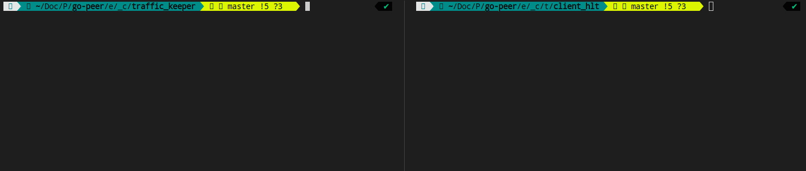

# HLT

> Hidden Lake Traffic


The `Hidden Lake Traffic` is an application that saves traffic passed through HLS. The saved traffic can be used by other applications when they were offline. HLT provides an API for loading and unloading messages. Messages are stored in the database based on the "ring" structure. Thus, new messages will overwrite the old ones after some time.

> More information about HLT in the [habr.com/ru/post/717184](https://habr.com/ru/post/717184/ "Habr HLT")

## How it works

HLT emulates HLS to receive messages. In this scenario, HLT has only the functions of accepting messages, without the ability to generate or send them via HLS or independently.

<p align="center"></p>
<p align="center">Figure 1. Example of running HLT client.</p>

## Supported platforms

- Windows (x86_64, arm64)
- Linux (x86_64, arm64)
- MacOS (x86_64, arm64)

## Minimum system requirements

1. Processor: `1x2.2GHz` (characteristic for relayer mode)
2. Memory: `0.5GB RAM` (~200MB of memory is consumed in relayer mode)
3. Storage: `20Gib available space` (the size of messages per day from one node in storage mode)

## Build and run

Default build and run

```bash 
$ cd ./cmd/hidden_lake/traffic
$ make build # create hlt, hlt_[arch=amd64,arm64]_[os=linux,windows,darwin] and copy to ./bin
$ make run # run ./bin/hlt

> [INFO] 2023/06/03 15:39:13 HLT is running...
> ...
```

Open ports `9581`, `9582` (TCP, HTTP).
Creates `./hlt.yml` or `./_mounted/hlt.yml` (docker), `./hlt.db` or `./_mounted/hlt.db` (docker) files.
The file `hlm.db` stores all sent/received messages as structure `ring` from network HL. 

Default config `hlt.yml`

```yaml
settings:
  message_size_bytes: 8192
  key_size_bits: 4096
  work_size_bits: 22
  queue_period_ms: 5000
  limit_void_size_bytes: 4096
  messages_capacity: 2048
logging:
  - info
  - warn
  - erro
address:
  tcp: 127.0.0.1:9581
  http: 127.0.0.1:9582
connections:
  - 127.0.0.1:9571
```

Build and run with docker

```bash 
$ cd ./cmd/hidden_lake/traffic
$ make docker-build 
$ make docker-run

> [INFO] 2023/06/03 08:44:14 HLT is running...
> ...
```

## Example 

Build and run service
```bash
$ cd examples/traffic_actions/keeper
$ make
```

Run client
```bash
$ cd client
$ go run ./main.go w 'hello, world!'
$ go run ./main.go h
$ go run ./main.go r cb3c6558fe0cb64d0d2bad42dffc0f0d9b0f144bc24bb8f2ba06313af9297be4 # hash get by 'h' option
```

## Config structure

```
"logging"      Enable loggins in/out actions in the network
"address"      API addresses for HLT functions
"network_key"  A network key created to encapsulate connections
"connections"  Connections to HLS's
"consumers"    HTTP consumers of raw messages
```

```yaml
settings:
  message_size_bytes: 8192
  key_size_bits: 4096
  work_size_bits: 22
  messages_capacity: 2048
  queue_period_ms: 5000
  limit_void_size_bytes: 4096
  network_key: hlt-network-key
logging:
  - info
  - warn
  - erro
address:
  tcp: 127.0.0.1:9581
  http: 127.0.0.1:9582
connections:
  - service:9571
consumers:
  - localhost:8082/traffic
```

## Response structure from HLT API

```
"result" is string
"return" is int; 1 = success
```

```json
{
	"result":"hidden-lake-traffic",
	"return":1
}
```

## HLT API

```
1. GET      /api/storage/pointer
2. GET      /api/storage/hashes
3. GET/POST /api/network/message
4. GET      /api/config/settings
```

### 1. /api/storage/pointer

#### 1.1. GET Request

```bash
curl -i -X GET -H 'Accept: application/json' http://localhost:9582/api/storage/pointer
```

#### 1.1. GET Response

```
HTTP/1.1 200 OK
Content-Type: text/plain
Date: Sat, 23 Dec 2023 16:05:08 GMT
Content-Length: 1

1
```

### 2. /api/storage/hashes

#### 2.1. GET Request

```bash
curl -i -X GET -H 'Accept: application/json' 'http://localhost:9582/api/storage/hashes?id=0'
```

#### 2.1. GET Response

```
HTTP/1.1 200 OK
Content-Type: application/json
Date: Mon, 07 Aug 2023 02:59:42 GMT
Content-Length: 68

0315007d065c0996e4c178f45d70dd4e5f6b317f0bcb831dfbed0b14289fa7ed
```

### 3. /api/network/message

#### 3.1. GET Request

```bash
curl -i -X GET -H 'Accept: application/json' 'http://localhost:9582/api/network/message?hash=0315007d065c0996e4c178f45d70dd4e5f6b317f0bcb831dfbed0b14289fa7ed'
```

#### 3.1. GET Response

```
HTTP/1.1 200 OK
Content-Type: text/plain
Date: Sun, 10 Dec 2023 06:27:56 GMT
Transfer-Encoding: chunked

00000000002759b35d9eb70074a79515ba2cf5269af8d6d8d08fac85c44bae8a203b4ee7afaa3243676f2d70656572017b227075626b223a2237636161633162373037326530313833653931343164366134353632363130363934393834383936336664666531613631373337323233333262616231653562303264396239623166336265653162613932623666323836646438356431613365313766613862316532656564376261623035393231316138656137303630313463393463326539353935316332343730306565343661653864636531613963356563663535663065323235643839623866663164333738366537313461643437626537343137303036613962316134366433346536663066323166646338306266303038343837663538616139346431633639383634373963326465626564373763326530626239376536613833643734353463363561383033386234326234396263303863336431383561626236326435373366393962326631343532326230376532343038316634373366346665393165663830393937626532343362626439333139383739616436313231386438396435656637333832666462396264353736373561633532613135613162363338643237613339633139396562646336636330356534303936623161376135363266383665323235373566373366356461623265373133333338343535393632633531613463663861323365373933626138626638666136373665343537333739666639643362326333303731343530383065313463346338646561363336376362353432303664333531303532373436333763303036633132613364353966336331346664653831663439643537633431653135363863366565343633613136653166306465326363303031386164613262623333646637643538353266326430366331666337613439396535656236636234396163636464356237363866343630613637373530383032643132393061653861323138393531653638316437386334626434363232626365636330353635393161653862303338616537646665303764613462613234323130373330363937313833333439346631353962663437306338356333623139653462636338353166306437386137343230393834346364643632343538643362373539386166616361613137383361393638363366326433373239363538643065343262316330636430666136353163333763363535363766646665653830663538303136353133393432326634396465643936393832366462353364333834663963623039633736333431616664356338656434336239356330623662353430363637646330356435373633316161643265396264313062623935373362343533303561353064636135303936303537353539393330373065623436303339643431366163663539343963386530623165306437613439323439643230356266383834653831643239333532613965313036643334353330383530333164656364326366326665613136623364636232396664643136653461393465222c22656e636b223a2231663761636635343030643366373934346432333965313236613537343130313830363532373439636339663336626532333333636537326263636235653233326461356261666166633864613736613134313730343231646532356665326661633432396431653538353336393939376330623031613864653763666362393162386463353763393864313938363165396338643532333462323936346137626661323330306632613733346165326533616239303266326537636261386163663136363461316663346139323131643335383733613635333830643861353266383164613164333432613166393036366532343935633866643632653034356261373131346635363031366437643565383335373838333539666162663634346132333233323033303865663137666633666138393733383565653561643435656632356339633330386633646235643438386364336534616364666362303966316530653638343733393963396664616364636363353539656334323563653064363734306537383964333262393730346662393765353333663735303736343466343539323835303338393230383335616261646361353635393134643330323538633931666133633631636261336139353837313937333731373936626464306366653138356636633261343366343762356335386666353130663932386564663437333135356665646630653737383662346666396263626665316464646236373662306662376664306365316336626534306365316538646261646464343437626234386265626337306264303936373066616637623433656331663661653366393333376131643065393033326161396266613831643166316232663462343338303762663237623162653736643531323663343736376162396237306333356430306639663064613636616531333637323665636539306133383037356636373531393436656166326135623964383332336364623635366134346165396634313863306532643931636635623066396235666636613730633366353731353265616135333631363862653735376264373231313338383633343465616634356663383237363639613761373536356539323136383764663036666438643663306538333066626137343435353639343932346431333132363930373936343939613438613061646639613531303163323663396162376630613831373437326461333935343334393233326661633162373566646534643835653930336236343731653033393430303363623234623131303234373433323664353066396331653139316632663738326235316264313534393266303432623939333537666437386434386136633061353139346137323236663234222c2273616c74223a22356435386637343363323166323733323731613132626566613331653032343730643661643962623264616262386666346166653531373032393531663737333061613262366162343839326439613866646162363735326263636139396139222c2268617368223a22666633353364303839633364396666303266326530636632323862626164313464633438303138393464356339303638336634383361633239383035303465656234376661353532636237356565306464356433636665353361356466376364222c227369676e223a22386536353637393436363134613662343433666333656632363737336364613062313963653366363630326639613337356131633631346132346564316532393735636165393737316130623161373730306563366664346364366230633035353063663934623539323337343739353633316433396632353930623132333364643661303536333361393933333434623932363835383635653136663731323136656564393766363261653733336265623234326433633231646331616137313438363636356438656539346661353039383565313238383764363433643438323862666433623337323962303135646663623132386534396265313861653433626161373565663634666330303164636231373632383939303264313437633332303866653237333034646162333235656237326166663562373134616237373432623438376462303864343430613135333437646232663961343234323630386539366564353034373861346464363164623062333266393262633538663962616334303234383539333033396233383031346366383964376663353733626136366631636163396135386661353231333936386666386439343964363937373132643832663164666136376236663537613163343132343063353935303637366234336165353761653835633964616465376233626633646537613633653335326135613765303037326131643539323165313664346565363635346532393432646364366463303430663733643562633230643564313164386137663339303362643337313665303964633762333062623132363239303932313232333234393131393735656463393839376539656365353766346664656335373163613937643239356333623261656164386562633733386435376630393133613262353832646430656233656335616234363331373539623361356166613234306461343430386264396538366330326131366136346437363539636133613836653366353537666438636631333835336433393764653830626230333132633065656438353165376637666639653562616431626339623933343461626537623663323263613635323339636663306134333364396439663964613061383037363535616435303532613439383538323361363565383036663765623036626265663739643163353162333464346562356262623237323664383465666233653336303861613466323638383938323534353533313933386335303263626138346263316338656465336164346636313561636232336339363034643739373336333130393437316336623932343338313830623963376138646339333532303431623364306162633236656331643132366331633565663661303430636565343737323239653233346236653031353837643739363432396665636434227d4005c88d68adc3d2d1910403238a45fda3e9b65c3a32e93de507118e79fb059f8282d7af10f821bce5221cdf083aa7d2fe626c8de5937f0e4324340a9d80e723897309ea7cb91b1710801a31458bb2784b6be27fc73931647b5c2d46b2252f1ce882e5bb295cafebbe06370e46a9f4886ed868cc52aa576c2a91bd2909252010e07f38a9a4eff1760d70e7541ba686dd6eb30a6dba4924899740c77c002783e0e2399268aa39f8903e6571fcf35316c739aac117c9ca320d93c67f613956cc4744930f7a01b04cff021bd84c42eec1e95fc62b6734d710fde1540cbc4de0c6782c28e846cea3c6cd2efa59b43123e365dffe195643637e5da59b1c458a6ac20775bac58c257f49ef7da6c3158816de2c311f556803eeccffab99ee71dc68f66e220e4b405d9a0ea3cbbc11ed4e4c587b6b6309076e3488cd758382b60338874be4180edae75e8b52cf680d267065d6ea03e72eb2463f3112ae8aab48375ac7500034d145b0a276f9229dc66fd24ff27c202a21503e7efcbc55ed2a0dd7e85613666fc918c0724265fd46d20275be98faa4f9477487821519af379a4b9bf102f69b9311273ee2fef4afaffc1a4adb68b8fd14d5dbab987e95007d9642a261f4c9a9c8d29bb02a340c6f92f22fff0a248ddb48310448c94b221fee8b7bcf0e725a72a5ccb84948d6797d0c50acbcbcc85caa14d906e41542a41be3726a2c2865a5b26a446f6f9e3b2151d7a8db7c11891d626ab47bee1524d80bd843bf64105a7d2fa63e71d5c732b0951cc52295a67951877fd021c1b4464b67c5773be8e451fa01a768fe70855d0b6c8aea986d1a09e722262bf00c1dac0e4523e0abd5bff533f5b59c838c1e8e0f663818e8d0baff4299351aaadb3f77be62bc4ace606485730349573f1ee22c1f9326d263d1014745f6afc04fea8325913388bfe64a39b4dfdaa8c634abce6b05c96d87d5eab96089e7483160f008cfb0892a15b4482d2f9a7318e5a2fec887b916a8815a79a485d970d01c590c85fdc41c9d8df96c99fff371bcbfa05a9f21c7dbb24809b3818a72b8cb2898b8e5e04a3e2cdf43bffd7f74250d264d4f0f0a38ae815ebe6ff40f955db39d8d8b5db6de6108863cfbaa54c71ef7c2d8cad6ebb57847d3a2a08e892e919b5eba1663eae33a360236e86896d798a3bb93e226d800388b228d7c98a7f030cc7c8ec2d384757bdc65274ec3eca4d62e6cd5ab38cdbbb0c8d4109caf3b109285411733ceb5b89886db4d91e3c2b0928a73ec152fd3b375cf0402da8225798831430911cb2511592b60ca6e4099ea39f29f53763cb1fe54b11f12cfe0432765871bb2c5c34d76d3e271428b6defc2d68f3c6502c10df4e3f2a931006b40f6b09353555fd3b284488b2146083422c617aa722fe758d7b8d00a52b9f39ff77c7305ef02d34d983a5e9df129d1fc681b74d7930de450d4f495c34f932cc37fc037c1860d0d82b0e465a07e7a5a192bebf920c4c3331ef72fbb3ec69f03c248d62045c32421482668eedfdf428b1d3e4cdb6c4a692b741f4fe2e868cac91199c19673b2fa8c07bdbbb8e33a8c16c43a984b4facd2c99ba0e2b5e532f6a42da9165e81afa4e9f039e72832fff5dce2096d3043402689bc8f4b734338a501a65da696a2197ddb58fab510e9e5f786b5b1c04a6554717817b64175eab398c89e24e40f8267ee18c601ae5c01ad2c6d8c6d1c713f43d6fe2e16a6b71bb49e69bd7849d3be0ce5f1a93423b69f328f648ecef11566c6a5b993ec7bf18b083539b00c116e9ee17e2ea2dd3dda47048fa38ce38841f717f747de4c512ca02e2c0a141ccfba72ddb28d4f4c28d953d0a6cc41e954447414ad0d3793169a32c1cc7015162b3c75e8328639237f49638f1831055cd86c9e3538f51dc6bfdb5069062355c4579322f528d8131a85a9ea09a177a883e4c5edd78be728c7dde61120934a143f75f64c2fdaf3bf61d9f1a5b7278c0494072c558184f8e18e23072b1724c58c5617ee46667430ea09f9beb6d7ec18b4d08164b6cf0e08debd297d114067f5591c04792156b7047f5aa39accc99863c9d4c450974711778f347c81b83a490ae131b4da7ffa4c13e94c020cfa76bf37e5b326c2d84fa2cce1f2ea6a2e0708ee34d716912a412f8d3cdcf241fa4b9fe7e01b292e26f635755ed12cdd21ac40411e5e92f576cf4878334251efd3658504f257e1ab37233a3ca0f9b0d5c63d62a5a6502e3074d65ede52d3dbe20b7b6b69e7e4a0ebb933ac178db3b656b8c00ac9eb059f2f6082a808f2f086b7833910f7ffa1ceb48890e07f18141b7df37b4240ce527e2b2e38388cc2fb673f81eb03fab15a0bbc5ec1d925dec04a798d84eb6e428cec5c0b6406b84c9cb883214fb987a4de46474b79c1a4c85f635c28148f9832fe2fde19f53dcb1622eba378e66991f3bc57d9ad861ae05326a12bd779501b2f33141c15138c5c9a16fe9f35d5b48989402cfb9dd8425b75b686eaa6a42ec772c8f4486d3d4e15dc48ea6e1a0c11806f8186c4d5019081d4df4c0ec0405f592b38c1afa7f9d328b70851652eb34d7e72b29cf1e1fc958a97625f95f8c503aa8cec2310b430d45a70bbb7ded6bc3469a886e423f68ef8b262f7198383fda7198fd656269b9ae352c9d59ff4756e9726c8a8c851e1ef21050d4aeb067479f96760ea8c428234a13f367b677e13f9f79344c013796d79573941abb68f000059e615cd8cd9ec8959145d238dbb327bcf18f7d47fa31573a0f8d311951fe0489497cc16e68dcd52ee1b552b42f20716e616d7f8df8a11a13e13c1d22525980e90d047f2b5275ad830ffe006c37ce25fd48aade2b31e1308b5b53cb0b74c44633f68cf9c009edf5787c94e1d676de1bdb7ed73afdb44043e769c5161eabf9fb527fd21e9b9aa5fc58ed7e60cd3598f653b870573e648d2781e3d0f424945ef7bfbc67540333dc3fa02d9f50c1bdb6e386a6c44c17b897066bfca7f6f7ba73d2168677cfe7d1bbbad92dfe455781a3a213757c1d52414831d5b23e131b90df03018f3a111bf9cba9f05cfb0a66997a7fd8d024faf757a06693e19a0ac36cfce80a07710cf115f058eee0572422c9e88890d66482fcf2d2cbe44f847a646da6101a38c5ec4da1eafc17d2a5f316f954033b682ee9e5da0ed9db0077c71caff729b6de44e9c3dc1e43c4906a89872d279d88d59a61e8cf2577a9e0ef807dc2119523c0ca6cf9751f77e4140eba727adc77685fa41b101180a0834db08978a2b39b65ba07e2d5da857a445b989abaf8607cf1a9f15873862e70c9106aa9fa9ac9ffa0f223aa81795811c5eda6a8310893b8450d41dcf045df1caf28140b4541c7c8f7b53d3922594cad93d207cd179e1c84f733fc84cdbe78747bc4de469dcbb1fb8602790f7cd985caf25a27971e32865b33a5b9bb6b873818c4de73007a4be49b00a192c573fce4626ce758ab9c76dccfd6da62bac768148dab61ad4436cd018170848c80d1139d474186c7389659b51fc6d785bdde67d60b458b0a625badf7ad16c7d241b066d8a01ebd06069618ef0d0e0c022f1d4c1513804a22bead97bb6c899b12137b6b05fe7c778559d5aad9739471a36211f172b0c7f40565ed87582daffbb840e3643d4556339aa49fcca6325b37c7b23b0c2de55ec6916b7d5689bca26171dcb176ea599e48604ee372c7252745295e790a5d699c2b2bc9e649ddfc0cf9bc152255bf7d0131cf417fb44839f6afdd172e9fd68baa5f6f407343c9162790c54285a3a4ca0c316e35453f4f38c56999f824e613d758d5fa9e626f1163da19d452f229763a3844350ae9f8d7d66f31e863cf52e2c3132c7d9a0b11c38ce37e872d9f5cd9fbb62d5feb3dbc769bcea2e816562885b2ce5d3e004a206bcf3b94928fc686de5e389b0b97e4554bb6e3b41a7ed4b4930e4b29cc7ccc12b3e161b0bd0baf4ddecd02a18f8eb8e788a60107688eebc4d265bc097464f9c1679f925618e3e8f787b15cfd1dcd096ab2901fde5d87d05a6889efe077cca1c3e3cc2839ad4212d2c84a7946b6953eb059177b2f05552235487ac212c3dbd07ea1f4496de13746ad4df35274c7f6d5505421fa02a32fb29b4cb03bc8d6c02f54c3c1afeef18f20f841cb93a665e9cf4be529087ee036aedc26a117fc02ba874d5166303869f8cdbbecfb470c896829550af4629b66198d0bfa27989a5e9fc8d0ebea84e75b2551170c7acc3f838396e233bebbc5c9264d0de3040fac5d2c0972b510822522baecb65b65807f5b65d25df8969f3844dcf3fc2ef430e0174c66b179e1e4c3423248463e9d7b1afe84a1ff481cab65c676b8bf29540978770e8a870b5f21dfb581940af0c20c7975143281081d27dfeb365c18b6ccc7bf9056acf9fe694d558346d8debaeab7776a43dd5c6752b875a4d4f8786caa4a50a951770686254629c4eee501b0cea0e281a7b0dee947175fceeefd1082e4e093b34ba10271ab67611c2ddd963760609b5cd289717563bc3f1217495d11f4f4ce971894a1721601c8b3779dafd7c982e88743e617af06c2ce182f9d840a988dcf9134c0300a9501d65f7018ee64c7d96ef7473bae34b892e9d5c5f7e124b6a22e19f58fad3367972f29ae0a89c4ea38af11744f29af0ca8424f474f05e195552a183aa3f5ed121fd4c1a308b44de0b06fa8a76982aa529f23991d781974804bf5cd8993ac30b6eed85f682f355ee86c61d2c1021fc6f7f0a833b564d1351dfa4c8fe5437cf0b98627ca5a3264aaaf8884e44bbea43c24c5dd0692911af3104d3d40d03824dec655ec296d2b27c9235063458cf8571f766cdec4c0b7a70ea994f7ee072221f87601eb0576286a86512044b79b239a337d667d45ccfb613f123c3bb44515bf3c94b705e6068c9a963e97fed870b0be22bf0e1b8b00ce4fc5c5c101051108f93544ee5645201a2fdf89857e1ce4b325c09c1d5dbcd5d4b673ba700cabb227b078f7ea9fbc6eed31ad4d53115ec5f973e1fba8d0043648190e460b3166efb846ce92d4a83e502d3ff12fff8d7bbed511f0c5de361a70ef6827267a138daa7aedd5e39f07486907fc1a3d31d5e3baf081124665ae4bf17defa748237a0e89b4b71e9705e05c956d9ee40342ec653c47f830d8e3b9278d171aa34f1213358872ebb018f0a0eb87953dfcdf8d8f4d35124e9e7b16059023161b7620e7d474f1f4f5b65a53b7ce9a6a70b7d49110d9ba4a3086469ab9c95b36ef6d552b1e5f6f511bf326ba66f95e6f490be7c3cb39f23ae8ec0bdd4c6b9fc0b581c371b6b9066cb8ec46fcf7b13de2c49d638a5ea8d8c7748221700ce7819fb2b2bc5970d4372f74f8ff2d7a398798da457861d012fb8634656a264de28600ff93d1b2791cd8e630e4b5868adb498e4f5092b0109a2da812a54b0849917af93682f2998745634ae6a09d35c53861fc395ca33065df8fed99746b1873e08118bf911b52bd430d3ccca9c9d0575e495b8a93fd8e30fe292bada89a6ff427411fa40a3e2726b93a4be2d8f282cb25f2a7aece18c113e380998bd8bc9d3a41f99a94ccc3cc9983ae4f37b0158c554236740f3a93a08b07f8e874e6b8fe5366ef8f0141c9a29d49411c12bf08262cfe518a0f9c7627746e581eed55a808d13624c91755dba4673ff6dc77ee1492bb2af053c54ca42e46179e3c136878b5a7be8a5d8c4809dd7ecfb28b0ae89403cf8bffb304baef1b10aa54c64a4ee6c4d3ce46f7ad4988c05a0a0a92c9cd210cf76fa162fe69d3c70fc630e9d62eb6ef33d4d33bb94488a70eff47e0d335f77a62c358c778c40784b25b1256736b636c15e66343b404deeb1467c5063ba3b38a8c470a82ea08eed131c36ac70f72bd093b7cea0b2349bca113f667a51d48e4377484a2cf3a7939df5f2c973381953f00ce256ec9510780b52db449a03c6139c7e24cd4548f15c29edf47ac8bf5b1be9cb5cba76760488bf79cbbe6c37442616440b1aaeba0f29ca509d71b93a33c10156bfd443ba5776b201f84a579cdaca0c01a0527a0aed9ab5293f48231375687595dfbc1ad36651829c752e404e30a0008d47029b761a397b46c62a3b33187cc5482b06db879f0d4b1cc9bd32a7ca4c3463c0d9080f8f3fd5ddd3d8ecbd95101fcfdbc43ca952f6fa74336cfeae331ee9c1bbf2c32224a4e184364af369f98f62a7a6628861f2c7cfc4be6a2a3509eaacd18c5c352fb89c9565709bd79a59b550bbd900635f60681b42bd9c74cfdaec3a87f557b24acdc92ae5b57f9d9cc98e9ddcc99b8f96fcd8c28b04c15b82fecb7adf277aaa1f5c29b9d3a52006bb7c45cce109c66554bd36966ba20617bbe0347b26c2e4e5866b74fdacce1e7443fe1303bc15a84fe19efc325a8b96e2d0877a49feb837474be5a325e047c6f1750134bd64f1c69d928aa890009405b20409a7c1a6a0993550161020b88b4aaa91c3e1c6be5bfebed4419d2eb4af1de68d38bc1e314b4989abb0a6d8318593c7f524173267b81c938175c1708cac24a9caa170008d19e2a949bf216d46089b09e2d873cca425fb880ca75a6742840445dce08d17b2716d03e6a71e1763e84d8e6c48da971aa3d5681db0aa204110e9cbbf9fb2ece45ec4eeef183c958351fd3fac1fbf60b440f3b6b117876b5830533da536e787d494a91c7db1b8dc50e17625c04667cb9ab8c8b5171446cfaebf92932a4862ccc21d6a345a31946b768ab92504de19bc1367194ce01a45b8ded9497b7acdb76fcff2e5be2944
```

#### 3.2. POST Request

```bash
curl -i -X POST -H 'Accept: application/json' http://localhost:9582/api/network/message -d @README_example.msg
```

#### 3.2. POST Response

```
HTTP/1.1 200 OK
Content-Type: text/plain
Date: Mon, 07 Aug 2023 02:43:35 GMT
Content-Length: 23

success: handle message
```

### 4. /api/config/settings

#### 4.1. GET Request

```bash
curl -i -X GET -H 'Accept: application/json' http://localhost:9582/api/config/settings
```

#### 4.1. GET Response

```
HTTP/1.1 200 OK
Content-Type: application/json
Date: Sat, 23 Dec 2023 16:04:45 GMT
Content-Length: 126
```

```json
{"message_size_bytes":8192,"work_size_bits":22,"key_size_bits":4096,"messages_capacity":2048,"network_key":"j2BR39JfDf7Bajx3"}
```
