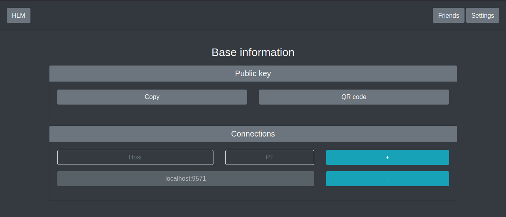

# HLM

> Hidden Lake Messenger

## Description

The HLM is a messenger based on the core of an anonymous network with theoretically provable anonymity of HLS. A feature of this messenger is the provision of anonymity of the fact of transactions (sending, receiving). 

## Index page

Base information about projects HLM and HLS with links to source.

## Settings page

Information about public key and connections. Connections can be appended and deleted.

## Friends page

Information about friends. Friends can be appended and deleted.

## Chat page

Chat with friend. The chat is based on web sockets, so it can update messages in real time. Messages can be sent.

