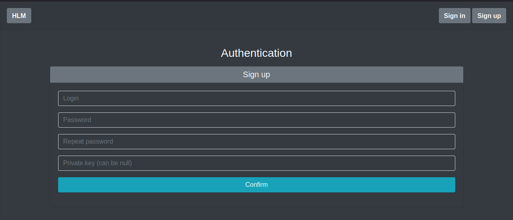
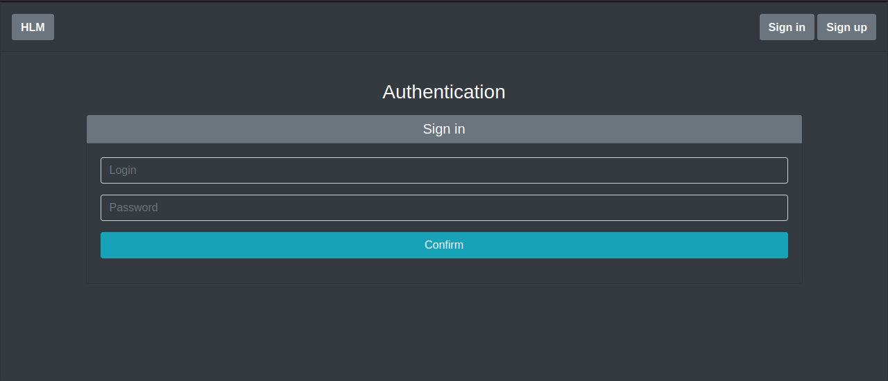
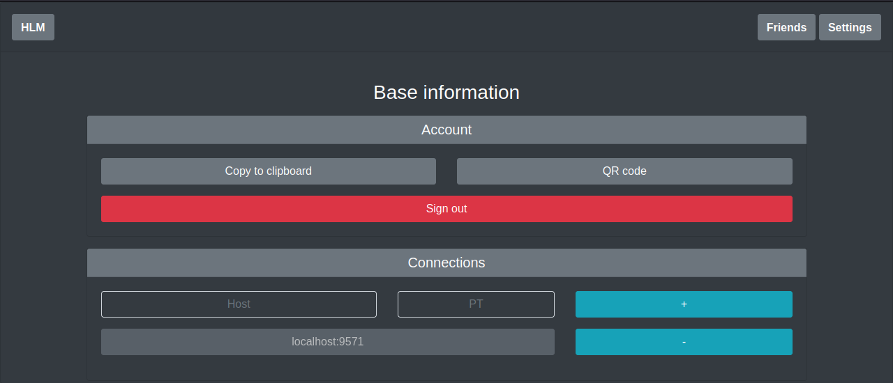
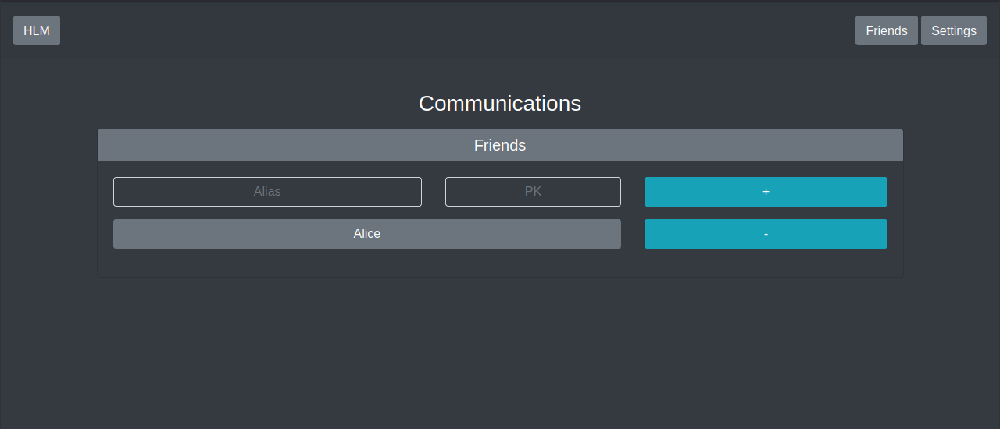

# HLM

> Hidden Lake Messenger


The `Hidden Lake Messenger` is a messenger based on the core of an anonymous network with theoretically provable anonymity of HLS. A feature of this messenger is the provision of anonymity of the fact of transactions (sending, receiving).

HLM is an application that implements a graphical user interface (GUI) on a browser-based HTML/CSS/JS display. Most of the code is based on the bootstrap library https://getbootstrap.com /. GUI is adapted to the size of the window, so it can be used both in a desktop and in a smartphone.

> More information about HLM in the [habr.com/ru/post/701488](https://habr.com/ru/post/701488/ "Habr HLM")

## How it works

Most of the code is a call to API functions from the HLS kernel. However, there are additional features aimed at the security of the HLM application itself.

Firstly, there is registration and authorization, which does not exist in the HLS core. Registration performs the role of creating / depositing a private key `PrivKey` in order to save it through encryption. 

The encryption of the private key is carried out on the basis of the entered `login (L) / password (P)`, where the login acts as a cryptographic salt. The concatenation of the login and password `L||P` is hashed `2^20` times `K = H(L||H(...L||(H(L||P)...))` to increase the password security by about `20 bits` of entropy and turn it into an encryption key `K`. The resulting `K` is additionally hashed by `H(K)` and stored together with the encrypted version of the private key `Q = E(K, PrivKey)`.

<p align="center"></p>
<p align="center">Figure 5. Data encryption with different types of input parameters.</p>

Authorization is performed by entering a `login/password`, their subsequent conversion to `K' and H(K')`, subsequent comparison with the stored hash `H(K) = H(K')?` and subsequent decryption of the private key `D(K, Q) = D(K, E(K, PrivKey)) = PrivKey`.

Secondly, the received key K is also used to encrypt all incoming and outgoing messages `C = E(K, M)`. All personal encrypted messages `C` are stored in the local database of each individual network participant.

### Example

The example will involve (as well as in HLS) three nodes `middle_hls, node1_hlm and node2_hlm`. The first one is only needed for communication between `node1_hlm` and `node2_hlm` nodes. Each of the remaining ones is a combination of HLS and HLM, where HLM plays the role of an application and services, as it was depicted in `Figure 3`.

Build and run nodes
```bash
$ cd examples/cmd/anon_messenger
$ make
```

The output of the `middle_hls` node is similar to `Figure 4`.

Than open browser on `localhost:8080`
<p align="center"></p>
<p align="center">Figure 6. Home page of the HLM application.</p>

Next, you need to register by going to the Sign up page. Enter your `login/password` and insert the private key `priv.key`. That key is located in `examples/cmd/anon_messenger/node2_hlm`.

After the registration procedure, re-enter your `login/password`. After that, you will have the functions of adding connections and friends, as well as the communication with friends itself. In the example, friend `Alice` will be added by default. 

To see the success of sending and receiving messages, you need to do all the same operations, but with `localhost:7070` and `node2_hlm`. This node will be Alice.

> More example images about HLM pages in the [github.com/number571/go-peer/cmd/hlm/examples/images](https://github.com/number571/go-peer/tree/master/cmd/hlm/examples/images "Path to HLM images")

## Cryptographic algorithms and functions

1. AES-256-CTR (Data encryption)
2. RSA-4096-OAEP (Key encryption)
3. RSA-4096-PSS (Hash signing)
4. SHA-256 (Data hashing)
5. HMAC-SHA-256 (Network hashing)
6. PoW-20 (Hash proof)

## Signup page

Sign up login/password and additional private key. If field with private key is null than private key generated.



## Signin page

Sign in with login/password. Authorized client identified by a private key and can push messages into database.



## About page

Base information about projects HLM and HLS with links to source.


## Settings page

Information about public key and connections. Connections can be appended and deleted.



## Friends page

Information about friends. Friends can be appended and deleted.



## Chat page

Chat with friend. The chat is based on web sockets, so it can update messages in real time. Messages can be sent.


