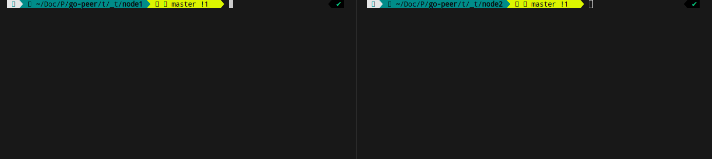

<h2>
	<p align="center">
    	<strong>
        	Anonymous network with 200 lines of code
   		</strong>
	</p>
	<p align="center">
        <a href="https://github.com/topics/golang">
        	
		</a>
        <a href="https://github.com/number571/go-peer/blob/master/LICENSE">
        	
		</a>
	</p>
	About project
</h2>

The M-A (`Micro-Anonymous`) network is based on a queue-based problem (also as HL). The implementation uses only the standard library of the Go language (also does not call the components of the go-peer library in any way).
The goal of this network is to minimalize the source code so that even a novice programmer can understand the entire mechanism of its functioning.

```bash
usage: 
    ./main [nickname] [host:port]
where:
    nickname - prints on another nodes
    host:port - listen address
```

> More information about M-A in the [habr.com/ru/articles/745256/](https://habr.com/ru/articles/745256/ "Habr M-A")

## How it works

<p align="center"></p>
<p align="center">Figure 1. Chat node1 with node2.</p>

In `_init/` directory should be exists `priv.key` (can be generated with `keygen` program), `auth.key` (key of network) and `connects.txt` (list of http nodes).
In `_keys/` directory should be exists public keys of nodes. The file names can be any. The attach to the public key is made via the `attach$` command.
By default program attach self public key. Therefore, if you write the `send$` command, you will send a message to yourself.

## Initialization

```bash
$ make genkey # creates priv.key, pub.key
$ cp pub.key ../_keys/node1.key # you can use public key to yourself
$ echo http://localhost:8080 > connects.txt # you can connect to yourself
$ echo "secret_key" > auth.key # set network key
```

## Build and run

```bash
$ cd ./cmd/micro_anon
$ make build # create ma, ma_[arch=amd64,arm64]_[os=linux,windows,darwin] and copy to ./bin
$ make run # ./bin/ma init_node 127.0.0.1:8080
```

## Example

```bash
> send$ test1!
>
node1: test1!
> attach$ node1.key
ok
> send$ hello, world!
> 
node1: hello, world!
>
```
